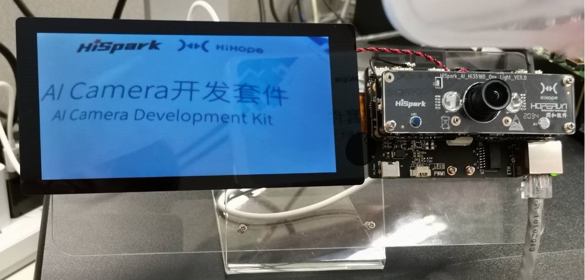

# Use Case

This use case takes  **camera\_sample**  \(contained in the source code\) as an example for photographing, recording, and previewing on the development board.

-   You can obtain source code of the sample from  **applications/sample/camera/media/camera\_sample.cpp**.
-   Before running the sample camera, you need to compile, burn, and run the image. For details, see  [Getting Started with Hi3516](../quick-start/introduction-to-the-hi3516-development-board.md).

    > **NOTE:** 
    >After the development board is started, the launcher is loaded and displayed above the media layer by default. To prevent covering  **camera\_sample**, you should remove the launcher during compilation or packaging.
    >How to Remove: In  **applications/sample/camera/hap/BUILD.gn**, comment out or delete the  **//applications/sample/camera/hap/setting.hap**  line from the  **sources**  list.

-   The compilation result of the sample code is stored in  **out/ipcamera\_hi3516dv300/dev\_tools/bin/camera\_sample**. To ensure that the code can be executed on the development board, you can copy the file to a TF card through a card reader, or modify the compilation script of  **camera\_sample**  to copy the compilation result to  **rootfs.img**.

    Modify the first  **output\_dir**  in the source code path  **applications/sample/camera/media/BUILD.gn**.

    -   Before:  **output\_dir = "$root\_out\_dir/dev\_tools"**
    -   After:  **output\_dir = "$root\_out\_dir/"**

    Recompile the source code repository and burn the code into the development board. Then you can find the  **camera\_sample**  file in the  **bin**  directory of the board.

    > **NOTICE:** 
    >You should insert a TF card \(up to 128 GB supported\) for photographing and video recording before system startup. This way, the TF card will be automatically mounted to the  **/sdcard**  directory. If you insert the TF card after the system is started, you have to manually mount the TF card.
    >To view the photos and videos in the TF card, copy them to a computer. If you just want to preview photos and videos, you do not need to insert a TF card.

-   Perform the following steps to run the sample:

1.  Run the  **cd**  command to go to the end path of the executable program and start  **camera\_sample**  by running the command in the following figure.

    **Figure  1**  Starting camera\_sample  
    

    The control commands are displayed as shown in the preceding figure. Press  **S**  to stop the current operation \(including video recording and preview\), and press  **Q**  to exit the program.

2.  Press  **1**  to take a photo in JPG format. The photo is saved in the  **/sdcard**  directory and named  **Capture\***.

    **Figure  2**  Serial port logs displayed after the photographing command is executed  
    

    To view the saved file, exit the program and enter the file system. To start the program again, return to the previous step.

    **Figure  3**  Saved files  
    

3.  Press  **2**  to start recording. The video file is in MP4 format and saved in the  **/sdcard**  directory with the name  **Record\***. Press  **S**  to stop recording.

    **Figure  4**  Serial port logs displayed after the recording command is executed  
    

4.  Press  **3**  to start preview. The preview is displayed on the screen. Press  **S**  to stop preview.

    **Figure  5**  Serial port logs displayed after the preview command is executed  
    

    The following figure shows the preview.

    **Figure  6**  Preview effect  
    

5.  Press  **Q**  to exit.

    **Figure  7**  Serial port logs displayed after the exit command is executed  
    

