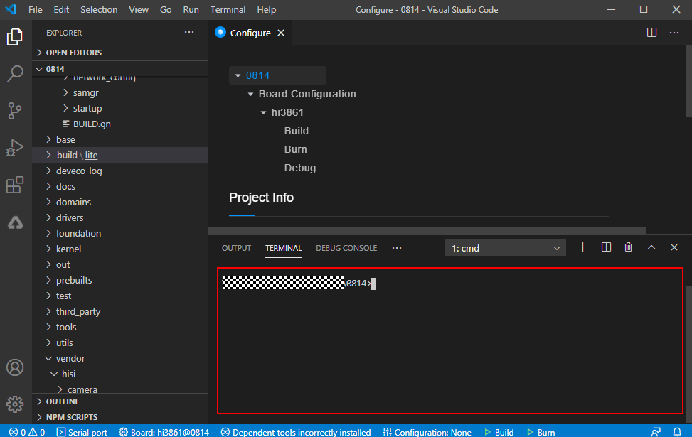
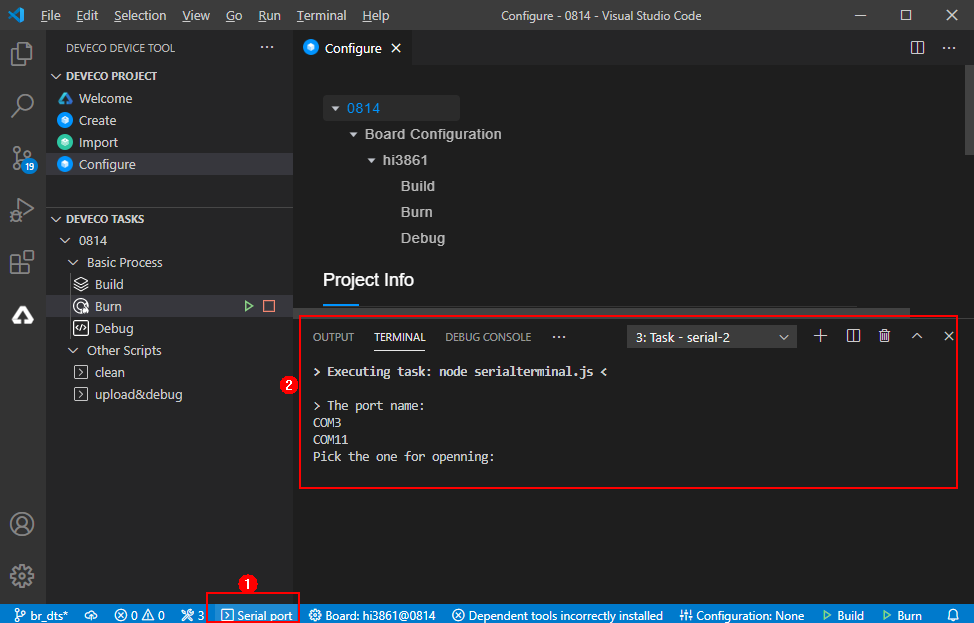
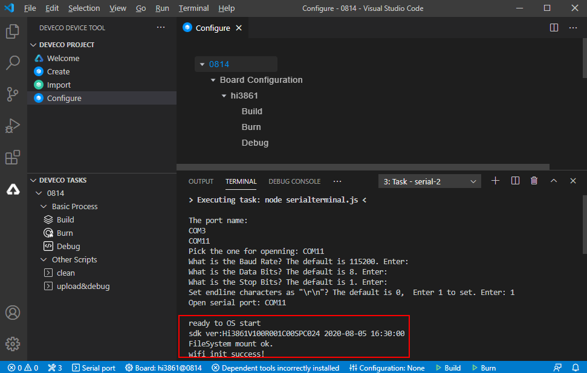

# Developing the First Example Program Running on Hi3861<a name="EN-US_TOPIC_0000001053302600"></a>

-   [Acquiring Source Code](#section1545225464016)
-   [Building](#section1736014117148)
-   [Burning Images](#section1610612214150)
-   [Connecting WLAN Module to the Internet](#section168257461059)

This example shows how to connect the WLAN module to the gateway using attention \(AT\) commands.

## Acquiring Source Code<a name="section1545225464016"></a>

You need to acquire  [Hi3861 source code](https://repo.huaweicloud.com/harmonyos/os/1.0/code-1.0.tar.gz), download it on a Linux server, and decompress it. For more obtaining methods, see  [Source Code Acquisition](../get-code/source-code-acquisition.md).

## Building<a name="section1736014117148"></a>

This section describes how to perform the WLAN module building on a Linux server.

If the Linux environment is installed using Docker, perform the building by referring to  [Using Docker to Prepare the Build Environment](../get-code/tool-acquisition.md). If the Linux environment is installed using a software package, perform the following steps:

1.  Open the HUAWEI DevEco Device Tool and choose  **View**  \>  **Terminal**.

    **Figure  1**  Starting the IDE terminal tool<a name="fig1975813338510"></a>  
    

    

    On the TERMINAL page, run the ssh command, for example,  **ssh** **_user_@_ipaddr_**, to connect to the Linux server.

    **Figure  2**  TERMINAL page<a name="fig91165301546"></a>  
    

    

2.  Go to the root directory of the code and run the  **python build.py wifiiot**  command in the TERMINAL page to start building.

    **Figure  3**  Running the command on TERMINAL page<a name="fig17727115215612"></a>  
    

    

3.  Check whether the building is successful. If yes,  **BUILD SUCCESS**  will be displayed, as shown in the following figure.

    **Figure  4**  Successful building<a name="fig1262101218463"></a>  
    

4.  Check whether the following files are generated in the  **./out/wifiiot/**  directory.

    ```
    ls -l out/wifiiot
    ```

    **Figure  5**  Directory for storing the generated files<a name="fig38521346164618"></a>  
    

    


## Burning Images<a name="section1610612214150"></a>

You can use the DevEco tool to perform the image burning of the Hi3861 WLAN module. For details about how to use the tool, see  [HUAWEI DevEco Device Tool User Guide](https://device.harmonyos.com/en/docs/ide/user-guides/service_introduction-0000001050166905).

1.  Use a USB cable to connect the Windows workstation to the Hi3861 development board.
2.  Download and install the  [USB-to-serial port driver](http://www.wch-ic.com/downloads/CH341SER_EXE.html).
3.  Query the COM port on the device manager, for example, CH340\(COM11\). The serial port integrates functions such as code burning, log printing, and AT commands execution.

    **Figure  6**  COM port of the device manager<a name="fig85905394917"></a>  
    

4.  Enter the burning configuration page.

    **Figure  7**  Basic configurations for image burning<a name="fig16939203111472"></a>  
    

    

5.  Set basic parameters.

    1.  Set a proper baud rate. A higher baud rate indicates a faster burning speed. Here the default value  **921600**  is recommended.
    2.  Select a data bit. The default value of  **Data bit**  for the WLAN module is  **8**.
    3.  Select the version package path  **./out/wifiiot/Hi3861\_wifiiot\_app\_allinone.bin**  and  **Hiburn**  mode.
    4.  Click  **Save**  to save configurations.

    **Figure  8**  Baud rate and data bit configurations<a name="fig4315145184815"></a>  
    

    **Figure  9**  Path of the burning package<a name="fig105491550185115"></a>  
    

    

6.  On the DevEco, click  **Burn**   and select the serial port  **COM11**.

    **Figure  10**  Starting a burning<a name="fig051518341529"></a>  
    

7.  After the serial port is selected,  **Connecting, please reset device...**  is shown below the  **TERMINAL**  tab, indicating that the module is in the to-be-burnt state.

    **Figure  11**  Burning process<a name="fig233565715549"></a>  
    

8.  Press the  **Reset**  key on the module to start burning.  **Execution Successful**  displayed below the  **TERMINAL**  tab indicates the burning is complete.

    **Figure  12**  Burning completed<a name="fig191921618564"></a>  
    

    


## Connecting WLAN Module to the Internet<a name="section168257461059"></a>

After completing version building and burning, do as follows to connect the WLAN module to the Internet using AT commands.

1.  Keep Windows workstation connected to the WLAN module and click  **Serial port**  at the bottom of DevEco to view the configuration page.

    **Figure  13**  Opening the DevEco serial port<a name="fig12489182991119"></a>  
    

2.  Select the serial port and set parameters. Enter the actual serial port number. Here the serial port number is  **COM11**; the default values of Baud rate, Data bit, and Stop bit are used;  **1**  is used as the end-line character since a valid input AT command must end with  **\\r\\n**.

    **Figure  14**  Setting serial port parameters<a name="fig192312048131213"></a>  
    

3.  Reset the WLAN module. The message  **ready to OS start**  is displayed on the terminal page, indicating that the WLAN module is started successfully.

    **Figure  15**  Successful resetting of the WLAN module <a name="fig496084516332"></a>  
    

    

4.  Run the following AT commands in sequence via the DevEco serial port terminal to start the STA mode, connect to the specified AP, and enable Dynamic Host Configuration Protocol \(DHCP\).

    ```
    AT+STARTSTA                             - Start the STA mode.
    AT+SCAN                                 - Scan for available APs.
    AT+SCANRESULT                           - Display the scanning result.
    AT+CONN="SSID",,2,"PASSWORD"            - Connect to the specified AP. (SSID and PASSWORD represent the name and password of the hotspot to be connected, respectively.)
    AT+STASTAT                              - View the connection result.
    AT+DHCP=wlan0,1                         - Request the IP address of wlan0 from the AP using DHCP.
    ```

5.  Check whether the WLAN module is properly connected to the gateway, as shown in the following figure.

    ```
    AT+IFCFG                                - View the IP address assigned to an interface of the module.
    AT+PING=X.X.X.X                         - Check the connectivity between the module and the gateway. Replace X.X.X.X with the actual gateway address.
    ```

    **Figure  16**  Successful networking of the WLAN module<a name="fig1166371318339"></a>  
    

    


