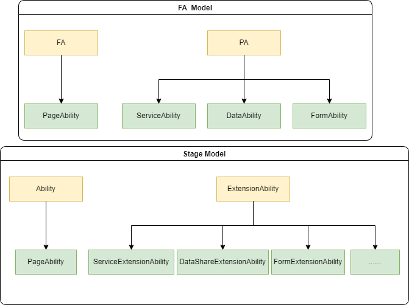

# Ability Framework Overview

An ability is an abstraction of a functionality that an application can provide. It is the minimum unit for the system to schedule applications. An application can contain one or more **Ability** instances.

The ability framework model has two forms. The first form is the FA model, which applies to application development using API 8 and earlier versions. In the FA model, there are Feature Ability (FA) and Particle Ability (PA). The FA supports Page abilities, and the PA supports Service and Data abilities. The stage model is introduced since API 9. In the stage model, there are Page abilities and Extension abilities. The Extension ability is further extended to Service Extension, Form Extension, Data Share Extension, and more.

The stage model is designed to make complex application development easier in a distributed environment. The two models have differences in the following aspects:

* Ability type and API usage

  

* Ability lifecycle

  

* Application configuration files and application package structure (The differences are reflected in the application packages generated by the IDE.)

For details about the two models, see [FA Model Overview](fa-brief.md) and [Stage Model Overview](stage-brief.md).
