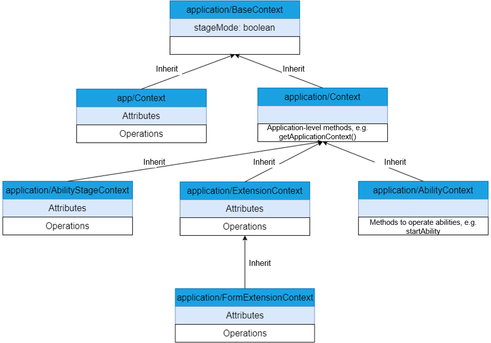

# Context Usage

## Context Overview
**context** provides the capability of obtaining contextual information of an application.

## Context Structure

The OpenHarmony application framework has two models: Feature Ability (FA) model and stage model. Correspondingly, there are two sets of context mechanisms.

**application/BaseContext** is a common context base class, which does not belong to either model. It has only one attribute, **stageMode**, which specifies whether the context is used for the stage model.

The FA model has only one type of context: **app/Context**. Both the application-level context and ability-level context are instances of this type. If an ability-level method is invoked in the application-level context, an error occurs. Therefore, you must pay attention to the actual meaning of the context instance.

The stage model has six types of contexts: **application/Context**, **application/AbilityStageContext**, **application/ExtensionContext**, **application/AbilityContext**, **application/FormExtensionContext**, and **application/ServiceExtensionContext**. For details about these contexts and how to use them, see [Context in the Stage Model](#context-in-the-stage-model).




## Context in the FA Model

Only the methods in **app/Context** can be used for the context in the FA model.

The FA model has only one context definition. All capabilities in the context are provided through methods. The context uses these methods to extend the capabilities of the FA.

The context is defined in the d.ts file below:

https://gitee.com/openharmony/interface_sdk-js/blob/master/api/app/context.d.ts

Use the context as follows:

```javascript
// 1. Import featureAbility.
import featureAbility from '@ohos.ability.featureAbility'

export default {
  onCreate() {
    console.log('Application onCreate')

    // 2. Obtain the context.
    let context = featureAbility.getContext();

    // 3. Call the methods.
    context.setShowOnLockScreen(false, (data) => {
      console.log("data: " + JSON.stringify(data));
    });
  },
  onActive() {
    console.log('Application onActive')
  },
  onDestroy() {
    console.log('Application onDestroy')
  },
}
```

## Context in the Stage Model

The stage model has six contexts. The following describes these contexts in detail.

### application/Context

**Overview**

**application/Context** is the base class context that provides basic application information such as **resourceManager**, **applicationInfo**, and **cacheDir**. It also provides basic application methods such as **createBundleContext** and **switchArea**. The application-level context is of the **application/Context** type.

**How to Obtain**

Obtain the context by calling **context.getApplicationContext()** in **AbilityStage**, **Ability**, and **Extension**.

**Example**

```javascript
export default class MainAbility extends Ability {
  onCreate(want, launchParam) {
    console.log('MainAbility onCreate is called' + want + launchParam);
    // Obtain the application context.
    let appContext = this.context.getApplicationContext();
    // Obtain the path.
    console.log('filesDir is ' + appContext.filesDir);
  }

  onDestroy() {
    console.log('MainAbility onDestroy is called');
  }
}
```

**d.ts statement**

https://gitee.com/openharmony/interface_sdk-js/blob/master/api/application/Context.d.ts

### application/AbilityStageContext

**Overview**

**application/AbilityStageContext** is the context for the HAP file. In addition to those provided by the base class **application/Context**, this context contains **HapModuleInfo** and **Configuration**.

**How to Obtain**

Obtain the context from the **context** attribute in **AbilityStage**.

**Example**

```javascript
export default class MyAbilityStage extends AbilityStage {
  onCreate() {
    // The context attribute is of the AbilityStageContext type.
    console.log('HapModuleInfo is ' + context.currentHapModuleInfo);
  }
}
```

**d.ts statement**

https://gitee.com/openharmony/interface_sdk-js/blob/master/api/application/AbilityStageContext.d.ts

### application/AbilityContext

**Overview**

In the stage model, each ability has a context attribute.

**Ability** provides methods to manage the ability lifecycle, and **AbilityContext** provides methods to operate abilities (such as **startAbility** and **connectAbility**).

**How to Obtain**

Obtain the context from the **context** attribute in **Ability**.

**Example**

```javascript
export default class MainAbility extends Ability {
  onCreate(want, launchParam) {
    console.log('MainAbility onCreate is called' + want + launchParam);
    var want = {
      "bundleName": "com.example.MyApplication",
      "abilityName": "ServiceExtAbility",
    }
    // 1. The context here is of the AbilityContext type.
    let contxt = this.context;
    // 2. Start the ability.
    contxt.startAbility(want).then((data) => {
      console.info("startAbility success:" + JSON.stringify(data));
    }).catch((error) => {
      console.error("startAbility failed:" + JSON.stringify(error));
    });
  }

  onDestroy() {
    console.log("MainAbility on Destroy is called");
  }
}
```

**d.ts statement**

https://gitee.com/openharmony/interface_sdk-js/blob/master/api/application/AbilityContext.d.ts

### application/ExtensionContext

**Overview**

Unlike the FA model, the stage model separates **Service** from **Ability** and defines a group of **Extension** classes to provide the same capabilities. **Extension** is a base class and does not provide specific service functions. The service party extends the corresponding **Extension** class as required. For example, a Service ability is extended to **ServiceExtensionAbility**, and a form (service widget) is extended to **FormExtensionAbility**.

**ExtensionContext** provides the context for the extension. **ExtensionContext** has the **HapModuleInfo** and **Configuration** attributes.

**How to Obtain**

This type of context is not used independently.

**d.ts statement**

https://gitee.com/openharmony/interface_sdk-js/blob/master/api/application/ExtensionContext.d.ts

### application/ServiceExtensionContext

**Overview**

Similar to **ServiceAbility** of the FA model, **ServiceExtensionAbility** contains only the processing related to lifecycle callbacks.

The methods for operating the Service Extension ability (such as **startAbility** and **connectAbility**) are provided in **ServiceExtensionContext**.

**How to Obtain**

Obtain the context from the **context** attribute in **ServiceExtensionAbility**.

**Example**
```javascript
export default class ServiceExtAbility extends ServiceExtensionAbility {
  onCreate(want) {
    console.info("ServiceAbility onCreate**");
    // The context here is of the ServiceExtensionContext type.
    let contxt = this.context;
  }

  onRequest(want, startId)  {
    console.info("ServiceAbility onRequest**");
  }

  onConnect(want)  {
    console.info("ServiceAbility onConnect**");
    return new StubTest("test");
  }

  onDisconnect(want) {
    console.info("ServiceAbility onDisconnect**");
  }

  onDestroy() {
    console.info("ServiceAbility onDestroy**");
  }
}

```

**d.ts statement**

https://gitee.com/openharmony/interface_sdk-js/blob/master/api/application/ServiceExtensionContext.d.ts

### application/FormExtensionContext

For details, see [FormExtensionContext](/en/application-dev/reference/apis/js-apis-formextensioncontext.md)

**d.ts statement**

https://gitee.com/openharmony/interface_sdk-js/blob/master/api/application/FormExtensionContext.d.ts

## FAQs

Can I obtain the context through globalThis?

**Answer**

You can use **globalThis** to obtain the context in the FA model, but not in the stage model. To obtain the context in the stage model, use the **context** attribute in the corresponding component.

**Reason**

In the FA model, each ability instance has a JS VM instance. Therefore, a global ability instance can be obtained from the **global** object of the JS engine. In the stage model, where all the processes of an application share a JS VM instance, there is no global ability instance, and using **globalThis** may cause an error or crash.
