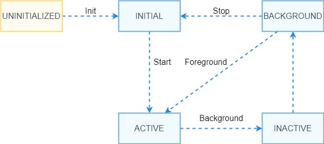

# Page Ability Development

## Overview
### Concepts
The Page ability has the ArkUI and therefore provides the capability of interacting with users. When you create an ability in the integrated development environment (IDE), the IDE automatically creates template code. The capabilities related to the Page ability are exposed through the singleton **featureAbility**, and the lifecycle callbacks are exposed through the callback functions in **app.js/app.ets**.

### Page Ability Lifecycle

The ability lifecycle is a general term for all states of an ability (either a Page or a Service ability), such as **INACTIVE**, **ACTIVE**, and **BACKGROUND**.

The following figure shows the lifecycle state transition of the Page ability.




Description of ability lifecycle states:

  - **UNINITIALIZED**: The ability is not initialized. This is a temporary state. An ability changes directly to the **INITIAL** state upon its creation.

  - **INITIAL**: This state refers to the initial or stopped state. The ability in this state is not running. The ability enters the **INACTIVE** state after it is started.

  - **INACTIVE**: The ability is visible but does not gain focus.

  - **ACTIVE**: The ability runs in the foreground and gains focus.

  - **BACKGROUND**: The ability returns to the background. After being re-activated, the ability enters the **ACTIVE** state. After being destroyed, the ability enters the **INITIAL** state.

**The following figure shows the lifecycle of the Page ability.**


You can override the lifecycle callback functions provided by the Page ability in **app.js/app.ets**.

## Development Guidelines
### Available APIs

**Table 1** APIs provided by featureAbility

| API                                             | Description           |
| --------------------------------------------------- | --------------- |
| void startAbility(parameter: StartAbilityParameter) | Starts an ability.    |
| Context getContext():                               | Obtains the application context.|
| void terminateSelf()                                | Terminates the ability.    |
| bool hasWindowFocus()                               | Checks whether the ability gains focus.   |


### Starting a Local Page Ability

* Modules to Import

```
import featureAbility from '@ohos.ability.featureAbility'
```
* Example

```javascript
import featureAbility from '@ohos.ability.featureAbility'
featureAbility.startAbility({
  want:
  {
    action: "",
    entities: [""],
    type: "",
    options: {
      // Grant the permission to read the URI.
      authReadUriPermission: true,
      // Grant the permission to write the URI.
      authWriteUriPermission: true,
      // Forward the intent result to the origin ability.
      abilityForwardResult: true,
      // Mark the ability start-up triggered by continuation.
      abilityContinuation: true,
      // Specify that a component does not belong to ohos.
      notOhosComponent: true,
      // Specify whether an ability is started.
      abilityFormEnabled: true,
      // Grant the permission to persist the URI.
      authPersistableUriPermission: true,
      // Grant the permission to persist the URI.
      authPrefixUriPermission: true,
      // Support distributed scheduling and start-up across multiple devices.
      abilitySliceMultiDevice: true,
      // An ability using the Service template is started regardless of whether the
      // host application has been started.
      startForegroundAbility: true,
      // Install the specified ability if it is not installed.
      installOnDemand: true,
      // Return the result to the origin ability slice.
      abilitySliceForwardResult: true,
      // Install the specified ability with the background mode if it is not installed.
      installWithBackgroundMode: true
    },
    deviceId: "",
    bundleName: "com.example.startability",
    abilityName: "com.example.startability.MainAbility",
    uri: ""
  },
},
);
```
You can also include **parameters** in the **want** parameter and set its value in the key-value format.
* Example
```javascript
import featureAbility from '@ohos.ability.featureAbility'
featureAbility.startAbility({
    want:
    {
        bundleName: "com.example.startability",
        uri: "",
        parameters: {
            abilityName: "com.example.startability.MainAbility"
        }
    },
},
);
```
### Starting a Remote Page Ability

* Modules to Import

```
import featureAbility from '@ohos.ability.featureAbility'
```

* Example

```javascript
var promise = await featureAbility.startAbility({
    want:
    {
        deviceId: this.deviceId,
        bundleName: "com.example.test",
        abilityName: "com.example.test.MainAbility",
    },
}
);
```
### Lifecycle APIs
**Table 2** Lifecycle callback functions

| API      | Description                                                        |
| ------------ | ------------------------------------------------------------ |
| onShow()     | Invoked when the ability is switched from the background to the foreground. In this case, the ability is visible to users.|
| onHide()     | Invoked when the ability is switched from the foreground to the background. In this case, the ability is invisible.|
| onDestroy()  | Invoked when the ability is destroyed. In this callback, you can make preparations for app exit, such as recycling resources and clearing the cache.|
| onCreate()   | Invoked when the ability is created for the first time. You can initialize the application in this callback.|
| onInactive() | Invoked when the ability loses focus. An ability loses focus before entering the background state.|
| onActive()   | Invoked when the ability is switched to the foreground and gains focus.     |

* Example
You need to override the lifecycle callback functions in **app.js/app.ets**. The IDE template generates **onCreate()** and **onDestroy()** by default. You need to override the other functions.
```javascript
export default {
  onCreate() {
    console.info('Application onCreate')
  },
  onDestroy() {
    console.info('Application onDestroy')
  },
  onShow(){
    console.info('Application onShow')
  },
  onHide(){
    console.info('Application onHide')
  },
  onInactive(){
    console.info('Application onInactive')
  },
  onActive(){
    console.info('Application onActive')
  },
}
```
### Development Example
The following sample is provided to help you better understand how to develop a Page ability:

- [DMS](https://gitee.com/openharmony/app_samples/tree/master/ability/DMS)

This sample describes how to start a local ability and remote ability.
