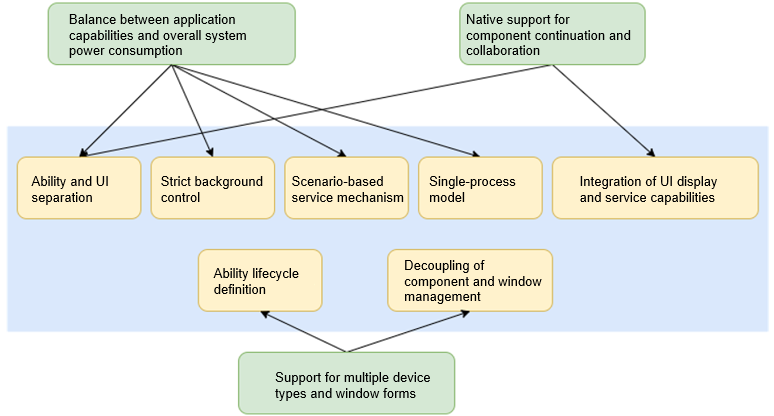
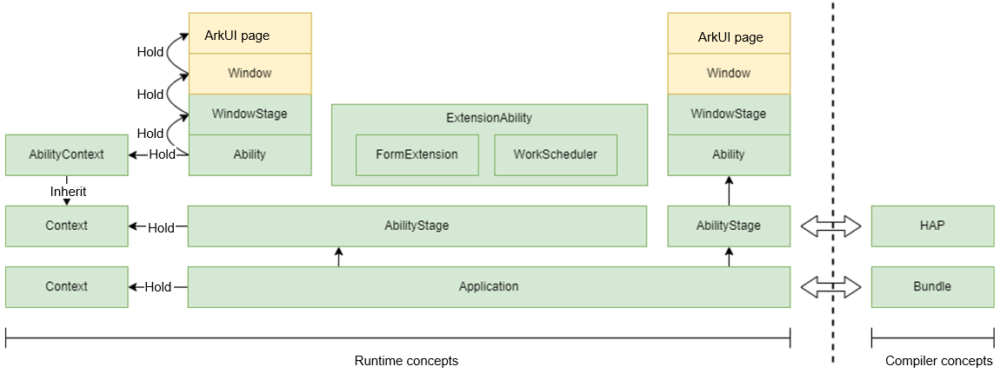
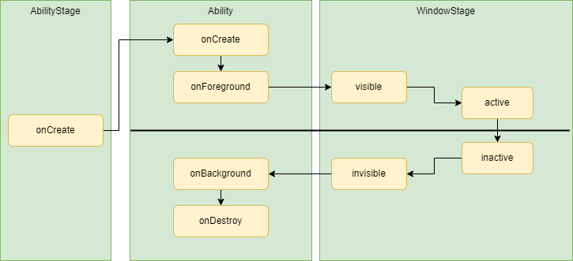
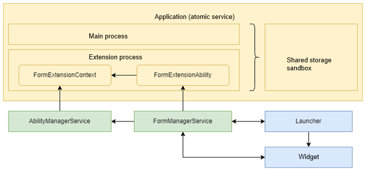
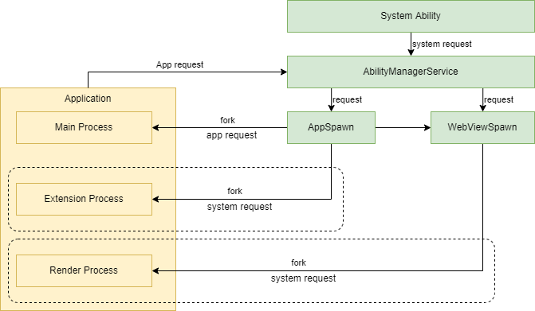

# Stage Model Overview

### Design Ideas

The stage model is designed to make it easier to develop complex applications in the distributed environment.

The following figure shows the design ideas of the stage model.

The stage model is designed based on the following considerations:

- **Balance between application capabilities and overall system power consumption**

  On a running device, resources are preferentially guaranteed for foreground applications, on the prerequisites that the overall power consumption requirements of the system are met. The stage model balances the application capabilities and overall system power consumption through ability and UI separation, strict background control, scenario-based service mechanism, and single-process model.

- **Native support for component continuation and collaboration**

  OpenHarmony natively supports distributed deployment. Therefore, its application framework must be designed for easier component migration and collaboration. The stage model achieves this design objective by providing features such as separation between ability and UI as well as integration of UI display and service capabilities.

- **Support for multiple device types and window forms**

  To support multiple device types and facilitate the implementation of different window forms, the component manager and window manager must be decoupled at the architecture layer for easier tailoring. To achieve this goal, the stage model redefines the ability lifecycle and implements unidirectional dependency of the component manager and window manager.

### Basic Concepts

The following figure shows the basic concepts in the stage model.

-  **HAP**: Harmony Ability Package, also called module, which is the basic unit for building, distributing, and loading OpenHarmony applications. Each HAP has a unique name, which is called **moduleName**, in an application.
-  **Bundle**: an OpenHarmony application identified by **appid**. A bundle can contain multiple HAP files. Each application has a **bundleName**. However, **bundleName** must be used together with **appid** and other information to uniquely identify an application.
-  **AbilityStage**: runtime class of an HAP. It is created when the HAP is loaded to the process for the first time and is visible to developers in the runtime.
-  **Application**: runtime class of a bundle, which is invisible to developers in the runtime.
-  **Context**: provides various capabilities that can be invoked by developers during the runtime. The **Ability** and **ExtensionAbility** classes have their own context classes, which inherit the base class **Context**. The base class provides information such as the bundle name, module name, and path.
-  **Ability**: provides lifecycle callback, holds the **AbilityContext** class, and supports component continuation and collaboration.
-  **ExtensionAbility**: general name of scenario-based service extension abilities. The system defines multiple scenario-based **ExtensionAbility** classes, each of which has its own **ExtensionAbilityContext**.
-  **WindowStage**: local window manager.
-  **Window**: basic unit managed by the window manager. It has an ArkUI engine instance.
- **ArkUI Page**: displays declarative ArkUI.

### Lifecycle

The ability and ability stage lifecycles are the most important concepts in the basic process of an application. The comparison between the FA model lifecycle and stage model lifecycle is provided in [Ability Framework Overview](ability-brief.md). This section focuses on the ability lifecycle transition and the scheduling relationships between the ability, ability stage, and window stage.

To implement multi-device-form tailoring and multi-window scalability, OpenHarmony decouples the component manager from the window manager. The ability lifecycle defined in the stage model includes only the creation, destruction, foreground, and background states. The gain focus and lose focus states that are closely related to UI content are defined in the window stage. This implements weak coupling between the abilities and windows. On the service side, the window manager notifies the component manager of the foreground and background changes, so the component manager only senses the foreground and background changes but not the focus changes.

### ExtensionAbility Mechanism

Different from the ability used for page display, the extension ability provides a restricted service running environment. It has the following features:

- Its process runs independently from the main process and shares the same storage sandbox with the main process. There is no inter-process communication (IPC) between the process and the main process.

- It has an independent context that provides scenario-specific APIs.

- It is created by the system, rather than by applications.

- The lifecycles of the extension ability and process are managed by the system.

The following figure uses the widget scenario as an example. You can inherit from the **FormExtensionAbility** base class to provide the widget details. The lifecycle of the **FormExtensionAbility** instance and that of the extension ability process where the instance is located are managed by **FormManagerService**, which is a system service.

### Process Model

All OpenHarmony applications are designed to meet the single-process model. In the single-process model, an application is not allowed to configure multiple processes, and all processes in the application are created and managed by the system. Each application supports a maximum of three types of processes:

- Main process: runs all ability components, pages, and service logic.

- Extension process: runs classes derived from **ExtensionAbility** in the application. The lifecycle of this process is managed by a scenario-specific system service.

- Render process: created for the WebView and used to load the WebView rendering library.

  The following figure shows the process model of an application.

  
