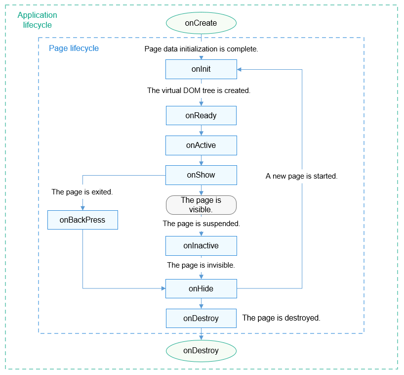

# Lifecycle

## Application Lifecycle

You can define the following application lifecycle functions in the  **app.js**  file.

<table><thead align="left"><tr id="row147612518471"><th class="cellrowborder" valign="top" width="21.052105210521052%" id="mcps1.1.5.1.1">
Attribute

</th>
<th class="cellrowborder" valign="top" width="18.421842184218423%" id="mcps1.1.5.1.2">
Type

</th>
<th class="cellrowborder" valign="top" width="21.052105210521052%" id="mcps1.1.5.1.3">
Description

</th>
<th class="cellrowborder" valign="top" width="39.473947394739476%" id="mcps1.1.5.1.4">
Called When

</th>
</tr>
</thead>
<tbody><tr id="row12761165124716"><td class="cellrowborder" valign="top" width="21.052105210521052%" headers="mcps1.1.5.1.1 ">
onCreate

</td>
<td class="cellrowborder" valign="top" width="18.421842184218423%" headers="mcps1.1.5.1.2 ">
() =&gt; void

</td>
<td class="cellrowborder" valign="top" width="21.052105210521052%" headers="mcps1.1.5.1.3 ">
Listens for application creation.

</td>
<td class="cellrowborder" valign="top" width="39.473947394739476%" headers="mcps1.1.5.1.4 ">
The application is created.

</td>
</tr>
<tr id="row846314312512"><td class="cellrowborder" valign="top" width="21.052105210521052%" headers="mcps1.1.5.1.1 ">
onShow6+

</td>
<td class="cellrowborder" valign="top" width="18.421842184218423%" headers="mcps1.1.5.1.2 ">
() =&gt; void

</td>
<td class="cellrowborder" valign="top" width="21.052105210521052%" headers="mcps1.1.5.1.3 ">
Listens for whether the application is running in the foreground.

</td>
<td class="cellrowborder" valign="top" width="39.473947394739476%" headers="mcps1.1.5.1.4 ">
The application is running in the foreground.

</td>
</tr>
<tr id="row2035233945117"><td class="cellrowborder" valign="top" width="21.052105210521052%" headers="mcps1.1.5.1.1 ">
onHide6+

</td>
<td class="cellrowborder" valign="top" width="18.421842184218423%" headers="mcps1.1.5.1.2 ">
() =&gt; void

</td>
<td class="cellrowborder" valign="top" width="21.052105210521052%" headers="mcps1.1.5.1.3 ">
Listens for whether the application is running in the background.

</td>
<td class="cellrowborder" valign="top" width="39.473947394739476%" headers="mcps1.1.5.1.4 ">
The application is running in the background.

</td>
</tr>
<tr id="row7762751174719"><td class="cellrowborder" valign="top" width="21.052105210521052%" headers="mcps1.1.5.1.1 ">
onDestroy

</td>
<td class="cellrowborder" valign="top" width="18.421842184218423%" headers="mcps1.1.5.1.2 ">
() =&gt; void

</td>
<td class="cellrowborder" valign="top" width="21.052105210521052%" headers="mcps1.1.5.1.3 ">
Listens for application uninstallation.

</td>
<td class="cellrowborder" valign="top" width="39.473947394739476%" headers="mcps1.1.5.1.4 ">
The application exits.

</td>
</tr>
</tbody>
</table>

## Page Lifecycle

You can define the following page lifecycle functions in the  **.js**  file of the page.

<table><thead align="left"><tr id="row320574954820"><th class="cellrowborder" valign="top" width="22.12%" id="mcps1.1.5.1.1">
Attribute

</th>
<th class="cellrowborder" valign="top" width="23.05%" id="mcps1.1.5.1.2">
Type

</th>
<th class="cellrowborder" valign="top" width="17.23%" id="mcps1.1.5.1.3">
Description

</th>
<th class="cellrowborder" valign="top" width="37.6%" id="mcps1.1.5.1.4">
Called When

</th>
</tr>
</thead>
<tbody><tr id="row120616499486"><td class="cellrowborder" valign="top" width="22.12%" headers="mcps1.1.5.1.1 ">
onInit

</td>
<td class="cellrowborder" valign="top" width="23.05%" headers="mcps1.1.5.1.2 ">
() =&gt; void

</td>
<td class="cellrowborder" valign="top" width="17.23%" headers="mcps1.1.5.1.3 ">
Listens for page initialization.

</td>
<td class="cellrowborder" valign="top" width="37.6%" headers="mcps1.1.5.1.4 ">
Page initialization is complete. This function is called only once in the page lifecycle.

</td>
</tr>
<tr id="row920612490483"><td class="cellrowborder" valign="top" width="22.12%" headers="mcps1.1.5.1.1 ">
onReady

</td>
<td class="cellrowborder" valign="top" width="23.05%" headers="mcps1.1.5.1.2 ">
() =&gt; void

</td>
<td class="cellrowborder" valign="top" width="17.23%" headers="mcps1.1.5.1.3 ">
Listens for page creation.

</td>
<td class="cellrowborder" valign="top" width="37.6%" headers="mcps1.1.5.1.4 ">
A page is created. This function is called only once in the page lifecycle.

</td>
</tr>
<tr id="row920615493488"><td class="cellrowborder" valign="top" width="22.12%" headers="mcps1.1.5.1.1 ">
onShow

</td>
<td class="cellrowborder" valign="top" width="23.05%" headers="mcps1.1.5.1.2 ">
() =&gt; void

</td>
<td class="cellrowborder" valign="top" width="17.23%" headers="mcps1.1.5.1.3 ">
Listens for page display.

</td>
<td class="cellrowborder" valign="top" width="37.6%" headers="mcps1.1.5.1.4 ">
The page is displayed.

</td>
</tr>
<tr id="row14207184919481"><td class="cellrowborder" valign="top" width="22.12%" headers="mcps1.1.5.1.1 ">
onHide

</td>
<td class="cellrowborder" valign="top" width="23.05%" headers="mcps1.1.5.1.2 ">
() =&gt; void

</td>
<td class="cellrowborder" valign="top" width="17.23%" headers="mcps1.1.5.1.3 ">
Listens for page disappearance.

</td>
<td class="cellrowborder" valign="top" width="37.6%" headers="mcps1.1.5.1.4 ">
The page disappears.

</td>
</tr>
<tr id="row11207194916482"><td class="cellrowborder" valign="top" width="22.12%" headers="mcps1.1.5.1.1 ">
onDestroy

</td>
<td class="cellrowborder" valign="top" width="23.05%" headers="mcps1.1.5.1.2 ">
() =&gt; void

</td>
<td class="cellrowborder" valign="top" width="17.23%" headers="mcps1.1.5.1.3 ">
Listens for page destruction.

</td>
<td class="cellrowborder" valign="top" width="37.6%" headers="mcps1.1.5.1.4 ">
The page is destroyed.

</td>
</tr>
<tr id="row192082496486"><td class="cellrowborder" valign="top" width="22.12%" headers="mcps1.1.5.1.1 ">
onBackPress

</td>
<td class="cellrowborder" valign="top" width="23.05%" headers="mcps1.1.5.1.2 ">
() =&gt; boolean

</td>
<td class="cellrowborder" valign="top" width="17.23%" headers="mcps1.1.5.1.3 ">
Listens for the back button action.

</td>
<td class="cellrowborder" valign="top" width="37.6%" headers="mcps1.1.5.1.4 ">
The back button is touched.

<ul id="ul02081949144816"><li><strong id="b1355813548581">true</strong> means that the page processes the return logic.</li><li><strong id="b163335813598">false</strong> means that the default return logic is used.</li><li>If no value is returned, the default return logic is used.</li></ul>
</td>
</tr>
<tr id="row8208174916489"><td class="cellrowborder" valign="top" width="22.12%" headers="mcps1.1.5.1.1 ">
onActive()5+

</td>
<td class="cellrowborder" valign="top" width="23.05%" headers="mcps1.1.5.1.2 ">
() =&gt; void

</td>
<td class="cellrowborder" valign="top" width="17.23%" headers="mcps1.1.5.1.3 ">
Listens for page activation.

</td>
<td class="cellrowborder" valign="top" width="37.6%" headers="mcps1.1.5.1.4 ">
The page is activated.

</td>
</tr>
<tr id="row92091549174812"><td class="cellrowborder" valign="top" width="22.12%" headers="mcps1.1.5.1.1 ">
onInactive()5+

</td>
<td class="cellrowborder" valign="top" width="23.05%" headers="mcps1.1.5.1.2 ">
() =&gt; void

</td>
<td class="cellrowborder" valign="top" width="17.23%" headers="mcps1.1.5.1.3 ">
Listens for page suspension.

</td>
<td class="cellrowborder" valign="top" width="37.6%" headers="mcps1.1.5.1.4 ">
The page is suspended.

</td>
</tr>
<tr id="row020918491481"><td class="cellrowborder" valign="top" width="22.12%" headers="mcps1.1.5.1.1 ">
onNewRequest()5+

</td>
<td class="cellrowborder" valign="top" width="23.05%" headers="mcps1.1.5.1.2 ">
() =&gt; void

</td>
<td class="cellrowborder" valign="top" width="17.23%" headers="mcps1.1.5.1.3 ">
Listens for a new FA request.

</td>
<td class="cellrowborder" valign="top" width="37.6%" headers="mcps1.1.5.1.4 ">
The FA has been started and a new request is received.

</td>
</tr>
</tbody>
</table>

The lifecycle functions of page A are called in the following sequence:

-   Open page A: onInit\(\) -\> onReady\(\) -\> onShow\(\)
-   Open page B on page A: onHide\(\)
-   Go back to page A from page B: onShow\(\)
-   Exit page A: onBackPress\(\) -\> onHide\(\) -\> onDestroy\(\)
-   Hide page A: onInactive\(\) -\> onHide\(\)
-   Show background page A on the foreground: onShow\(\) -\> onActive\(\)

