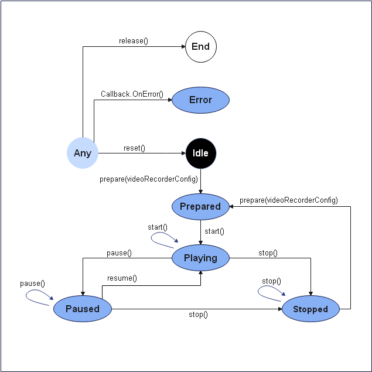

# Video Recording Development

## When to Use

During video recording, audio and video signals are captured, encoded, and saved to files. You can specify parameters such as the encoding format, encapsulation format, and file path for video recording.

**Figure 1** Video recording state transition




**Figure 2** Layer 0 diagram of video recording


## How to Develop

For details about the APIs used for video recording, see [js-apis-media.md](../reference/apis/js-apis-media.md).

### Full-Process Scenario

The full video recording process includes creating an instance, setting recording parameters, recording video, pausing, resuming, and stopping recording, and releasing resources.

```js
let videoProfile = {
    audioBitrate : 48000,
    audioChannels : 2,
    audioCodec : 'audio/mp4a-latm',
    audioSampleRate : 48000,
    fileFormat : 'mp4',
    videoBitrate : 48000,
    videoCodec : 'video/mp4v-es',
    videoFrameWidth : 640,
    videoFrameHeight : 480,
    videoFrameRate : 30
}

let videoConfig = {
    audioSourceType : 1,
    videoSourceType : 0,
    profile : videoProfile,
    url : 'file:///data/media/01.mp4',
    orientationHint : 0,
    location : { latitude : 30, longitude : 130 },
}
	
// Error callback triggered in the case of an error
function failureCallback(error) {
    console.info('error happened, error name is ' + error.name);
    console.info('error happened, error code is ' + error.code);
    console.info('error happened, error message is ' + error.message);
}
	
// Error callback triggered in the case of an exception
function catchCallback(error) {
    console.info('catch error happened, error name is ' + error.name);
    console.info('catch error happened, error code is ' + error.code);
    console.info('catch error happened, error message is ' + error.message);
}
	
let videoRecorder = null; // videoRecorder is an empty object and assigned with a value after createVideoRecorder is successfully called.
let surfaceID = null; // Used to save the surface ID returned by getInputSurface.
// Create a VideoRecorder object.
await media.createVideoRecorder().then((recorder) => {
    console.info('case createVideoRecorder called');
    if (typeof (recorder) != 'undefined') {
        videoRecorder = recorder;
        console.info('createVideoRecorder success');
    } else {
        console.info('createVideoRecorder failed');
    }
}, failureCallback).catch(catchCallback);

// Obtain the surface ID, save it, and pass it to camera-related interfaces.
await videoRecorder.getInputSurface().then((surface) => {
    console.info('getInputSurface success');
    surfaceID = surface;
}, failureCallback).catch(catchCallback);
	
// Video recording depends on camera-related interfaces. The following operations can be performed only after the video output start interface is invoked.

// Start video recording.
await videoRecorder.start().then(() => {
    console.info('start success');
}, failureCallback).catch(catchCallback);

// Pause video playback before the video output stop interface is invoked.
await videoRecorder.pause().then(() => {
    console.info('pause success');
}, failureCallback).catch(catchCallback);

// Resume video playback after the video output start interface is invoked.
await videoRecorder.resume().then(() => {
    console.info('resume success');
}, failureCallback).catch(catchCallback);

// Stop video recording after the video output stop interface is invoked.
await videoRecorder.stop().then(() => {
    console.info('stop success');
}, failureCallback).catch(catchCallback);

// Reset the recording configuration.
await videoRecorder.reset().then(() => {
    console.info('reset success');
}, failureCallback).catch(catchCallback);

// Release the video recording resources and camera object resources.
await videoRecorder.release().then(() => {
    console.info('release success');
}, failureCallback).catch(catchCallback);

// Set the related object to null.
videoRecorder = null;
surfaceID = null;
```
