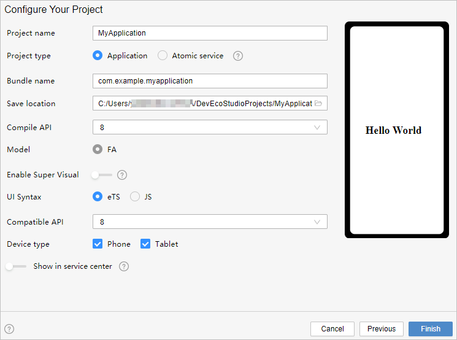
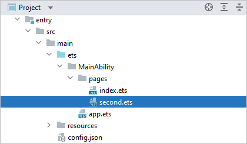
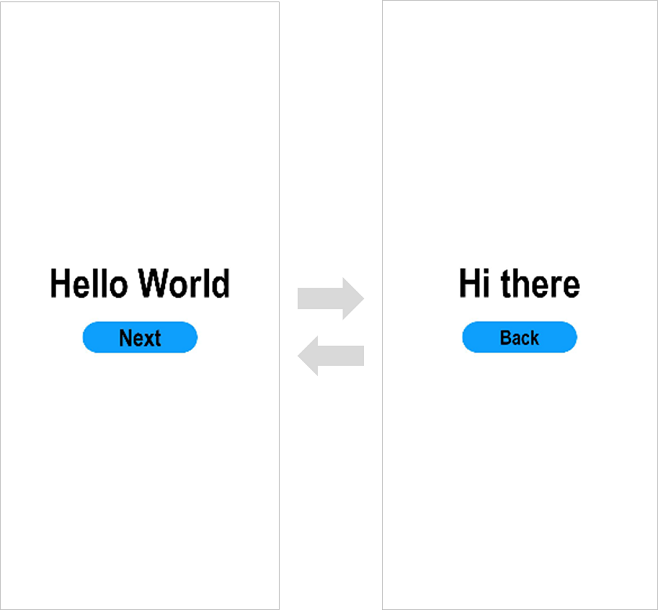

# Getting Started with eTS in the Traditional Coding Approach

>  **Note：**
> To use eTS, your DevEco Studio must be V3.0.0.601 Beta1 or later.
> 
> For best possible results, use [DevEco Studio V3.0.0.900 Beta3](https://developer.harmonyos.com/cn/develop/deveco-studio#download_beta_openharmony) for your development.


## Creating an eTS Project

1. Open DevEco Studio, choose **File** &gt; **New** &gt; **Create Project**, select **Empty Ability**, and click **Next**.

   

2. On the project configuration page, set **UI Syntax** to **eTS** and retain the default values for other parameters.

   

3. Click **Finish**. DevEco Studio will automatically generate the sample code and resources that match your project type. Wait until the project is created.


## eTS Project Files

- **entry** : OpenHarmony project module, which can be built into an ability package (HAP).
  - **src &gt; main &gt; ets** : a collection of eTS source code.
  - **src &gt; main &gt; ets &gt; MainAbility** : entry to your application/service.
  - **src &gt; main &gt; ets &gt; MainAbility &gt; pages** : pages contained in **MainAbility**.
  - **src &gt; main &gt; ets &gt; MainAbility &gt; app.ets** : ability lifecycle file.
  - **src &gt; main &gt; resources** : a collection of resource files used by your application/service, such as graphics, multimedia, character strings, and layout files.
  - **src &gt; main &gt; config.json** : module configuration file. This file describes the global configuration information of the application/service, the device-specific configuration information, and the configuration information of the HAP file.
  - **build-profile.json5** : module information and build configuration options, including **buildOption target**.
  - **hvigorfile.js** : module-level compilation and build task script. You can customize related tasks and code implementation.
- **build-profile.json5** : application-level configuration information, including the signature and product configuration.
- **hvigorfile.js** : application-level compilation and build task script.


## Building the First Page

1. Use the **Text** component.
   After the project synchronization is complete, choose **entry** &gt; **src** &gt; **main** &gt; **ets** &gt; **MainAbility** &gt; **pages** in the **Project** window and open the **index.ets** file. You can see that the file contains a **&lt;Text&gt;** component. The sample code in the **index.ets** file is shown below:

   
   ```ts
   @Entry
   @Component
   struct Index {
     @State message: string = 'Hello World'
   
     build() {
       Row() {
         Column() {
           Text(this.message)
             .fontSize(50)
             .fontWeight(FontWeight.Bold)
         }
         .width('100%')
       }
       .height('100%')
     }
   }
   ```

2. Add a **&lt;Button&gt;** component.
   On the default page, add a **&lt;Button&gt;** component to accept user clicks and implement redirection to another page. The sample code in the **index.ets** file is shown below:

   
   ```ts
   @Entry
   @Component
   struct Index {
     @State message: string = 'Hello World'
   
     build() {
       Row() {
         Column() {
           Text(this.message)
             .fontSize(50)
             .fontWeight(FontWeight.Bold)
           // Add a button to accept user clicks.
           Button() {
             Text('Next')
               .fontSize(30)
               .fontWeight(FontWeight.Bold)
           }
           .type(ButtonType.Capsule)
           .margin({
             top: 20
           })
           .backgroundColor('#0D9FFB')
           .width('40%')
           .height('5%')
         }
         .width('100%')
       }
       .height('100%')
     }
   }
   ```

3. On the toolbar in the upper right corner of the editing window, click **Previewer** to open the Previewer. Below is how the first page looks on the Previewer.
   
   


## Building the Second Page

1. Create the second page.
   In the **Project** window, choose **entry** &gt; **src** &gt; **main** &gt; **ets** &gt; **MainAbility**, right-click the **pages** folder, choose **New** &gt; **Page**, name the page **second**, and click **Finish**. Below is the structure of the **pages** folder:

   

2. Add **&lt;Text&gt;** and **&lt;Button&gt;** components.
   Add **&lt;Text&gt;** and **&lt;Button&gt;** components and set their styles, as you do for the first page. The sample code in the **second.ets** file is shown below:

   
   ```ts
   @Entry
   @Component
   struct Second {
     @State message: string = 'Hi there'
   
     build() {
       Row() {
         Column() {
           Text(this.message)
             .fontSize(50)
             .fontWeight(FontWeight.Bold)
           Button() {
             Text('Back')
               .fontSize(25)
               .fontWeight(FontWeight.Bold)
           }
           .type(ButtonType.Capsule)
           .margin({
             top: 20
           })
           .backgroundColor('#0D9FFB')
           .width('40%')
           .height('5%')
         }
         .width('100%')
       }
       .height('100%')
     }
   }
   ```


## Implementing Page Redirection

You can implement page redirection through the page router, which finds the target page based on the page URI. Import the **router** module and then perform the steps below:

1. Implement redirection from the first page to the second page.
   In the **index.ets** file of the first page, bind the **onClick** event to the **Next** button so that clicking the button redirects the user to the second page. The sample code in the **index.ets** file is shown below:

   
   ```ts
   import router from '@ohos.router';
   
   @Entry
   @Component
   struct Index {
     @State message: string = 'Hello World'
   
     build() {
       Row() {
         Column() {
           Text(this.message)
             .fontSize(50)
             .fontWeight(FontWeight.Bold)
           // Add a button to accept user clicks.
           Button() {
             Text('Next')
               .fontSize(30)
               .fontWeight(FontWeight.Bold)
           }
           .type(ButtonType.Capsule)
           .margin({
             top: 20
           })
           .backgroundColor('#0D9FFB')
           .width('40%')
           .height('5%')
           // Bind the onClick event to the Next button so that clicking the button redirects the user to the second page.
           .onClick(() => {
             router.push({ url: 'pages/second' })
           })
         }
         .width('100%')
       }
       .height('100%')
     }
   }
   ```

2. Implement redirection from the second page to the first page.
   In the **second.ets** file of the second page, bind the **onClick** event to the **Back** button so that clicking the button redirects the user back to the first page. The sample code in the **second.ets** file is shown below:

   
   ```ts
   import router from '@ohos.router';
   
   @Entry
   @Component
   struct Second {
     @State message: string = 'Hi there'
   
     build() {
       Row() {
         Column() {
           Text(this.message)
             .fontSize(50)
             .fontWeight(FontWeight.Bold)
           Button() {
             Text('Back')
               .fontSize(25)
               .fontWeight(FontWeight.Bold)
           }
           .type(ButtonType.Capsule)
           .margin({
             top: 20
           })
           .backgroundColor('#0D9FFB')
           .width('40%')
           .height('5%')
           // Bind the onClick event to the Back button so that clicking the button redirects the user back to the first page.
           .onClick(() => {
             router.back()
           })
         }
         .width('100%')
       }
       .height('100%')
     }
   }
   ```

3. Open the **index.ets** file and click  in the Previewer to refresh the file. The figure below shows the effect.

   


## Running the Application on a Real Device

1. Connect the development board running the OpenHarmony standard system to the computer.

2. Choose **File** &gt; **Project Structure** &gt; **Project** &gt; **Signing Configs**, select **Automatically generate signing**, wait until the automatic signing is complete, and click **OK**, as shown below.

   

3. On the toolbar in the upper right corner of the editing window, click . The display effect is shown in the figure below.

   

Congratulations! You have finished developing your OpenHarmony application in eTS in the traditional coding approach. To learn more about OpenHarmony, see [OpenHarmony Overview](../application-dev-guide.md)
