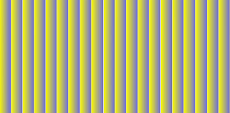

# Gradient Styles<a name="EN-US_TOPIC_0000001127284866"></a>

Gradient styles are commonly supported and can be set in the  **style**  attribute or a  **.css**  file. Gradients enable smooth transition between two or more specified colors.

This framework supports two gradient styles: linear gradient and repeating linear gradient.

## Linear Gradient/Repeating Linear Gradient<a name="s9fb0b2412d2843e4b06e05acc39dc394"></a>

To use the gradient style, you need to specify the transition direction and transition color.

1.  Transition direction: specified by  **direction**  or  **angle**.

    -   **direction**: gradient by direction
    -   **angle**: gradient by angle

    ```
    background: linear-gradient(direction/angle, color, color, ...);
    background: repeating-linear-gradient(direction/angle, color, color, ...);
    ```

2.  Transition color: \#ff0000, \#ffff0000, rgb \(255, 0, 0\), and rgba \(255, 0, 0, 1\). At least two colors must be specified.

-   Parameter

    <a name="tbec24098117142bc8e59e180f6a2cbed"></a>
    <table><thead align="left"><tr id="r74a4b97fb46b429ab94909799d5aa057"><th class="cellrowborder" valign="top" width="13.13131313131313%" id="mcps1.1.6.1.1"><p id="a7a35c17dc8684775a8d4ce9fa2498b53"><a name="a7a35c17dc8684775a8d4ce9fa2498b53"></a><a name="a7a35c17dc8684775a8d4ce9fa2498b53"></a>Name</p>
    </th>
    <th class="cellrowborder" valign="top" width="29.292929292929294%" id="mcps1.1.6.1.2"><p id="ae1621e9d7be54b608b04d6e59e386fa8"><a name="ae1621e9d7be54b608b04d6e59e386fa8"></a><a name="ae1621e9d7be54b608b04d6e59e386fa8"></a>Type</p>
    </th>
    <th class="cellrowborder" valign="top" width="14.14141414141414%" id="mcps1.1.6.1.3"><p id="a58edb9b081d74f8aaeecee41af5f8a11"><a name="a58edb9b081d74f8aaeecee41af5f8a11"></a><a name="a58edb9b081d74f8aaeecee41af5f8a11"></a>Default Value</p>
    </th>
    <th class="cellrowborder" valign="top" width="9.09090909090909%" id="mcps1.1.6.1.4"><p id="a69d42c9602a0464eb484093c6cb89261"><a name="a69d42c9602a0464eb484093c6cb89261"></a><a name="a69d42c9602a0464eb484093c6cb89261"></a>Mandatory</p>
    </th>
    <th class="cellrowborder" valign="top" width="34.34343434343434%" id="mcps1.1.6.1.5"><p id="a55bc093362f04d8dbcb4343d3e80f940"><a name="a55bc093362f04d8dbcb4343d3e80f940"></a><a name="a55bc093362f04d8dbcb4343d3e80f940"></a>Description</p>
    </th>
    </tr>
    </thead>
    <tbody><tr id="rdbe9ecbd3a3442b48d39860444d96cf8"><td class="cellrowborder" valign="top" width="13.13131313131313%" headers="mcps1.1.6.1.1 "><p id="a963cbdb8589b42b785dd1fa4892839bb"><a name="a963cbdb8589b42b785dd1fa4892839bb"></a><a name="a963cbdb8589b42b785dd1fa4892839bb"></a>direction</p>
    </td>
    <td class="cellrowborder" valign="top" width="29.292929292929294%" headers="mcps1.1.6.1.2 "><p id="ab54d4ccb681c46f7bcc4e5d702fc8b30"><a name="ab54d4ccb681c46f7bcc4e5d702fc8b30"></a><a name="ab54d4ccb681c46f7bcc4e5d702fc8b30"></a>to &lt;side-or-corner&gt;  &lt;side-or-corner&gt; = [left | right] || [top | bottom]</p>
    </td>
    <td class="cellrowborder" valign="top" width="14.14141414141414%" headers="mcps1.1.6.1.3 "><p id="a52342ab36286439b89baabf1b7a0096f"><a name="a52342ab36286439b89baabf1b7a0096f"></a><a name="a52342ab36286439b89baabf1b7a0096f"></a>to bottom (gradient from top to bottom)</p>
    </td>
    <td class="cellrowborder" valign="top" width="9.09090909090909%" headers="mcps1.1.6.1.4 "><p id="a92b9128925dc4acdbef5bfaf6af1b93d"><a name="a92b9128925dc4acdbef5bfaf6af1b93d"></a><a name="a92b9128925dc4acdbef5bfaf6af1b93d"></a>No</p>
    </td>
    <td class="cellrowborder" valign="top" width="34.34343434343434%" headers="mcps1.1.6.1.5 "><p id="a1351d071b6d54f7084bdc7e4f15c7e72"><a name="a1351d071b6d54f7084bdc7e4f15c7e72"></a><a name="a1351d071b6d54f7084bdc7e4f15c7e72"></a>Transition direction. For example, <strong id="b9784809451"><a name="b9784809451"></a><a name="b9784809451"></a>to right</strong> (gradient from left to right) or</p>
    <p id="a8146911b819748f0890e86cdf0fecc20"><a name="a8146911b819748f0890e86cdf0fecc20"></a><a name="a8146911b819748f0890e86cdf0fecc20"></a><strong id="b144311914164519"><a name="b144311914164519"></a><a name="b144311914164519"></a>to bottom right</strong> (from the top left to the bottom right).</p>
    </td>
    </tr>
    <tr id="r6cdda990326c445283ef0188ad38a764"><td class="cellrowborder" valign="top" width="13.13131313131313%" headers="mcps1.1.6.1.1 "><p id="ada09dad6eade41edaa02a6a85e32b884"><a name="ada09dad6eade41edaa02a6a85e32b884"></a><a name="ada09dad6eade41edaa02a6a85e32b884"></a>angle</p>
    </td>
    <td class="cellrowborder" valign="top" width="29.292929292929294%" headers="mcps1.1.6.1.2 "><p id="ad9728bbfb4304c148051212f59c32096"><a name="ad9728bbfb4304c148051212f59c32096"></a><a name="ad9728bbfb4304c148051212f59c32096"></a>&lt;deg&gt;</p>
    </td>
    <td class="cellrowborder" valign="top" width="14.14141414141414%" headers="mcps1.1.6.1.3 "><p id="ac59bbfd4b50c44e8be93a9c8fb1039d0"><a name="ac59bbfd4b50c44e8be93a9c8fb1039d0"></a><a name="ac59bbfd4b50c44e8be93a9c8fb1039d0"></a>180deg</p>
    </td>
    <td class="cellrowborder" valign="top" width="9.09090909090909%" headers="mcps1.1.6.1.4 "><p id="ae6853c652f2c414b8b2eee535d838115"><a name="ae6853c652f2c414b8b2eee535d838115"></a><a name="ae6853c652f2c414b8b2eee535d838115"></a>No</p>
    </td>
    <td class="cellrowborder" valign="top" width="34.34343434343434%" headers="mcps1.1.6.1.5 "><p id="a88b591f082704070b5b802aa11442816"><a name="a88b591f082704070b5b802aa11442816"></a><a name="a88b591f082704070b5b802aa11442816"></a>Transition direction. Angle between the gradient line and the y-axis (in the clockwise direction), with the geometric center of the element being the origin of coordinates and the horizontal axis being the x-axis.</p>
    </td>
    </tr>
    <tr id="r5f48e6c55e0c44b7adb0bb77eb12ce04"><td class="cellrowborder" valign="top" width="13.13131313131313%" headers="mcps1.1.6.1.1 "><p id="a8aba9a5fa61b4a9ab6eaaa0b840cd463"><a name="a8aba9a5fa61b4a9ab6eaaa0b840cd463"></a><a name="a8aba9a5fa61b4a9ab6eaaa0b840cd463"></a>color</p>
    </td>
    <td class="cellrowborder" valign="top" width="29.292929292929294%" headers="mcps1.1.6.1.2 "><p id="a1402dc10b0c940b799d3330682496908"><a name="a1402dc10b0c940b799d3330682496908"></a><a name="a1402dc10b0c940b799d3330682496908"></a>&lt;color&gt; [&lt;length&gt;|&lt;percentage&gt;]</p>
    </td>
    <td class="cellrowborder" valign="top" width="14.14141414141414%" headers="mcps1.1.6.1.3 "><p id="a630e796e57164b71aa934fc8bcc87455"><a name="a630e796e57164b71aa934fc8bcc87455"></a><a name="a630e796e57164b71aa934fc8bcc87455"></a>-</p>
    </td>
    <td class="cellrowborder" valign="top" width="9.09090909090909%" headers="mcps1.1.6.1.4 "><p id="a81076bc36e3c4674b5186aee26a0ae73"><a name="a81076bc36e3c4674b5186aee26a0ae73"></a><a name="a81076bc36e3c4674b5186aee26a0ae73"></a>Yes</p>
    </td>
    <td class="cellrowborder" valign="top" width="34.34343434343434%" headers="mcps1.1.6.1.5 "><p id="a36325f0de58d4db6bf1c35678a0d8e70"><a name="a36325f0de58d4db6bf1c35678a0d8e70"></a><a name="a36325f0de58d4db6bf1c35678a0d8e70"></a>Colors among which smooth transitions are rendered.</p>
    </td>
    </tr>
    </tbody>
    </table>

-   Example:

    ```
    #gradient {
      height: 300px;
      width: 600px;
    }
    ```

    **Figure  1**  Gradient from top to bottom \(default\)<a name="fd4af6346567d40febe33cb89b27cb797"></a>  
    .png "gradient-from-top-to-bottom-(default)")

    ```
    /* Gradient starts from red at the top to green at the bottom. */
    background: linear-gradient(red, #00ff00);
    ```

    **Figure  2**  Gradient at an angle of 45°<a name="f2d14c573ff20422fa206c381b7e50a56"></a>  
    

    ```
    /* Gradient at an angle of 45°, changing from red to green */
    background: linear-gradient(45deg, rgb(255,0,0),rgb(0, 255, 0));
    ```

    **Figure  3**  Gradient from left to right<a name="fdd5bac2f37d14ab6b9dd68cdc40df08c"></a>  
    

    ```
    /* Gradient from left to right, which is available in the 270 px width between the left 90 px and the left 360 px (600*0.6) */
    background: linear-gradient(to right, rgb(255,0,0) 90px, rgb(0, 255, 0) 60%);
    ```

    **Figure  4**  Repeating gradient from left to right<a name="fb33af9507d004041ba9394434e73a7c9"></a>  
    

    ```
    /* Repeating gradient from left to right, the area of which is 30 px (60-30) and the transparency is 0.5 */
    background: repeating-linear-gradient(to right, rgba(255, 255, 0, 1) 30px,rgba(0, 0, 255, .5) 60px);
    ```


