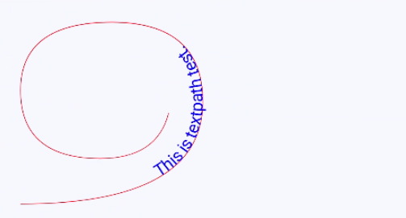
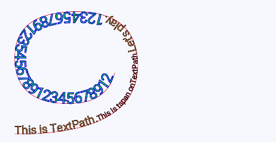
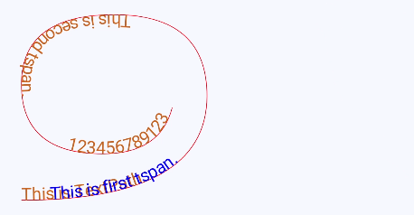
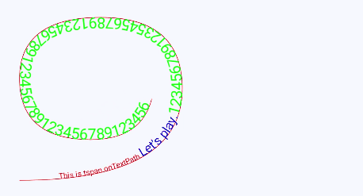
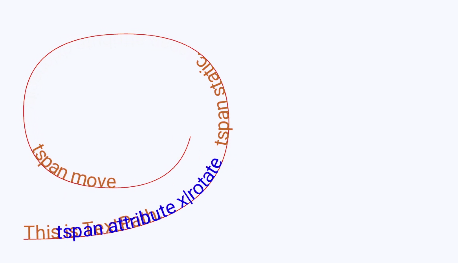
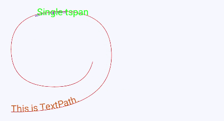

# textPath<a name="EN-US_TOPIC_0000001127284818"></a>

The  **<textPath\>**  component is used to draw text along the path.

> **NOTE:** 
>-   This component is supported since API version 7. Updates will be marked with a superscript to indicate their earliest API version.
>-   Draws text based on the specified path. The  **tspan**  child component can be nested for segmenting.
>-   **<textPath\>**  can be nested only by the parent element label  **svg**.

## Required Permissions<a name="section11257113618419"></a>

None

## Child Components<a name="section9288143101012"></a>

**tspan**  is supported.

## Attributes<a name="section2907183951110"></a>

The attributes in the following table are supported.

<a name="table20633101642315"></a>
<table><thead align="left"><tr id="row663331618238"><th class="cellrowborder" valign="top" width="23.119999999999997%" id="mcps1.1.6.1.1"><p id="aaf1247770b244944bbcc9f28d9a6f00b"><a name="aaf1247770b244944bbcc9f28d9a6f00b"></a><a name="aaf1247770b244944bbcc9f28d9a6f00b"></a>Name</p>
</th>
<th class="cellrowborder" valign="top" width="23.119999999999997%" id="mcps1.1.6.1.2"><p id="a6efc3502761f4faf9630e484280f75b6"><a name="a6efc3502761f4faf9630e484280f75b6"></a><a name="a6efc3502761f4faf9630e484280f75b6"></a>Type</p>
</th>
<th class="cellrowborder" valign="top" width="10.48%" id="mcps1.1.6.1.3"><p id="a27a37273d9ad47569ddbcb8db985d302"><a name="a27a37273d9ad47569ddbcb8db985d302"></a><a name="a27a37273d9ad47569ddbcb8db985d302"></a>Default Value</p>
</th>
<th class="cellrowborder" valign="top" width="7.5200000000000005%" id="mcps1.1.6.1.4"><p id="p824610360217"><a name="p824610360217"></a><a name="p824610360217"></a>Mandatory</p>
</th>
<th class="cellrowborder" valign="top" width="35.76%" id="mcps1.1.6.1.5"><p id="a2ff3361bfd3b420ba4967452d2ddd098"><a name="a2ff3361bfd3b420ba4967452d2ddd098"></a><a name="a2ff3361bfd3b420ba4967452d2ddd098"></a>Description</p>
</th>
</tr>
</thead>
<tbody><tr id="row36332165231"><td class="cellrowborder" valign="top" width="23.119999999999997%" headers="mcps1.1.6.1.1 "><p id="a83b6dd280109466fb015e64de1ef4df3"><a name="a83b6dd280109466fb015e64de1ef4df3"></a><a name="a83b6dd280109466fb015e64de1ef4df3"></a>id</p>
</td>
<td class="cellrowborder" valign="top" width="23.119999999999997%" headers="mcps1.1.6.1.2 "><p id="abc38fa2b85854bc687af75eb17a00a4d"><a name="abc38fa2b85854bc687af75eb17a00a4d"></a><a name="abc38fa2b85854bc687af75eb17a00a4d"></a>string</p>
</td>
<td class="cellrowborder" valign="top" width="10.48%" headers="mcps1.1.6.1.3 "><p id="a8d12e4af905d4743a5ec9cd6018d2972"><a name="a8d12e4af905d4743a5ec9cd6018d2972"></a><a name="a8d12e4af905d4743a5ec9cd6018d2972"></a>-</p>
</td>
<td class="cellrowborder" valign="top" width="7.5200000000000005%" headers="mcps1.1.6.1.4 "><p id="p42461736102118"><a name="p42461736102118"></a><a name="p42461736102118"></a>No</p>
</td>
<td class="cellrowborder" valign="top" width="35.76%" headers="mcps1.1.6.1.5 "><p id="a1a1731af05554f119fa365748f276bb2"><a name="a1a1731af05554f119fa365748f276bb2"></a><a name="a1a1731af05554f119fa365748f276bb2"></a>Unique ID of the component.</p>
</td>
</tr>
<tr id="row1634171618236"><td class="cellrowborder" valign="top" width="23.119999999999997%" headers="mcps1.1.6.1.1 "><p id="a3cf785e2a2a043268d168f58d59207c8"><a name="a3cf785e2a2a043268d168f58d59207c8"></a><a name="a3cf785e2a2a043268d168f58d59207c8"></a>path</p>
</td>
<td class="cellrowborder" valign="top" width="23.119999999999997%" headers="mcps1.1.6.1.2 "><p id="aa9b258d23e1e425dbc2ffe8edbc91a42"><a name="aa9b258d23e1e425dbc2ffe8edbc91a42"></a><a name="aa9b258d23e1e425dbc2ffe8edbc91a42"></a>string</p>
</td>
<td class="cellrowborder" valign="top" width="10.48%" headers="mcps1.1.6.1.3 "><p id="ac312df4f14444c98955ed055456848a7"><a name="ac312df4f14444c98955ed055456848a7"></a><a name="ac312df4f14444c98955ed055456848a7"></a>0</p>
</td>
<td class="cellrowborder" valign="top" width="7.5200000000000005%" headers="mcps1.1.6.1.4 "><p id="p1624612362219"><a name="p1624612362219"></a><a name="p1624612362219"></a>Yes</p>
</td>
<td class="cellrowborder" valign="top" width="35.76%" headers="mcps1.1.6.1.5 "><p id="adbe7ecbee96b4f938b04a4b8d62791bf"><a name="adbe7ecbee96b4f938b04a4b8d62791bf"></a><a name="adbe7ecbee96b4f938b04a4b8d62791bf"></a>Shape of the path.</p>
<p id="p46751932620"><a name="p46751932620"></a><a name="p46751932620"></a>The meanings of the letters are as follows:</p>
<a name="ul146753321226"></a><a name="ul146753321226"></a><ul id="ul146753321226"><li>M = moveto</li><li>L = lineto</li><li>H = horizontal lineto</li><li>V = vertical lineto</li><li>C = curveto</li><li>S = smooth curveto</li><li>Q = quadratic Belzier curve</li><li>T = smooth quadratic Belzier curveto</li><li>A = elliptical Arc</li><li>Z = closepath</li></ul>
</td>
</tr>
<tr id="row1259531661611"><td class="cellrowborder" valign="top" width="23.119999999999997%" headers="mcps1.1.6.1.1 "><p id="p1359601671613"><a name="p1359601671613"></a><a name="p1359601671613"></a>startOffset</p>
</td>
<td class="cellrowborder" valign="top" width="23.119999999999997%" headers="mcps1.1.6.1.2 "><p id="p65967163165"><a name="p65967163165"></a><a name="p65967163165"></a>&lt;length&gt;|&lt;percentage&gt;</p>
</td>
<td class="cellrowborder" valign="top" width="10.48%" headers="mcps1.1.6.1.3 "><p id="p10596151671610"><a name="p10596151671610"></a><a name="p10596151671610"></a>0</p>
</td>
<td class="cellrowborder" valign="top" width="7.5200000000000005%" headers="mcps1.1.6.1.4 "><p id="p1059610169169"><a name="p1059610169169"></a><a name="p1059610169169"></a>No</p>
</td>
<td class="cellrowborder" valign="top" width="35.76%" headers="mcps1.1.6.1.5 "><p id="p125961416161611"><a name="p125961416161611"></a><a name="p125961416161611"></a>Start offset of the text drawing along the path.</p>
</td>
</tr>
<tr id="row1539273652316"><td class="cellrowborder" valign="top" width="23.119999999999997%" headers="mcps1.1.6.1.1 "><p id="p136018399235"><a name="p136018399235"></a><a name="p136018399235"></a>font-size</p>
</td>
<td class="cellrowborder" valign="top" width="23.119999999999997%" headers="mcps1.1.6.1.2 "><p id="p2360123910236"><a name="p2360123910236"></a><a name="p2360123910236"></a>&lt;length&gt;</p>
</td>
<td class="cellrowborder" valign="top" width="10.48%" headers="mcps1.1.6.1.3 "><p id="p1536023952313"><a name="p1536023952313"></a><a name="p1536023952313"></a>30px</p>
</td>
<td class="cellrowborder" valign="top" width="7.5200000000000005%" headers="mcps1.1.6.1.4 "><p id="p123607393234"><a name="p123607393234"></a><a name="p123607393234"></a>No</p>
</td>
<td class="cellrowborder" valign="top" width="35.76%" headers="mcps1.1.6.1.5 "><p id="p1736083914232"><a name="p1736083914232"></a><a name="p1736083914232"></a>Font size.</p>
</td>
</tr>
<tr id="row1530844982318"><td class="cellrowborder" valign="top" width="23.119999999999997%" headers="mcps1.1.6.1.1 "><p id="p1161816329244"><a name="p1161816329244"></a><a name="p1161816329244"></a>fill</p>
</td>
<td class="cellrowborder" valign="top" width="23.119999999999997%" headers="mcps1.1.6.1.2 "><p id="p46187324247"><a name="p46187324247"></a><a name="p46187324247"></a>&lt;color&gt;</p>
</td>
<td class="cellrowborder" valign="top" width="10.48%" headers="mcps1.1.6.1.3 "><p id="p19618123262419"><a name="p19618123262419"></a><a name="p19618123262419"></a>black</p>
</td>
<td class="cellrowborder" valign="top" width="7.5200000000000005%" headers="mcps1.1.6.1.4 "><p id="p861833282418"><a name="p861833282418"></a><a name="p861833282418"></a>No</p>
</td>
<td class="cellrowborder" valign="top" width="35.76%" headers="mcps1.1.6.1.5 "><p id="p1661813321247"><a name="p1661813321247"></a><a name="p1661813321247"></a>Font fill color.</p>
</td>
</tr>
<tr id="row35122053818"><td class="cellrowborder" valign="top" width="23.119999999999997%" headers="mcps1.1.6.1.1 "><p id="p185135014381"><a name="p185135014381"></a><a name="p185135014381"></a>by</p>
</td>
<td class="cellrowborder" valign="top" width="23.119999999999997%" headers="mcps1.1.6.1.2 "><p id="p3513501388"><a name="p3513501388"></a><a name="p3513501388"></a>number</p>
</td>
<td class="cellrowborder" valign="top" width="10.48%" headers="mcps1.1.6.1.3 "><p id="p195135011386"><a name="p195135011386"></a><a name="p195135011386"></a>-</p>
</td>
<td class="cellrowborder" valign="top" width="7.5200000000000005%" headers="mcps1.1.6.1.4 "><p id="p13513190203818"><a name="p13513190203818"></a><a name="p13513190203818"></a>No</p>
</td>
<td class="cellrowborder" valign="top" width="35.76%" headers="mcps1.1.6.1.5 "><p id="p1551320143814"><a name="p1551320143814"></a><a name="p1551320143814"></a>Attribute offset relative to the specified animation. The default value of <strong id="b47896415258"><a name="b47896415258"></a><a name="b47896415258"></a>from</strong> is the original attribute value.</p>
</td>
</tr>
<tr id="row818611518331"><td class="cellrowborder" valign="top" width="23.119999999999997%" headers="mcps1.1.6.1.1 "><p id="a4a0bae0e1bb946d6bc7bf30e0a535343"><a name="a4a0bae0e1bb946d6bc7bf30e0a535343"></a><a name="a4a0bae0e1bb946d6bc7bf30e0a535343"></a>opacity</p>
</td>
<td class="cellrowborder" valign="top" width="23.119999999999997%" headers="mcps1.1.6.1.2 "><p id="a2679e4565dbc4370b40d1be831a6148d"><a name="a2679e4565dbc4370b40d1be831a6148d"></a><a name="a2679e4565dbc4370b40d1be831a6148d"></a>number</p>
</td>
<td class="cellrowborder" valign="top" width="10.48%" headers="mcps1.1.6.1.3 "><p id="a0b0d56a245e14779a5561f99cd1ce9f6"><a name="a0b0d56a245e14779a5561f99cd1ce9f6"></a><a name="a0b0d56a245e14779a5561f99cd1ce9f6"></a>1</p>
</td>
<td class="cellrowborder" valign="top" width="7.5200000000000005%" headers="mcps1.1.6.1.4 "><p id="p324614367213"><a name="p324614367213"></a><a name="p324614367213"></a>No</p>
</td>
<td class="cellrowborder" valign="top" width="35.76%" headers="mcps1.1.6.1.5 "><p id="aa0471c31e05e465aa9c42312b9ab9f6f"><a name="aa0471c31e05e465aa9c42312b9ab9f6f"></a><a name="aa0471c31e05e465aa9c42312b9ab9f6f"></a>Opacity of an element. The value ranges from <strong id="b79611410473"><a name="b79611410473"></a><a name="b79611410473"></a>0</strong> to <strong id="b129720146470"><a name="b129720146470"></a><a name="b129720146470"></a>1</strong>. The value <strong id="b998914144710"><a name="b998914144710"></a><a name="b998914144710"></a>1</strong> means opaque, and <strong id="b10991814184713"><a name="b10991814184713"></a><a name="b10991814184713"></a>0</strong> means completely transparent. Attribute animations are supported.</p>
</td>
</tr>
<tr id="row2924118202412"><td class="cellrowborder" valign="top" width="23.119999999999997%" headers="mcps1.1.6.1.1 "><p id="p196181832182412"><a name="p196181832182412"></a><a name="p196181832182412"></a>fill-opacity</p>
</td>
<td class="cellrowborder" valign="top" width="23.119999999999997%" headers="mcps1.1.6.1.2 "><p id="p86181832172411"><a name="p86181832172411"></a><a name="p86181832172411"></a>number</p>
</td>
<td class="cellrowborder" valign="top" width="10.48%" headers="mcps1.1.6.1.3 "><p id="p196181432132411"><a name="p196181432132411"></a><a name="p196181432132411"></a>1.0</p>
</td>
<td class="cellrowborder" valign="top" width="7.5200000000000005%" headers="mcps1.1.6.1.4 "><p id="p11618632132414"><a name="p11618632132414"></a><a name="p11618632132414"></a>No</p>
</td>
<td class="cellrowborder" valign="top" width="35.76%" headers="mcps1.1.6.1.5 "><p id="p8618113232414"><a name="p8618113232414"></a><a name="p8618113232414"></a>Font fill opacity.</p>
</td>
</tr>
<tr id="row2173171232411"><td class="cellrowborder" valign="top" width="23.119999999999997%" headers="mcps1.1.6.1.1 "><p id="p10618143213244"><a name="p10618143213244"></a><a name="p10618143213244"></a>stroke</p>
</td>
<td class="cellrowborder" valign="top" width="23.119999999999997%" headers="mcps1.1.6.1.2 "><p id="p8618432172410"><a name="p8618432172410"></a><a name="p8618432172410"></a>&lt;color&gt;</p>
</td>
<td class="cellrowborder" valign="top" width="10.48%" headers="mcps1.1.6.1.3 "><p id="p11618113218244"><a name="p11618113218244"></a><a name="p11618113218244"></a>black</p>
</td>
<td class="cellrowborder" valign="top" width="7.5200000000000005%" headers="mcps1.1.6.1.4 "><p id="p17618143212415"><a name="p17618143212415"></a><a name="p17618143212415"></a>No</p>
</td>
<td class="cellrowborder" valign="top" width="35.76%" headers="mcps1.1.6.1.5 "><p id="p11619183202419"><a name="p11619183202419"></a><a name="p11619183202419"></a>Stroke and stroke color.</p>
</td>
</tr>
<tr id="row2291916102415"><td class="cellrowborder" valign="top" width="23.119999999999997%" headers="mcps1.1.6.1.1 "><p id="p206197323248"><a name="p206197323248"></a><a name="p206197323248"></a>stroke-width</p>
</td>
<td class="cellrowborder" valign="top" width="23.119999999999997%" headers="mcps1.1.6.1.2 "><p id="p46191932112412"><a name="p46191932112412"></a><a name="p46191932112412"></a>number</p>
</td>
<td class="cellrowborder" valign="top" width="10.48%" headers="mcps1.1.6.1.3 "><p id="p18619632182413"><a name="p18619632182413"></a><a name="p18619632182413"></a>1px</p>
</td>
<td class="cellrowborder" valign="top" width="7.5200000000000005%" headers="mcps1.1.6.1.4 "><p id="p126191432162418"><a name="p126191432162418"></a><a name="p126191432162418"></a>No</p>
</td>
<td class="cellrowborder" valign="top" width="35.76%" headers="mcps1.1.6.1.5 "><p id="p1061943252417"><a name="p1061943252417"></a><a name="p1061943252417"></a>Stroke width.</p>
</td>
</tr>
<tr id="row20141131962416"><td class="cellrowborder" valign="top" width="23.119999999999997%" headers="mcps1.1.6.1.1 "><p id="p11619173282415"><a name="p11619173282415"></a><a name="p11619173282415"></a>stroke-opacity</p>
</td>
<td class="cellrowborder" valign="top" width="23.119999999999997%" headers="mcps1.1.6.1.2 "><p id="p761918327249"><a name="p761918327249"></a><a name="p761918327249"></a>number</p>
</td>
<td class="cellrowborder" valign="top" width="10.48%" headers="mcps1.1.6.1.3 "><p id="p8619193222410"><a name="p8619193222410"></a><a name="p8619193222410"></a>1.0</p>
</td>
<td class="cellrowborder" valign="top" width="7.5200000000000005%" headers="mcps1.1.6.1.4 "><p id="p56194325241"><a name="p56194325241"></a><a name="p56194325241"></a>No</p>
</td>
<td class="cellrowborder" valign="top" width="35.76%" headers="mcps1.1.6.1.5 "><p id="p1461983272420"><a name="p1461983272420"></a><a name="p1461983272420"></a>Stroke opacity.</p>
</td>
</tr>
</tbody>
</table>

## Example<a name="section360556124815"></a>

The following is an example of the  **textspan**  attribute. The  **textpath**  text is drawn along the path specified by the  **path**  attribute, and the start point is offset by 20% of the  **path**  length. \(The drawn element  **<path\>**  curve is for reference only.\)

```
/* xxx.css */
.container {
    flex-direction: row;
    justify-content: flex-start;
    align-items: flex-start;
    height: 1200px;
    width: 600px;
}
```

```
<!-- xxx.hml -->
<div class="container">
  <svg fill="#00FF00" x="50">
    <path d="M40,360 Q360,360 360,180 Q360,40 200,40 Q40,40 40,160 Q40,280 180,280 Q280,280 300,200" stroke="red" fill="none"></path>
    <text>
      <textpath fill="blue" startOffset="20%" path="M40,360 Q360,360 360,180 Q360,40 200,40 Q40,40 40,160 Q40,280 180,280 Q280,280 300,200" font-size="30px">
        This is textpath test.
      </textpath>
    </text>
  </svg>
</div>
```



Combination of  **textpath**  and  **tspan**

```
<!-- xxx.hml -->
<div class="container">
  <svg fill="#00FF00" x="50">
    <path d="M40,360 Q360,360 360,180 Q360,40 200,40 Q40,40 40,160 Q40,280 180,280 Q280,280 300,200" stroke="red" fill="none"></path>
      <text>
        <textpath fill="blue" startOffset="20%" path="M40,360 Q360,360 360,180 Q360,40 200,40 Q40,40 40,160 Q40,280 180,280 Q280,280 300,200" font-size="15px">
          <tspan dx="-50px" fill="red">This is tspan onTextPath.</tspan>
          <tspan font-size="25px">Let's play.</tspan>
          <tspan font-size="30px" fill="#00FF00">12345678912354567891234567891234567891234567891234567890</tspan>
        </textpath>
      </text>
  </svg>
</div>
```


```
<!-- xxx.hml -->
<div class="container">
  <svg fill="#00FF00" x="50">
    <path d="M40,760 Q360,760 360,580 Q360,440 200,440 Q40,440 40,560 Q40,680 180,680 Q280,680 300,600" stroke="red" fill="none"></path>
    <text>
      <textpath fill="#D2691E" path="M40,760 Q360,760 360,580 Q360,440 200,440 Q40,440 40,560 Q40,680 180,680 Q280,680 300,600"font-size="30px" stroke="black" stroke-width="1" >
        This is TextPath.
        <tspan font-size="20px" fill="red">This is tspan onTextPath.</tspan>
        <tspan font-size="30px">Let's play.</tspan>
        <tspan font-size="40px" fill="#00FF00"  stroke="blue" stroke-width="2">12345678912354567891234567891234567891234567891234567890
        </tspan>
      </textpath>
    </text>
  </svg>
</div>
```



```
<!-- xxx.hml -->
<div class="container">
  <svg fill="#00FF00" x="50">
    <path d="M40,1160 Q360,1160 360,980 Q360,840 200,840 Q40,840 40,960 Q40,1080 180,1080 Q280,1080 300,1000" stroke="red" fill="none">
    </path>
    <!--      Value percentage    -->
    <text>
      <textpath fill="#D2691E" path="M40,1160 Q360,1160 360,980 Q360,840 200,840 Q40,840 40,960 Q40,1080 180,1080 Q280,1080 300,1000" font-size="30px">
        This is TextPath.
        <tspan x="50" fill="blue">This is first tspan.</tspan>
        <tspan x="50%">This is second tspan.</tspan>
        <tspan dx="10%">12345678912354567891234567891234567891234567891234567890</tspan>
      </textpath>
    </text>
  </svg>
</div>
```



The following is an example of the  **startOffset**  animation. When the text is drawn, the start offset is moved from 10% to 40%, and the text whose length exceeds the path length range is not drawn.

```
/* xxx.css */
.container {
    flex-direction: row;
    justify-content: flex-start;
    align-items: flex-start;
    height: 3000px;
    width: 1080px;
}
```

```
<!-- xxx.hml -->
<div class="container">
  <svg fill="#00FF00">
    <path d="M40,360 Q360,360 360,180 Q360,40 200,40 Q40,40 40,160 Q40,280 180,280 Q280,280 300,200" stroke="red" fill="none"></path>
    <text>
      <textpath fill="blue" startOffset="10%" path="M40,360 Q360,360 360,180 Q360,40 200,40 Q40,40 40,160 Q40,280 180,280 Q280,280 300,200" font-size="15px">
        <tspan dx="-50px" fill="red">This is tspan onTextPath.</tspan>
        <tspan font-size="25px">Let's play.</tspan>
        <tspan font-size="30px" fill="#00FF00">12345678912354567891234567891234567891234567891234567890</tspan>
        <animate attributeName="startOffset" from="10%" to="40%" dur="3s" repeatCount="indefinite"></animate>
      </textpath>
    </text>
  </svg>
</div>
```



Animation and effect of the combination of  **textpath**  and  **tspan**

```
<!-- xxx.hml -->
<div class="container">
  <svg fill="#00FF00">
    <path d="M40,1160 Q360,1160 360,980 Q360,840 200,840 Q40,840 40,960 Q40,1080 180,1080 Q280,1080 300,1000" stroke="red" fill="none">
    </path>
    <text>
      <textpath fill="#D2691E" path="M40,1160 Q360,1160 360,980 Q360,840 200,840 Q40,840 40,960 Q40,1080 180,1080 Q280,1080 300,1000" font-size="30px">
        This is TextPath.
        <tspan x="50" fill="blue">
          tspan attribute x|rotate
          <animate attributeName="x" from="50" to="100" dur="5s" repeatCount="indefinite"></animate>
          <animate attributeName="rotate" from="0" to="360" dur="5s" repeatCount="indefinite"></animate>
        </tspan>
        <tspan x="30%">tspan static.</tspan>
        <tspan>
          tspan attribute dx|opacity
          <animate attributeName="dx" from="0%" to="30%" dur="3s" repeatCount="indefinite"></animate>
          <animate attributeName="opacity" from="0.01" to="0.99" dur="3s" repeatCount="indefinite"></animate>
        </tspan>
        <tspan dx="5%">tspan move</tspan>
      </textpath>
    </text>
  </svg>
</div>
```



\(1\) "tspan attribute x|rotate" indicates that the text drawing start point moves from 50 px to 100 px and rotates clockwise by 0 degrees to 360 degrees.

\(2\) "tspan attribute dx|opacity" is drawn after the "tspan static." drawing is complete. The offset moves from 0% to 30%, and the opacity changes from shallow to deep.

\(3\)  **tspan move**: After the previous  **tspan**  is drawn, the next tspan is drawn with an offset of 5% to show the effect of following the previous  **tspan**.

Animation and effect of the combination of  **textpath**  and  **tspan**

```
<!-- xxx.hml -->
<div class="container">
  <svg fill="#00FF00">
    <path d="M40,1560 Q360,1560 360,1380 Q360,1240 200,1240 Q40,1240 40,1360 Q40,1480 180,1480 Q280,1480 300,1400" stroke="red" 
      fill="none">
    </path>
    <text>
      <textpath fill="#D2691E" path="M40,1560 Q360,1560 360,1380 Q360,1240 200,1240 Q40,1240 40,1360 Q40,1480 180,1480 Q280,1480 300,1400" font-size="30px">
        This is TextPath.
        <tspan dx="20" fill="blue">
          tspan attribute fill|fill-opacity
          <animate attributeName="fill" from="blue" to="red" dur="3s" repeatCount="indefinite"></animate>
          <animate attributeName="fill-opacity" from="0.01" to="0.99" dur="3s" repeatCount="indefinite"></animate>
        </tspan>
        <tspan dx="20" fill="blue">
          tspan attribute font-size
          <animate attributeName="font-size" from="10" to="50" dur="3s" repeatCount="indefinite"></animate>
        </tspan>
      </textpath>
        <tspan font-size="30">Single tspan</tspan>
    </text>
  </svg>
</div>
```



\(1\)  **This is TextPath**.: Draw the first paragraph of text on the path without offset. The size is 30px, and the color is "\#D2691E".

\(2\) The value of  **tspan attribute fill|fill-opacity**  is 20px offset from the end of the previous text segment. The color is from blue to red, and the opacity is from light to deep.

\(3\)  **tspan attribute font-size**: The drawing start point is 20px offset from the end of the previous segment. The start point is static, and the font size ranges from 10px to 50px. The overall length is continuously prolonged.

\(4\)  **Single tspan**: Draw a horizontal line at the end of the previous segment to follow the previous segment.

Animation and effect of the combination of  **textpath**  and  **tspan**

```
<!-- xxx.hml -->
<div class="container">
  <svg fill="#00FF00">
    <path d="M40,1960 Q360,1960 360,1780 Q360,1640 200,1640 Q40,1640 40,1760 Q40,1880 180,1880 Q280,1880 300,1800" stroke="red" 
      fill="none">
    </path>
    <text>
      <textpath fill="#D2691E" path="M40,1960 Q360,1960 360,1780 Q360,1640 200,1640 Q40,1640 40,1760 Q40,1880 180,1880 Q280,1880 300,1800" font-size="30px">
          This is TextPath.
          <tspan dx="20" fill="blue">
            tspan attribute stroke
            <animate attributeName="stroke" from="red" to="#00FF00" dur="3s" repeatCount="indefinite"></animate>
          </tspan>
          <tspan dx="20" fill="white" stroke="red">
            tspan attribute stroke-width-opacity
            <animate attributeName="stroke-width" from="1" to="5" dur="3s" repeatCount="indefinite"></animate>
            <animate attributeName="stroke-opacity" from="0.01" to="0.99" dur="3s" repeatCount="indefinite"></animate>
          </tspan>
      </textpath>
    </text>
  </svg>
</div>
```


\(1\)  **tspan attribute stroke**: The stroke color gradually changes from red to green.

\(2\)  **tspan attribute stroke-width-opacity**: The contour width is changed from 1px to 5px, and the opacity is changed from shallow to deep.

