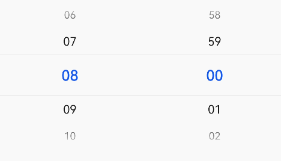

# DatePicker


>  **NOTE**
> This component is supported since API version 8. Updates will be marked with a superscript to indicate their earliest API version.


The **&lt;DatePicker&gt;** component allows users to select date and time.


## Required Permissions

None


## Child Components

None


## APIs

DatePicker(value:{start?: Date, end?: Date, selected?: Date, type?: DatePickerType})

Creates a date picker that allows users to select a date or time within the specified range.

- Parameters
    | Name | Type | Mandatory | Default Value | Description |
  | -------- | -------- | -------- | -------- | -------- |
  | start | Date | No | Date('1970-1-1') | Start date of the date picker. |
  | end | Date | No | Date('2100-12-31') | End date of the date picker. |
  | selected | Date | No | Current system date or time | Selected date when **type** is set to **DatePickerType.Date** and selected time when **type** is set to **DatePickerType.Time**. |
  | type | DatePickerType | No | DatePickerType.Date | Picker type, which can be date picker and time picker. The date picker is used by default. |

- DatePickerType enums
    | Name | Description |
  | -------- | -------- |
  | Date | Date picker. |
  | Time | Time picker. |


## Attributes

| Name | Type | Default Value | Description |
| -------- | -------- | -------- |-------- |
| lunar | boolean | false | Whether to display the lunar calendar.<br/>- **true**: The lunar calendar is displayed.<br/>- **false**: The lunar calendar is not displayed. |
| useMilitaryTime | boolean | false | Whether the display time is in 24-hour format. The value cannot be dynamically modified. |


## Events

| Name | Description |
| -------- | -------- |
| onChange(callback: (value: DatePickerResult) =&gt; void) | This event is triggered when a date or time is selected. |

- DatePickerResult
    | Name | Type | Description |
  | -------- | -------- | -------- |
  | year | number | Year of the selected date (when **type** is **DatePickerType.Date**). |
  | month | number | Month of the selected date (when **type** is **DatePickerType.Date**). |
  | day | number | Date of the selected date (when **type** is **DatePickerType.Date**). |
  | hour | number | Hour portion of the selected time (when **type** is **DatePickerType.Time**). |
  | minute | number | Minute portion of the selected time (when **type** is **DatePickerType.Time**). |


## Example


### Date Picker (with Lunar Calendar)


```
@Entry
@Component
struct DatePickerExample01 {
  private selectedDate: Date = new Date('2021-08-08')

  build() {
    Column() {
      DatePicker({
        start: new Date('1970-1-1'),
        end: new Date('2200-1-1'),
        selected: this.selectedDate,
        type: DatePickerType.Date
      })
      .lunar(true)
      .onChange((date: DatePickerResult) => {
        console.info('select current date is: ' + JSON.stringify(date))
      })
    }.width('100%')
  }
}
```


### Date Picker (Without Lunar Calendar)


```
@Entry
@Component
struct DatePickerExample02 {
  private selectedDate: Date = new Date('2021-08-08')

  build() {
    Column() {
      DatePicker({
        start: new Date('1970-1-1'),
        end: new Date('2200-1-1'),
        selected: this.selectedDate,
        type: DatePickerType.Date
      })
      .lunar(false)
      .onChange((date: DatePickerResult) => {
        console.info('select current date is: ' + JSON.stringify(date))
      })
    }.width('100%')
  }
}
```


### Time Picker


```
@Entry
@Component
struct DatePickerExample03 {
  private selectedTime: Date = new Date('2021-9-29 08:00:00')

  build() {
    Column() {
      DatePicker({
        start: new Date('00:00:00'),
        end: new Date('23:59:59'),
        selected: this.selectedTime,
        type: DatePickerType.Time
      })
      .useMilitaryTime(true)
      .onChange((date: DatePickerResult) => {
        console.info('select current date is: ' + JSON.stringify(date))
      })
    }.width('100%')
  }
}
```


