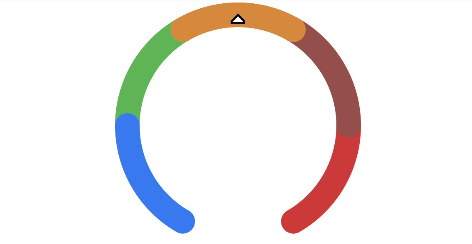

# Gauge


> **NOTE**<br>
> This component is supported since API version 8. Updates will be marked with a superscript to indicate their earliest API version.


Data gauge chart widget, which is used to display data in a ring chart.


## Required Permissions

None


## Child Components

None


## APIs

Gauge(value:{value: number, min?: number, max?: number})

- Parameter
  | Name | Type | Mandatory | Default Value | Description |
  | -------- | -------- | -------- | -------- | -------- |
  | value | number | Yes | - | Current data value. |
  | min | number | No | 0 | Minimum value of the current data segment. |
  | max | number | No | 100 | Maximum value of the current data segment. |


## Attributes

| Name | Type | Default Value | Description |
| -------- | -------- | -------- | -------- |
| value | number | 0 | Sets the value of the current data chart. |
| startAngle | Angle | -150 | Set the start angle. Clock 0 indicates 0 degree, and the clockwise direction indicates the positive angle. |
| endAngle | Angle | 150 | Sets the end angle position. The clock 0 point is 0 degree, and the clockwise direction is the positive angle. |
| colors | Color \| Array&lt;ColorStop&gt; | - | Set the color of the chart. You can set the pure color or segmental gradient color. |
| strokeWidth | Length | - | Sets the ring thickness of a ring chart. |


## Example


```
@Entry
@Component
struct GaugeExample {
  build() {
    Column() {
      Gauge({ value: 50, min: 0, max: 100 })
        .startAngle(210).endAngle(150)
        .colors([[0x317AF7, 1], [0x5BA854, 1], [0xE08C3A, 1], [0x9C554B, 1], [0xD94838, 1]])
        .strokeWidth(20)
        .width(200).height(200)
    }.width('100%').margin({ top: 5 })
  }
}
```


