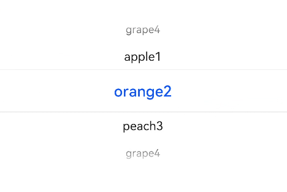

# TextPicker


> **NOTE**<br>
> This component is supported since API version 8. Updates will be marked with a superscript to indicate their earliest API version.


The **&lt;TextPicker&gt;** component allows users to select text from a list of options.


## Required Permissions

None


## Child Components

None


## APIs

TextPicker(value: {range: string[], selected?: number})

Creates a text picker based on the selection range specified by **range**.

- Parameter
  | Name | Type | Mandatory | Default Value | Description |
  | -------- | -------- | -------- | -------- | -------- |
  | range | string[] | Yes | - | Data selection range of the picker. |
  | selected | number | No | - | Index value of the selected item in the array. By default, the first element is selected. |


## Attributes

| Name | Type | Default Value | Description |
| -------- | -------- | -------- | -------- |
| defaultPickerItemHeight | Length | - | Default height of a Picker content item element. |


## Events

| Name | Description |
| -------- | -------- |
| onChange(callback: (value: string, index: number) =&gt; void) | Triggered when an item in the picker is selected.<br/>- **value**: text of the selected item.<br/>- **index**: index of the selected item. |


## Example


```
@Entry
@Component
struct TextPickerExample {
  private select: number = 1
  private fruits: string[] = ['apple1', 'orange2', 'peach3', 'grape4']

  build() {
    Column() {
      TextPicker({range: this.fruits, selected: this.select})
        .onChange((value: string, index: number) => {
          console.info('Picker item changed, value: ' + value + ', index: ' + index)
        })
    }
  }
}
```


