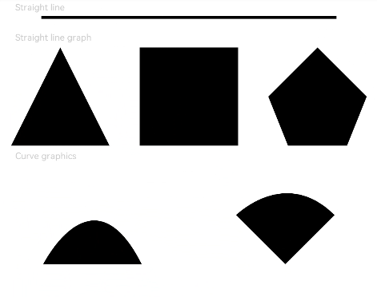

# Path<a name="EN-US_TOPIC_0000001192755118"></a>

> **NOTE:** 
>This component is supported since API version 7. Updates will be marked with a superscript to indicate their earliest API version.

The  **<Path\>**  component is used to draw a path.

## Required Permissions<a name="section53281531154915"></a>

None

## Child Components<a name="section53306512504"></a>

None

## Attributes<a name="section3525926155013"></a>

<a name="table1743024643712"></a>
<table><thead align="left"><tr id="row1447814618374"><th class="cellrowborder" valign="top" width="20%" id="mcps1.1.6.1.1"><p id="p10478124612378"><a name="p10478124612378"></a><a name="p10478124612378"></a>Name</p>
</th>
<th class="cellrowborder" valign="top" width="20%" id="mcps1.1.6.1.2"><p id="p047814462379"><a name="p047814462379"></a><a name="p047814462379"></a>Type</p>
</th>
<th class="cellrowborder" valign="top" width="20%" id="mcps1.1.6.1.3"><p id="p194781468378"><a name="p194781468378"></a><a name="p194781468378"></a>Default Value</p>
</th>
<th class="cellrowborder" valign="top" width="15.559999999999999%" id="mcps1.1.6.1.4"><p id="p13478174613371"><a name="p13478174613371"></a><a name="p13478174613371"></a>Mandatory</p>
</th>
<th class="cellrowborder" valign="top" width="24.44%" id="mcps1.1.6.1.5"><p id="p1947834613713"><a name="p1947834613713"></a><a name="p1947834613713"></a>Description</p>
</th>
</tr>
</thead>
<tbody><tr id="row647811465373"><td class="cellrowborder" valign="top" width="20%" headers="mcps1.1.6.1.1 "><p id="p1747894614378"><a name="p1747894614378"></a><a name="p1747894614378"></a>width</p>
</td>
<td class="cellrowborder" valign="top" width="20%" headers="mcps1.1.6.1.2 "><p id="p747874613713"><a name="p747874613713"></a><a name="p747874613713"></a>Length</p>
</td>
<td class="cellrowborder" valign="top" width="20%" headers="mcps1.1.6.1.3 "><p id="p15478104611379"><a name="p15478104611379"></a><a name="p15478104611379"></a>0</p>
</td>
<td class="cellrowborder" valign="top" width="15.559999999999999%" headers="mcps1.1.6.1.4 "><p id="p18478146113711"><a name="p18478146113711"></a><a name="p18478146113711"></a>No</p>
</td>
<td class="cellrowborder" valign="top" width="24.44%" headers="mcps1.1.6.1.5 "><p id="p144781446193711"><a name="p144781446193711"></a><a name="p144781446193711"></a>Width of the rectangle where the path is located.</p>
</td>
</tr>
<tr id="row134792468379"><td class="cellrowborder" valign="top" width="20%" headers="mcps1.1.6.1.1 "><p id="p8479184618376"><a name="p8479184618376"></a><a name="p8479184618376"></a>height</p>
</td>
<td class="cellrowborder" valign="top" width="20%" headers="mcps1.1.6.1.2 "><p id="p1047914610372"><a name="p1047914610372"></a><a name="p1047914610372"></a>Length</p>
</td>
<td class="cellrowborder" valign="top" width="20%" headers="mcps1.1.6.1.3 "><p id="p1447944693719"><a name="p1447944693719"></a><a name="p1447944693719"></a>0</p>
</td>
<td class="cellrowborder" valign="top" width="15.559999999999999%" headers="mcps1.1.6.1.4 "><p id="p1479146163715"><a name="p1479146163715"></a><a name="p1479146163715"></a>No</p>
</td>
<td class="cellrowborder" valign="top" width="24.44%" headers="mcps1.1.6.1.5 "><p id="p18479046183713"><a name="p18479046183713"></a><a name="p18479046183713"></a>Height of the rectangle where the path is located.</p>
</td>
</tr>
<tr id="row1479144643718"><td class="cellrowborder" valign="top" width="20%" headers="mcps1.1.6.1.1 "><p id="p1647912463376"><a name="p1647912463376"></a><a name="p1647912463376"></a>commands</p>
</td>
<td class="cellrowborder" valign="top" width="20%" headers="mcps1.1.6.1.2 "><p id="p947918468377"><a name="p947918468377"></a><a name="p947918468377"></a>string</p>
</td>
<td class="cellrowborder" valign="top" width="20%" headers="mcps1.1.6.1.3 "><p id="p1247904613715"><a name="p1247904613715"></a><a name="p1247904613715"></a>''</p>
</td>
<td class="cellrowborder" valign="top" width="15.559999999999999%" headers="mcps1.1.6.1.4 "><p id="p174799464375"><a name="p174799464375"></a><a name="p174799464375"></a>Yes</p>
</td>
<td class="cellrowborder" valign="top" width="24.44%" headers="mcps1.1.6.1.5 "><p id="p1647914617378"><a name="p1647914617378"></a><a name="p1647914617378"></a>Command string for drawing the path.</p>
</td>
</tr>
</tbody>
</table>

The supported commands are as follows:

-   M = moveto
-   L = lineto
-   H = horizontal lineto
-   V = vertical lineto
-   C = curveto
-   S = smooth curveto
-   Q = quadratic Belzier curve
-   T = smooth quadratic Belzier curveto
-   A = elliptical Arc
-   Z = closepath

For example, the command  **M0 20 L50 50 L50 100 Z**  defines a path that starts from \(0, 20\), reaches \(50, 50\) and then \(50, 100\), and ends at \(0, 20\).

## Example<a name="section4459736105512"></a>

```
@Entry
@Component
struct PathExample {
  build() {
    Column({ space: 5 }) {
      Text('Straight line').fontSize(9).fontColor(0xCCCCCC).width('90%')
      Path().width(300).height(10).commands('M0 0 L900 0').stroke(Color.Black).strokeWidth(3)

      Text('Straight line graph').fontSize(9).fontColor(0xCCCCCC).width('90%')
      Flex({ justifyContent: FlexAlign.SpaceAround }) {
        // Run MoveTo(150, 0), LineTo(300, 300), LineTo(0, 300), and ClosePath() in sequence.
        Path().width(100).height(100).commands('M150 0 L300 300 L0 300 Z')
        // Run MoveTo(0, 0), HorizontalLineto(300), VerticalLineto(300), HorizontalLineto(0), and ClosePath() in sequence.
        Path().width(100).height(100).commands('M0 0 H300 V300 H0 Z')
        // Run MoveTo(150, 0), LineTo(0, 150), LineTo(60, 300), LineTo(240, 300), LineTo(300, 150), and ClosePath() in sequence.
        Path().width(100).height(100).commands('M150 0 L0 150 L60 300 L240 300 L300 150 Z')
      }.width('100%')

      Text('Curve graphics').fontSize(9).fontColor(0xCCCCCC).width('90%')
      Flex({ justifyContent: FlexAlign.SpaceAround }) {
        / / Run MoveTo(0, 300), draw a curve between (150, 0) and (300, 300), and then run ClosePath().
        Path().width(100).height(100).commands("M0 300 S150 0 300 300 Z")
        / / Run MoveTo(0, 150), draw a curve among (0, 150), (150, 0), and (300, 150), and then run ClosePath().
        Path().width(100).height(100).commands('M0 150 C0 150 150 0 300 150 L150 300 Z')
      }
    }.width('100%').margin({ top: 5 })
  }
}
```



