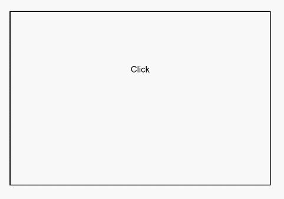

# Gesture Binding Methods


>  **NOTE：**
> This method is supported since API version 7. Updates will be marked with a superscript to indicate their earliest API version.


## Required Permissions

None


## Binding Gesture Recognition


Use the following attributes to bind gesture recognition to a component. When a gesture is recognized, the event callback is invoked to notify the component.


  | Name | Type | Default&nbsp;Value | Description | 
| -------- | -------- | -------- | -------- |
| gesture | gesture:&nbsp;GestureType,<br/>mask?:&nbsp;GestureMask | gesture:&nbsp;-,<br/>mask:&nbsp;GestureMask.Normal | Gesture&nbsp;to&nbsp;recognize.<br/>**gesture**&nbsp;specifies&nbsp;the&nbsp;type&nbsp;of&nbsp;the&nbsp;gesture&nbsp;to&nbsp;bind,&nbsp;and&nbsp;**mask**&nbsp;specifies&nbsp;the&nbsp;event&nbsp;response&nbsp;setting. | 
| priorityGesture | gesture:&nbsp;GestureType,<br/>mask?:&nbsp;GestureMask | gesture:&nbsp;-,<br/>mask:&nbsp;GestureMask.Normal | Gesture&nbsp;to&nbsp;preferentially&nbsp;recognize.<br/>**gesture**&nbsp;specifies&nbsp;the&nbsp;type&nbsp;of&nbsp;the&nbsp;gesture&nbsp;to&nbsp;bind,&nbsp;and&nbsp;**mask**&nbsp;specifies&nbsp;the&nbsp;event&nbsp;response&nbsp;setting.<br/>>&nbsp;&nbsp;**NOTE：**<br/>>&nbsp;-&nbsp;By&nbsp;default,&nbsp;the&nbsp;child&nbsp;component&nbsp;takes&nbsp;precedence&nbsp;over&nbsp;the&nbsp;parent&nbsp;component&nbsp;in&nbsp;gesture&nbsp;recognition.&nbsp;When&nbsp;**priorityGesture**&nbsp;is&nbsp;configured&nbsp;for&nbsp;the&nbsp;parent&nbsp;component,&nbsp;the&nbsp;parent&nbsp;component&nbsp;takes&nbsp;precedence&nbsp;over&nbsp;the&nbsp;child&nbsp;component&nbsp;in&nbsp;gesture&nbsp;recognition. | 
| parallelGesture | gesture:&nbsp;GestureType,<br/>mask?:&nbsp;GestureMask | gesture:&nbsp;-,<br/>mask:&nbsp;GestureMask.Normal | Gesture&nbsp;that&nbsp;can&nbsp;be&nbsp;triggered&nbsp;together&nbsp;with&nbsp;the&nbsp;child&nbsp;component&nbsp;gesture.<br/>**gesture**&nbsp;specifies&nbsp;the&nbsp;type&nbsp;of&nbsp;the&nbsp;gesture&nbsp;to&nbsp;bind,&nbsp;and&nbsp;**mask**&nbsp;specifies&nbsp;the&nbsp;event&nbsp;response&nbsp;setting.<br/>>&nbsp;&nbsp;**NOTE：**<br/>>&nbsp;-&nbsp;The&nbsp;gesture&nbsp;event&nbsp;is&nbsp;not&nbsp;a&nbsp;bubbling&nbsp;event.&nbsp;When&nbsp;**parallelGesture**&nbsp;is&nbsp;set&nbsp;for&nbsp;the&nbsp;parent&nbsp;component,&nbsp;gesture&nbsp;events&nbsp;that&nbsp;are&nbsp;the&nbsp;same&nbsp;for&nbsp;the&nbsp;parent&nbsp;component&nbsp;and&nbsp;child&nbsp;components&nbsp;can&nbsp;be&nbsp;triggered,&nbsp;thereby&nbsp;implementing&nbsp;a&nbsp;bubbling&nbsp;effect. | 


- GestureMask enums
    | Name | Description | 
  | -------- | -------- |
  | Normal | The&nbsp;gestures&nbsp;of&nbsp;child&nbsp;components&nbsp;are&nbsp;not&nbsp;masked&nbsp;and&nbsp;are&nbsp;recognized&nbsp;based&nbsp;on&nbsp;the&nbsp;default&nbsp;gesture&nbsp;recognition&nbsp;sequence. | 
  | IgnoreInternal | The&nbsp;gestures&nbsp;of&nbsp;child&nbsp;components&nbsp;are&nbsp;masked.&nbsp;Only&nbsp;the&nbsp;gestures&nbsp;of&nbsp;the&nbsp;current&nbsp;component&nbsp;are&nbsp;recognized.<br/>>&nbsp;&nbsp;**NOTE：**<br/>>&nbsp;However,&nbsp;the&nbsp;built-in&nbsp;gestures&nbsp;of&nbsp;the&nbsp;child&nbsp;components&nbsp;are&nbsp;not&nbsp;masked.&nbsp;For&nbsp;example,&nbsp;when&nbsp;the&nbsp;child&nbsp;component&nbsp;is&nbsp;a&nbsp;**&lt;List&gt;**&nbsp;component,&nbsp;the&nbsp;built-in&nbsp;sliding&nbsp;gestures&nbsp;can&nbsp;still&nbsp;be&nbsp;triggered. | 


- Gesture types
    | Name | Description | 
  | -------- | -------- |
  | TapGesture | Tap&nbsp;gesture,&nbsp;which&nbsp;can&nbsp;be&nbsp;a&nbsp;single-tap&nbsp;or&nbsp;multi-tap&nbsp;gesture. | 
  | LongPressGesture | Long&nbsp;press&nbsp;gesture. | 
  | PanGesture | Pan&nbsp;gesture. | 
  | PinchGesture | Pinch&nbsp;gesture. | 
  | RotationGesture | Rotation&nbsp;gesture. | 
  | GestureGroup | A&nbsp;group&nbsp;of&nbsp;gestures.&nbsp;Continuous&nbsp;recognition,&nbsp;parallel&nbsp;recognition,&nbsp;and&nbsp;exclusive&nbsp;recognition&nbsp;are&nbsp;supported. | 


## Gesture Response Event

The component uses the **gesture** method to bind the gesture object and uses the events provided in this object to respond to the gesture operation. For example, the **onAction** event of the **TapGesture** object can be used to respond to a click event. For details about the event definition, see the section of each gesture object.

- TapGesture events
    | Name | Description | 
  | -------- | -------- |
  | onAction((event?:&nbsp;GestureEvent)&nbsp;=&gt;&nbsp;void) | Callback&nbsp;invoked&nbsp;when&nbsp;a&nbsp;tap&nbsp;gesture&nbsp;is&nbsp;recognized. | 

- GestureEvent attributes
    | Name | Type | Description | 
  | -------- | -------- | -------- |
  | timestamp | number | Timestamp&nbsp;of&nbsp;the&nbsp;event. | 
  | target<sup>8+</sup> | EventTarget | Object&nbsp;that&nbsp;triggers&nbsp;the&nbsp;gesture&nbsp;event. | 


## Example


```
@Entry
@Component
struct GestureSettingsExample {
  @State value: string = ''

  build() {
    Column(){
      Column() {
        Text('Click\n' + this.value)
          .gesture(
          TapGesture()
            .onAction(() => {
              this.value = 'gesture onAction'
            }))
      }.height(200).width(300).padding(60).border({ width: 1 })
    // When priorityGesture is specified, the bound gesture is preferentially recognized and the child component gesture is ignored.
      .priorityGesture(
      TapGesture()
        .onAction((event: GestureEvent) => {
          this.value = 'priorityGesture onAction' + '\ncomponent globalPos:('
          + event.target.area.globalPos.x + ',' + event.target.area.globalPos.y + ')\nwidth:'
          + event.target.area.width + '\nheight:' + event.target.area.height
        }), GestureMask.IgnoreInternal
      )
    }.padding(60)
  }
}
```


