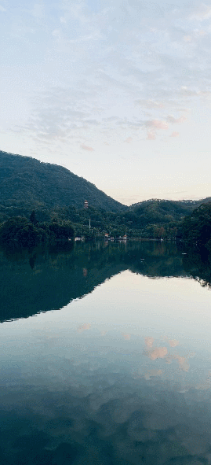

# Page Transition


>  **NOTE：**
> This animation is supported since API version 7. Updates will be marked with a superscript to indicate their earliest API version.


Customize the page transition animations by configuring the page entrance and exit components in the global **pageTransition** method.


  | Name | Parameter | Description | 
| -------- | -------- | -------- |
| PageTransitionEnter | Object | Page&nbsp;entrance&nbsp;component,&nbsp;which&nbsp;is&nbsp;used&nbsp;to&nbsp;customize&nbsp;the&nbsp;entrance&nbsp;effect&nbsp;of&nbsp;the&nbsp;current&nbsp;page.&nbsp;For&nbsp;details,&nbsp;see&nbsp;animation&nbsp;parameters. | 
| PageTransitionExit | Object | Page&nbsp;exit&nbsp;component,&nbsp;which&nbsp;is&nbsp;used&nbsp;to&nbsp;customize&nbsp;the&nbsp;exit&nbsp;effect&nbsp;of&nbsp;the&nbsp;current&nbsp;page.&nbsp;For&nbsp;details,&nbsp;see&nbsp;animation&nbsp;parameters. | 


- Animation parameters
    | Name | Type | Default&nbsp;Value | Mandatory | Description | 
  | -------- | -------- | -------- | -------- | -------- |
  | type | RouteType | - | No | If&nbsp;this&nbsp;parameter&nbsp;is&nbsp;not&nbsp;set,&nbsp;the&nbsp;reverse&nbsp;playback&nbsp;effect&nbsp;as&nbsp;pop&nbsp;switches&nbsp;to&nbsp;push&nbsp;is&nbsp;used. | 
  | duration | number | 1000 | No | Animation&nbsp;duration,&nbsp;in&nbsp;ms. | 
  | curve | Curve&nbsp;\|&nbsp;Curves | Linear | No | Animation&nbsp;curve.&nbsp;For&nbsp;details&nbsp;about&nbsp;the&nbsp;valid&nbsp;values,&nbsp;see&nbsp;**Curve&nbsp;enums**. | 
  | delay | number | 0 | No | Animation&nbsp;delay,&nbsp;in&nbsp;ms.&nbsp;Delayed&nbsp;animation&nbsp;is&nbsp;disabled&nbsp;by&nbsp;default. | 


- RouteType enums
    | Name | Description | 
  | -------- | -------- |
  | Pop | When&nbsp;page&nbsp;A&nbsp;jumps&nbsp;to&nbsp;page&nbsp;B,&nbsp;page&nbsp;A&nbsp;is&nbsp;Exit+Push,&nbsp;and&nbsp;page&nbsp;B&nbsp;is&nbsp;Enter+Push. | 
  | Push | When&nbsp;page&nbsp;B&nbsp;returns&nbsp;to&nbsp;page&nbsp;A,&nbsp;page&nbsp;A&nbsp;is&nbsp;Enter+Pop,&nbsp;and&nbsp;page&nbsp;B&nbsp;is&nbsp;Exit+Pop. | 


## Attributes

The **PageTransitionEnter** and **PageTransitionExit** components support the following attributes:

  | Name | Type | Default&nbsp;Value | Mandatory | Description | 
| -------- | -------- | -------- | -------- | -------- |
| slide | SlideEffect | SlideEffect.Right | No | Slide&nbsp;effect&nbsp;during&nbsp;page&nbsp;transition.&nbsp;For&nbsp;details&nbsp;about&nbsp;the&nbsp;valid&nbsp;values,&nbsp;see&nbsp;the&nbsp;description&nbsp;of&nbsp;[ERROR:Invalid&nbsp;link:en-us_topic_0000001257138309.xml#xref2991922111212,link:#li81331342185820](#li81331342185820). | 
| translate | {<br/>x?&nbsp;:&nbsp;number,<br/>y?&nbsp;:&nbsp;number,<br/>z?&nbsp;:&nbsp;number<br/>} | - | No | Translation&nbsp;effect&nbsp;during&nbsp;page&nbsp;transition,&nbsp;which&nbsp;is&nbsp;the&nbsp;value&nbsp;of&nbsp;the&nbsp;start&nbsp;point&nbsp;of&nbsp;entrance&nbsp;and&nbsp;the&nbsp;end&nbsp;point&nbsp;of&nbsp;exit.&nbsp;When&nbsp;this&nbsp;parameter&nbsp;is&nbsp;set&nbsp;together&nbsp;with&nbsp;**slide**,&nbsp;the&nbsp;latter&nbsp;takes&nbsp;effect&nbsp;by&nbsp;default. | 
| scale | {<br/>x?&nbsp;:&nbsp;number,<br/>y?&nbsp;:&nbsp;number,<br/>z?&nbsp;:&nbsp;number,<br/>centerX?&nbsp;:&nbsp;number,<br/>centerY?&nbsp;:&nbsp;number<br/>} | - | No | Scaling&nbsp;effect&nbsp;during&nbsp;page&nbsp;transition,&nbsp;which&nbsp;is&nbsp;the&nbsp;value&nbsp;of&nbsp;the&nbsp;start&nbsp;point&nbsp;of&nbsp;entrance&nbsp;and&nbsp;the&nbsp;end&nbsp;point&nbsp;of&nbsp;exit. | 
| opacity | number | 1 | No | Opacity,&nbsp;which&nbsp;is&nbsp;the&nbsp;opacity&nbsp;value&nbsp;of&nbsp;the&nbsp;start&nbsp;point&nbsp;of&nbsp;entrance&nbsp;or&nbsp;the&nbsp;end&nbsp;point&nbsp;of&nbsp;exit. | 

- SlideEffect enums
    | Name | Description | 
  | -------- | -------- |
  | Left | When&nbsp;set&nbsp;to&nbsp;Enter,&nbsp;slides&nbsp;in&nbsp;from&nbsp;the&nbsp;left.&nbsp;When&nbsp;set&nbsp;to&nbsp;Exit,&nbsp;slides&nbsp;out&nbsp;to&nbsp;the&nbsp;left. | 
  | Right | When&nbsp;set&nbsp;to&nbsp;Enter,&nbsp;slides&nbsp;in&nbsp;from&nbsp;the&nbsp;right.&nbsp;When&nbsp;set&nbsp;to&nbsp;Exit,&nbsp;slides&nbsp;out&nbsp;to&nbsp;the&nbsp;right. | 
  | Top | When&nbsp;set&nbsp;to&nbsp;Enter,&nbsp;slides&nbsp;in&nbsp;from&nbsp;the&nbsp;top.&nbsp;When&nbsp;set&nbsp;to&nbsp;Exit,&nbsp;slides&nbsp;out&nbsp;to&nbsp;the&nbsp;top. | 
  | Bottom | When&nbsp;set&nbsp;to&nbsp;Enter,&nbsp;slides&nbsp;in&nbsp;from&nbsp;the&nbsp;bottom.&nbsp;When&nbsp;set&nbsp;to&nbsp;Exit,&nbsp;slides&nbsp;out&nbsp;to&nbsp;the&nbsp;bottom. | 


## Events

The PageTransitionEnter and PageTransitionExit components support the following events:

  | Event | Description | 
| -------- | -------- |
| onEnter(type:&nbsp;RouteType,&nbsp;progress:&nbsp;number)&nbsp;=&gt;&nbsp;void | The&nbsp;callback&nbsp;input&nbsp;parameter&nbsp;is&nbsp;the&nbsp;normalized&nbsp;progress&nbsp;of&nbsp;the&nbsp;current&nbsp;entrance&nbsp;animation.&nbsp;The&nbsp;value&nbsp;range&nbsp;is&nbsp;0–1. | 
| onExit(type:&nbsp;RouteType,&nbsp;progress:&nbsp;number)&nbsp;=&gt;&nbsp;void | The&nbsp;callback&nbsp;input&nbsp;parameter&nbsp;is&nbsp;the&nbsp;normalized&nbsp;progress&nbsp;of&nbsp;the&nbsp;current&nbsp;exit&nbsp;animation.&nbsp;The&nbsp;value&nbsp;range&nbsp;is&nbsp;0–1. | 


## Example

Customization method 1: The entrance animation of the current page is configured as fade-in, and the exit animation is configured as zoom-out.


```
// index.ets
@Entry
@Component
struct PageTransitionExample1 {
  @State scale: number = 1
  @State opacity: number = 1
  @State active: boolean = false
  build() {
  Column() {
      Navigator({ target: 'pages/page1', type: NavigationType.Push }) {
        Image($r('app.media.bg1')).width("100%").height("100%")
      }
      .onClick(() => {
        this.active = true
      })
    }.scale({ x: this.scale }).opacity(this.opacity)
  }
// Customization method 1: Customize the transition process.
  pageTransition() {
    PageTransitionEnter({ duration: 1200, curve: Curve.Linear })
      .onEnter((type: RouteType, progress: number) => {
        this.scale = 1
        this.opacity = progress
      }) // The onEnter callback is triggered frame by frame during the entrance process. The input parameter is the normalized progress of the animation (0% to 100%).
    PageTransitionExit({ duration: 1500, curve: Curve.Ease })
      .onExit((type: RouteType, progress: number) => {
        this.scale = 1 - progress
        this.opacity = 1
      }) // The onExit callback is triggered frame by frame during the exit process. The input parameter is the normalized progress of the animation (0% to 100%).
  }
}
```


```
// page1.ets
@Entry
@Component
struct AExample {
  @State scale: number = 1
  @State opacity: number = 1
  @State active: boolean = false
  build() {
    Column() {
      Navigator({ target: 'pages/index' ,type: NavigationType.Push}) {
        Image($r('app.media.bg2')).width("100%").height("100%")
      }
    }.height("100%").width("100%").scale({ x: this.scale }).opacity(this.opacity)
  }
// Customization method 1: Customize the transition process.
  pageTransition() {
    PageTransitionEnter({ duration: 1200, curve: Curve.Linear })
      .onEnter((type: RouteType, progress: number) => {
        this.scale = 1
        this.opacity = progress
      }) // The onEnter callback is triggered frame by frame during the entrance process. The input parameter is the normalized progress of the animation (0% to 100%).
    PageTransitionExit({ duration: 1500, curve: Curve.Ease })
      .onExit((type: RouteType, progress: number) => {
        this.scale = 1 - progress
        this.opacity = 1
      }) // The onExit callback is triggered frame by frame during the exi process. The input parameter is the normalized progress of the animation (0% to 100%).
  }
}
```


Customization method 2: The entrance animation of the current page is configured to slide in from the left, and the exit animation is configured to zoom out with opacity change.


```
// index.ets 
@Entry
@Component
struct PageTransitionExample {
  @State scale: number = 1
  @State opacity: number = 1
  @State active: boolean = false

  build() {
    Column() {
      Navigator({ target: 'pages/page1', type: NavigationType.Push }) {
        Image($r('app.media.bg1')).width("100%").height("100%")
      }
      .onClick(() => {
        this.active = true
      })
    }.scale({ x: this.scale }).opacity(this.opacity)
  }

// Customization method 2: Use the default effects provided by the system, such as translation, scaling, and opacity.
  pageTransition() {
    PageTransitionEnter({ duration: 1200 })
      .slide(SlideEffect.Left)
    PageTransitionExit({ delay: 100 })
      .translate({ x: 100.0, y: 100.0 })
      .opacity(0)
  }
}
```


```
// page1.ets
@Entry
@Component
struct PageTransitionExample1 {
  @State scale: number = 1
  @State opacity: number = 1
  @State active: boolean = false

  build() {
    Column() {
      Navigator({ target: 'pages/index', type: NavigationType.Push }) {
        Image($r('app.media.bg2')).width  ("100%").height("100%")
      }
      .onClick(() => {
        this.active = true
      })
    }.scale({ x: this.scale }).opacity(this.opacity)
  }

// Customization method 2: Use the default effects provided by the system, such as translation, scaling, and opacity.
  pageTransition() {
    PageTransitionEnter({ duration: 1200 })
      .slide(SlideEffect.Left)
    PageTransitionExit({ delay: 100 })
      .translate({ x: 100.0, y: 100.0 })
      .opacity(0)
  }
}
```


