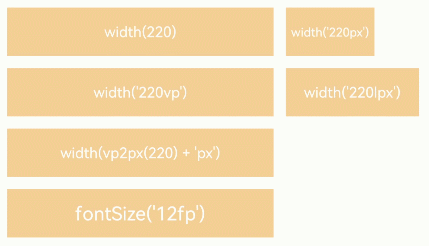

# Pixel Units<a name="EN-US_TOPIC_0000001111581268"></a>

The framework provides four pixel units, with vp as the reference data unit.

<a name="table230mcpsimp"></a>
<table><thead align="left"><tr id="row235mcpsimp"><th class="cellrowborder" valign="top" width="13%" id="mcps1.1.3.1.1"><p id="p237mcpsimp"><a name="p237mcpsimp"></a><a name="p237mcpsimp"></a>Name</p>
</th>
<th class="cellrowborder" valign="top" width="87%" id="mcps1.1.3.1.2"><p id="p239mcpsimp"><a name="p239mcpsimp"></a><a name="p239mcpsimp"></a>Description</p>
</th>
</tr>
</thead>
<tbody><tr id="row240mcpsimp"><td class="cellrowborder" valign="top" width="13%" headers="mcps1.1.3.1.1 "><p id="p242mcpsimp"><a name="p242mcpsimp"></a><a name="p242mcpsimp"></a>px</p>
</td>
<td class="cellrowborder" valign="top" width="87%" headers="mcps1.1.3.1.2 "><p id="p244mcpsimp"><a name="p244mcpsimp"></a><a name="p244mcpsimp"></a>Physical pixel unit of the screen.</p>
</td>
</tr>
<tr id="row245mcpsimp"><td class="cellrowborder" valign="top" width="13%" headers="mcps1.1.3.1.1 "><p id="p247mcpsimp"><a name="p247mcpsimp"></a><a name="p247mcpsimp"></a>vp</p>
</td>
<td class="cellrowborder" valign="top" width="87%" headers="mcps1.1.3.1.2 "><p id="p249mcpsimp"><a name="p249mcpsimp"></a><a name="p249mcpsimp"></a>Pixels specific to the screen density, which are converted into physical pixels of the screen based on the screen pixel density.</p>
</td>
</tr>
<tr id="row250mcpsimp"><td class="cellrowborder" valign="top" width="13%" headers="mcps1.1.3.1.1 "><p id="p252mcpsimp"><a name="p252mcpsimp"></a><a name="p252mcpsimp"></a>fp</p>
</td>
<td class="cellrowborder" valign="top" width="87%" headers="mcps1.1.3.1.2 "><p id="p254mcpsimp"><a name="p254mcpsimp"></a><a name="p254mcpsimp"></a>Font pixel, which is similar to vp and varies according to the system font size.</p>
</td>
</tr>
<tr id="row920003123018"><td class="cellrowborder" valign="top" width="13%" headers="mcps1.1.3.1.1 "><p id="p1020016393011"><a name="p1020016393011"></a><a name="p1020016393011"></a>lpx</p>
</td>
<td class="cellrowborder" valign="top" width="87%" headers="mcps1.1.3.1.2 "><p id="p1120043183010"><a name="p1120043183010"></a><a name="p1120043183010"></a>Logical pixel unit of the window. It is the ratio of the actual screen width to the logical width (configured by <a href="ts-framework-js-tag.md#table12744175911317">designWidth</a>). For example, if <strong id="b2423202212551"><a name="b2423202212551"></a><a name="b2423202212551"></a>designWidth</strong> is set to <strong id="b20172226195518"><a name="b20172226195518"></a><a name="b20172226195518"></a>720</strong>, then 1lpx is equal to 2px for a screen with an actual width of 1440 physical pixels.</p>
</td>
</tr>
</tbody>
</table>

## Pixel Unit Conversion<a name="section43478451141"></a>

Conversion from other pixel units to px is supported.

<a name="table16548143615916"></a>
<table><thead align="left"><tr id="row175481036794"><th class="cellrowborder" valign="top" width="35.69%" id="mcps1.1.3.1.1"><p id="p14548123614910"><a name="p14548123614910"></a><a name="p14548123614910"></a>API</p>
</th>
<th class="cellrowborder" valign="top" width="64.31%" id="mcps1.1.3.1.2"><p id="p11548183618912"><a name="p11548183618912"></a><a name="p11548183618912"></a>Description</p>
</th>
</tr>
</thead>
<tbody><tr id="row75487361090"><td class="cellrowborder" valign="top" width="35.69%" headers="mcps1.1.3.1.1 "><p id="p05483367914"><a name="p05483367914"></a><a name="p05483367914"></a>vp2px(value : number) : number</p>
</td>
<td class="cellrowborder" valign="top" width="64.31%" headers="mcps1.1.3.1.2 "><p id="p6239203321019"><a name="p6239203321019"></a><a name="p6239203321019"></a>Converts a value in units of vp to a value in units of px.</p>
</td>
</tr>
<tr id="row0770112219335"><td class="cellrowborder" valign="top" width="35.69%" headers="mcps1.1.3.1.1 "><p id="p177017220331"><a name="p177017220331"></a><a name="p177017220331"></a>px2vp(value : number) : number</p>
</td>
<td class="cellrowborder" valign="top" width="64.31%" headers="mcps1.1.3.1.2 "><p id="p8770192212335"><a name="p8770192212335"></a><a name="p8770192212335"></a>Converts a value in units of px to a value in units of vp.</p>
</td>
</tr>
<tr id="row15951172693314"><td class="cellrowborder" valign="top" width="35.69%" headers="mcps1.1.3.1.1 "><p id="p15951102643316"><a name="p15951102643316"></a><a name="p15951102643316"></a>fp2px(value : number) : number</p>
</td>
<td class="cellrowborder" valign="top" width="64.31%" headers="mcps1.1.3.1.2 "><p id="p995152643319"><a name="p995152643319"></a><a name="p995152643319"></a>Converts a value in units of fp to a value in units of px.</p>
</td>
</tr>
<tr id="row83152033153314"><td class="cellrowborder" valign="top" width="35.69%" headers="mcps1.1.3.1.1 "><p id="p231503317331"><a name="p231503317331"></a><a name="p231503317331"></a>px2fp(value : number) : number</p>
</td>
<td class="cellrowborder" valign="top" width="64.31%" headers="mcps1.1.3.1.2 "><p id="p143158337338"><a name="p143158337338"></a><a name="p143158337338"></a>Converts a value in units of px to a value in units of fp.</p>
</td>
</tr>
<tr id="row1619816394331"><td class="cellrowborder" valign="top" width="35.69%" headers="mcps1.1.3.1.1 "><p id="p121981939173310"><a name="p121981939173310"></a><a name="p121981939173310"></a>lpx2px(value : number) : number</p>
</td>
<td class="cellrowborder" valign="top" width="64.31%" headers="mcps1.1.3.1.2 "><p id="p819843963311"><a name="p819843963311"></a><a name="p819843963311"></a>Converts a value in units of lpx to a value in units of px.</p>
</td>
</tr>
<tr id="row955964320338"><td class="cellrowborder" valign="top" width="35.69%" headers="mcps1.1.3.1.1 "><p id="p35591243143310"><a name="p35591243143310"></a><a name="p35591243143310"></a>px2lpx(value : number) : number</p>
</td>
<td class="cellrowborder" valign="top" width="64.31%" headers="mcps1.1.3.1.2 "><p id="p14559343153314"><a name="p14559343153314"></a><a name="p14559343153314"></a>Converts a value in units of px to a value in units of lpx.</p>
</td>
</tr>
</tbody>
</table>

## Example<a name="section208264919153"></a>

```
@Entry
@Component
struct Example {
  build() {
    Column() {
      Flex({ wrap: FlexWrap.Wrap }) {
        Column() {
          Text("width(220)")
            .width(220).height(40).backgroundColor(0xF9CF93)
            .textAlign(TextAlign.Center).fontColor(Color.White).fontSize('12vp')
        }.margin(5)
        Column() {
          Text("width('220px')")
            .width('220px').height(40).backgroundColor(0xF9CF93)
            .textAlign(TextAlign.Center).fontColor(Color.White)
        }.margin(5)
        Column() {
          Text("width('220vp')")
            .width('220vp').height(40).backgroundColor(0xF9CF93)
            .textAlign(TextAlign.Center).fontColor(Color.White).fontSize('12vp')
        }.margin(5)
        Column() {
          Text("width('220lpx') designWidth:720")
            .width('220lpx').height(40).backgroundColor(0xF9CF93)
            .textAlign(TextAlign.Center).fontColor(Color.White).fontSize('12vp')
        }.margin(5)
        Column() {
          Text("width(vp2px(220) + 'px')")
            .width(vp2px(220) + 'px').height(40).backgroundColor(0xF9CF93)
            .textAlign(TextAlign.Center).fontColor(Color.White).fontSize('12vp')
        }.margin(5)
        Column() {
          Text("fontSize('12fp')")
            .width(220).height(40).backgroundColor(0xF9CF93)
            .textAlign(TextAlign.Center).fontColor(Color.White).fontSize('12fp')
        }.margin(5)
      }.width('100%')
    }
  }
}
```



