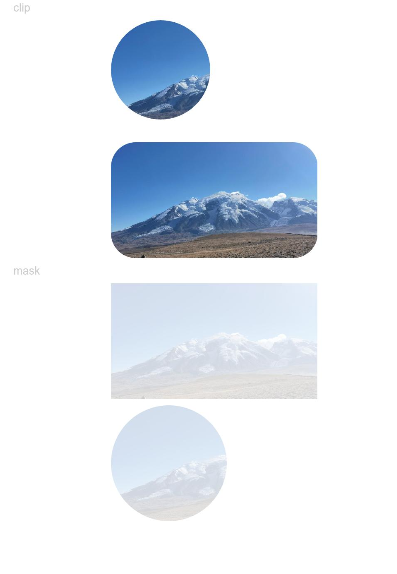

# Shape Clipping


>  **NOTE：**
> This attribute is supported since API version 7. Updates will be marked with a superscript to indicate their earliest API version.


## Required Permissions

None


## Attributes


  | Name | Type | Default&nbsp;Value | Description | 
| -------- | -------- | -------- | -------- |
| clip | Shape&nbsp;\|&nbsp;boolean | false | Specifies&nbsp;a&nbsp;clip&nbsp;mode.&nbsp;The&nbsp;value&nbsp;**Shape**&nbsp;indicates&nbsp;that&nbsp;the&nbsp;current&nbsp;component&nbsp;is&nbsp;cropped&nbsp;based&nbsp;on&nbsp;the&nbsp;specified&nbsp;shape.&nbsp;The&nbsp;value&nbsp;**boolean**&nbsp;specifies&nbsp;whether&nbsp;to&nbsp;clip&nbsp;the&nbsp;component&nbsp;based&nbsp;on&nbsp;the&nbsp;edge&nbsp;outline. | 
| mask | Shape | - | Adds&nbsp;a&nbsp;mask&nbsp;of&nbsp;the&nbsp;specified&nbsp;shape&nbsp;to&nbsp;the&nbsp;current&nbsp;component. | 


## Example

  
```
@Entry
@Component
struct ClipAndMaskExample {
  build() {
    Column({ space: 5 }) {
      Text('clip').fontSize(9).width('90%').fontColor(0xCCCCCC)
      // Clip the image by using a circle with a diameter of 280px.
      Image('/comment/bg.jpg')
        .clip(new Circle({ width: 80, height: 80 }))
        .width('500px').height('280px')

      Row() {
        Image('/comment/bg.jpg').width('500px').height('280px')
      }
      .clip(true)
      .borderRadius(20)

      Text('mask').fontSize(9).width('90%').fontColor(0xCCCCCC)
      // Add a 500 px x 280 px mask to the image.
      Image('/comment/bg.jpg')
        .mask(new Rect({ width: '500px', height: '280px' }).fill(Color.Gray))
        .width('500px').height('280px')

      // Add a 280 px x 280 px circle mask to the image.
      Image('/comment/bg.jpg')
        .mask(new Circle({ width: '280px', height: '280px' }).fill(Color.Gray))
        .width('500px').height('281px')
    }
    .width('100%')
    .margin({ top: 5 })
  }
}
```


