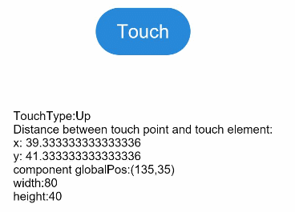

# Touch Event


>  **NOTE：**
> This method is supported since API version 7. Updates will be marked with a superscript to indicate their earliest API version.


## Required Permissions

None


## Events

| Name | Pop-up | Description |
| -------- | -------- | -------- |
| onTouch(callback:&nbsp;(event?:&nbsp;TouchEvent)&nbsp;=&gt;&nbsp;void) | Yes | Invoked&nbsp;when&nbsp;a&nbsp;touch&nbsp;action&nbsp;is&nbsp;triggered.&nbsp;For&nbsp;details&nbsp;about&nbsp;the&nbsp;event&nbsp;parameters,&nbsp;see&nbsp;[TouchEvent](#touchevent). |


### TouchEvent

- Attributes
    | Name | Type | Description | 
  | -------- | -------- | -------- |
  | type | TouchType | Type&nbsp;of&nbsp;a&nbsp;touch&nbsp;event. | 
  | touches | Array&lt;TouchObject&gt; | All&nbsp;finger&nbsp;information. | 
  | changedTouches | Array&lt;TouchObject&gt; | Finger&nbsp;information&nbsp;changed. | 
  | timestamp | number | Timestamp&nbsp;of&nbsp;the&nbsp;event. | 
  | target<sup>8+</sup> | EventTarget | Target&nbsp;of&nbsp;the&nbsp;event. | 

- APIs
    | API | Description | 
  | -------- | -------- |
  | stopPropagation():&nbsp;void | Pop-up&nbsp;of&nbsp;the&nbsp;stop&nbsp;event. | 


- TouchObject
    | Name | Type | Description | 
  | -------- | -------- | -------- |
  | type | TouchType | Type&nbsp;of&nbsp;a&nbsp;touch&nbsp;event. | 
  | id | number | Unique&nbsp;identifier&nbsp;of&nbsp;a&nbsp;finger. | 
  | screenX | number | X&nbsp;coordinate&nbsp;of&nbsp;the&nbsp;touch&nbsp;point&nbsp;relative&nbsp;to&nbsp;the&nbsp;left&nbsp;edge&nbsp;of&nbsp;the&nbsp;screen. | 
  | screenY | number | Y&nbsp;coordinate&nbsp;of&nbsp;the&nbsp;touch&nbsp;point&nbsp;relative&nbsp;to&nbsp;the&nbsp;upper&nbsp;edge&nbsp;of&nbsp;the&nbsp;device&nbsp;screen. | 
  | x | number | X&nbsp;coordinate&nbsp;of&nbsp;the&nbsp;touch&nbsp;point&nbsp;relative&nbsp;to&nbsp;the&nbsp;left&nbsp;edge&nbsp;of&nbsp;the&nbsp;element&nbsp;to&nbsp;touch. | 
  | y | number | Y&nbsp;coordinate&nbsp;of&nbsp;the&nbsp;touch&nbsp;point&nbsp;relative&nbsp;to&nbsp;the&nbsp;upper&nbsp;edge&nbsp;of&nbsp;the&nbsp;element&nbsp;to&nbsp;touch. | 


- TouchType
    | Name | Description | 
  | -------- | -------- |
  | Down | Trigger&nbsp;a&nbsp;touch&nbsp;event&nbsp;when&nbsp;a&nbsp;finger&nbsp;is&nbsp;pressed. | 
  | Up | Trigger&nbsp;a&nbsp;touch&nbsp;event&nbsp;when&nbsp;a&nbsp;finger&nbsp;is&nbsp;lifted. | 
  | Move | Trigger&nbsp;a&nbsp;touch&nbsp;event&nbsp;when&nbsp;a&nbsp;finger&nbsp;moves&nbsp;on&nbsp;the&nbsp;screen&nbsp;in&nbsp;pressed&nbsp;state. | 
  | Cancel | Trigger&nbsp;an&nbsp;event&nbsp;when&nbsp;a&nbsp;touch&nbsp;event&nbsp;is&nbsp;canceled. | 


## Example


```
@Entry
@Component
struct TouchExample {
  @State text: string = ''
  @State eventType: string = ''

  build() {
    Flex({ direction: FlexDirection.Column, alignItems: ItemAlign.Center, justifyContent: FlexAlign.SpaceBetween }) {
      Button('Touch').backgroundColor(0x2788D9).height(40).width(80)
        .onTouch((event: TouchEvent) => {
          if (event.type === TouchType.Down) {
            this.eventType = 'Down'
          }
          if (event.type === TouchType.Up) {
            this.eventType = 'Up'
          }
          if (event.type === TouchType.Move) {
            this.eventType = 'Move'
          }
          console.info(this.text = 'TouchType:' + this.eventType + '\nDistance between touch point and touch element:\nx: '
          + event.touches[0].x + '\n' + 'y: ' + event.touches[0].y + '\ncomponent globalPos:('
          + event.target.area.globalPos.x + ',' + event.target.area.globalPos.y + ')\nwidth:'
          + event.target.area.width + '\nheight:' + event.target.area.height)
        })
      Text(this.text)
    }.height(200).width(350).padding({ left: 35, right: 35, top: 35 })
  }
}
```


