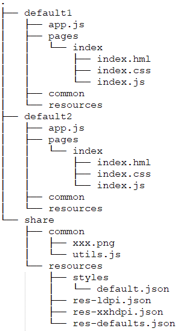

# File Organization

## Directory Structure

The following figure shows the typical directory structure of the JavaScript module \(**entry/src/main/js/module**\) for an application with feature abilities \(FA\) using JavaScript APIs.

**Figure  1**  Directory structure  

.png)

**Figure  2**  Directory structure for resource sharing  5+  

Functions of the files are as follows:

-   **.hml**  files describe the page layout.
-   **.css**  files describe the page style.
-   **.js**  files process the interactions between pages and users.

Functions of the folders are as follows:

-   The  **app.js**  file manages global JavaScript logics and application lifecycle. For details, see  [app.js](js-framework-js-file.md).
-   The  **pages**  directory stores all component pages.
-   The  **common**  directory stores public resource files, such as media resources, custom components,  and  **.js**  files.
-   The  **resources**  directory stores resource configuration files, for example, for multi-resolution loading. For details, see  [Resource Limitations and Access](js-framework-resource-restriction.md).
-   The  **share**  directory5+  is used to configure resources shared by multiple instances. For example, images and JSON files in this directory can be shared by  **default1**  and  **default2**  instances.

> **NOTE:** 
>-   Reserved folders \(**i18n**  and  **resources**\) cannot be renamed.
>-   If the same resource name and directory are used under the  **share**  directory and the instance \(**default**\) directory, the resource in the instance directory will be used when you reference the directory.
>-   The  **share**  directory does not support  **i18n**.
>-   You should create the optional folders \(shown in the directory structure\) as needed after you create the project in DevEco Studio.

## File Access Rules

Application resources can be accessed via an absolute or relative path. In the JS UI framework, an absolute path starts with a slash \(/\), and a relative path starts with  **./**  or  **../**. The rules are as follows:

-   To reference a code file, use a relative path, for example,  **../common/utils.js**.
-   To reference a resource file, use an absolute path, for example,  **/common/xxx.png**.
-   Store code files and resource files in the  **common**  directory and access the files in a required fashion.
-   In a  **.css**  file, use the  **url\(\)**  function to create a URL, for example,  **url\(/common/xxx.png\)**.

> **NOTE:** 
>When code file A needs to reference code file B:
>-   If code files A and B are in the same directory, you can use either a relative or absolute path in code file B to reference resource files.
>-   If code files A and B are in different directories, you must use an absolute path in code file B to reference resource files because the directory of code file B changes during Webpack packaging.
>-   Use an absolute path if you want to dynamically change the resource file path through data binding in a  **.js**  file.

## Media File Formats

**Table  1**  Supported image formats

<table><thead align="left"><tr id="row890542312811"><th class="cellrowborder" valign="top" width="50%" id="mcps1.2.3.1.1">
Image Format

</th>
<th class="cellrowborder" valign="top" width="50%" id="mcps1.2.3.1.2">
File Format

</th>
</tr>
</thead>
<tbody><tr id="row49065231788"><td class="cellrowborder" valign="top" width="50%" headers="mcps1.2.3.1.1 ">
BMP

</td>
<td class="cellrowborder" valign="top" width="50%" headers="mcps1.2.3.1.2 ">
.bmp

</td>
</tr>
<tr id="row1690615234816"><td class="cellrowborder" valign="top" width="50%" headers="mcps1.2.3.1.1 ">
GIF

</td>
<td class="cellrowborder" valign="top" width="50%" headers="mcps1.2.3.1.2 ">
.gif

</td>
</tr>
<tr id="row5906823580"><td class="cellrowborder" valign="top" width="50%" headers="mcps1.2.3.1.1 ">
JPEG

</td>
<td class="cellrowborder" valign="top" width="50%" headers="mcps1.2.3.1.2 ">
.jpg

</td>
</tr>
<tr id="row310155772112"><td class="cellrowborder" valign="top" width="50%" headers="mcps1.2.3.1.1 ">
PNG

</td>
<td class="cellrowborder" valign="top" width="50%" headers="mcps1.2.3.1.2 ">
.png

</td>
</tr>
<tr id="row942813247228"><td class="cellrowborder" valign="top" width="50%" headers="mcps1.2.3.1.1 ">
WebP

</td>
<td class="cellrowborder" valign="top" width="50%" headers="mcps1.2.3.1.2 ">
.webp

</td>
</tr>
</tbody>
</table>

**Table  2**  Supported video formats

<table><thead align="left"><tr id="row713736152813"><th class="cellrowborder" valign="top" width="50%" id="mcps1.2.3.1.1">
Video Formats

</th>
<th class="cellrowborder" valign="top" width="50%" id="mcps1.2.3.1.2">
File Formats

</th>
</tr>
</thead>
<tbody><tr id="row1613136102817"><td class="cellrowborder" valign="top" width="50%" headers="mcps1.2.3.1.1 ">
H.264 AVC

Baseline Profile (BP)

</td>
<td class="cellrowborder" valign="top" width="50%" headers="mcps1.2.3.1.2 ">
.3gp

.mp4

</td>
</tr>
</tbody>
</table>

