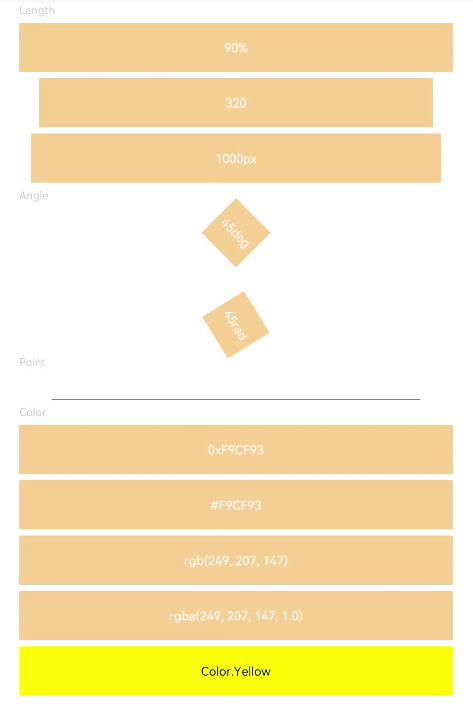

# Types

## Length Type

| Name| Type| Description|
| -------- | -------- | -------- |
| Length | string&nbsp;\|&nbsp;number | Length unit. If the input is a number, use **vp**. If the input is a string, explicitly specify the unit, for example, **'10px'**, or specify the length in percentage, for example, **'100%'**.|


## Angle Type

| Name| Type| Description|
| -------- | -------- | -------- |
| Angle | string&nbsp;\|&nbsp;number | Angle unit. If the input is a number, use **deg**. If the input is a string, explicitly specify the unit, which can be either of the following: <br/>-&nbsp;deg, as in **'100deg'** <br/>-&nbsp;rad, as in **'3.14rad'** |


## Point Type

| Name| Type| Description|
| -------- | -------- | -------- |
| Point | [Length,&nbsp;Length] | Coordinates of a point. The first value is the x-axis coordinate, and the second value is the y-axis coordinate.|


## Color Type

The **Color** used by the component attribute method is described as follows:

| Name| Type| Description|
| -------- | -------- | -------- |
| Color | string&nbsp;\|&nbsp;number&nbsp;\|&nbsp;Color | Color information. If the input is a string, use **rgb** or **rgba** to specify the color. If the input is a number, use Hex format to specify the color. If the input is a **Color" enum, use a color value to specify the color. <br/>-&nbsp;'rgb(255,&nbsp;255,&nbsp;255)' <br/>-&nbsp;'rgba(255,&nbsp;255,&nbsp;255,&nbsp;1.0)' <br/>-&nbsp;Hex format: 0xrrggbb, 0xaarrggbb, '\#FFFFFF' <br/>-&nbsp;Enum: Color.Black, Color.White|


The supported **Color** enums are described as follows:


| Color| Value| Illustration|
| -------- | -------- | -------- |
| Black | 0x000000 |  |
| Blue | 0x0000ff |  |
| Brown | 0xa52a2a |  |
| Gray | 0x808080 |  |
| Green | 0x008000 |  |
| Orange | 0xffa500 |  |
| Pink | 0xffc0cb |  |
| Red | 0xff0000 |  |
| White | 0xffffff |  |
| Yellow | 0xffff00 |  |


## ColorStop Type

**ColorStop** is used to describe the progressive color stop.

| Name| Type| Description|
| -------- | -------- | -------- |
| ColorStop | [Color,&nbsp;number] | Type of the progressive color stop. The first parameter specifies the color value, and the second parameter specifies the ratio of 0 to 1.|


## Resource Type

Resource reference type, which is used to set the value of a component attribute.

You can use **$r** or **$rawfile** to create a **Resource** object. For details, see [Resource Access](ts-media-resource-type.md).

- $r('belonging.type.name')
  **belonging**: system or application resource. The value can be **'sys'** or **'app'**.

  **type**: resource type, which can be **'color'**, **'float'**, **'string'**, or **'media'**.

  **name**: resource name, which is determined during resource definition.

- $rawfile('filename')
  **filename**: name of the file in **resources/rawfile** of the project.

| Name| Type| Description|
| -------- | -------- | -------- |
| Resource | {<br/>readonly&nbsp;id:&nbsp;[number];<br/>readonly&nbsp;type:&nbsp;[number];<br/>readonly&nbsp;params?:&nbsp;any[];<br/>} | **id**: resource ID. <br/>**type**: resource type (enumerated value). <br/>**params**: optional parameters. <br/>After a **Resource** object is created using **$r** or **$rawfile**, modifying attribute values of the object is prohibited.|


## ResourceStr<sup>8+</sup>

| Name| Type| Description|
| -------- | -------- | -------- |
| ResourceStr | string&nbsp;\|&nbsp;[Resource](#ResourceType) | Resource string.|


## Resource Color<sup>8+</sup>

| Name| Type| Description|
| -------- | -------- | -------- |
| ResourceColor | Color&nbsp;\|&nbsp;number&nbsp;\|&nbsp;string&nbsp;\|&nbsp;[Resource](#ResourceType) | Resource color.|


## Custom Builder<sup>8+</sup>

You can use **CustomBuilder** to define custom UI descriptions in component attribute methods.

| Name| Type| Description|
| -------- | -------- | -------- |
| CustomBuilder | ()&nbsp;=&gt;&nbsp;any | Builder of component attribute methods for defining custom UI descriptions. This type of method must be decorated by **@Builder**. For details, see [@Builder](ts-component-based-builder.md).|


## Example

```
@Entry
@Component
struct dataTypeExample {
  build() {
    Column({ space: 5 }) {
      Text('Length').fontColor(0xCCCCCC).fontSize(9).width('90%')
      Text('90%').width('90%').height(40).backgroundColor(0xF9CF93)
        .textAlign(TextAlign.Center).fontColor(Color.White)
      Text('320').width(320).height(40).backgroundColor(0xF9CF93)
        .textAlign(TextAlign.Center).fontColor(Color.White)
      Text('1000px').width('1000px').height(40).backgroundColor(0xF9CF93)
        .textAlign(TextAlign.Center).fontColor(Color.White)

      Text('Angle').fontColor(0xCCCCCC).fontSize(9).width('90%')
      Text('45deg')
        .width(40).height(40)
        .rotate({ x: 0, y: 0, z: 1, angle: 45, centerX: '50%', centerY: '50%' })
        .fontColor(Color.White)
        .backgroundColor(0xF9CF93).textAlign(TextAlign.Center)

      Text('45rad')
        .width(40).height(40)
        .rotate({ x: 0, y: 0, z: 1, angle: '45rad', centerX: '50%', centerY: '50%' })
        .fontColor(Color.White)
        .backgroundColor(0xF9CF93).textAlign(TextAlign.Center).margin({ top: 30 })

      Text('Point').fontColor(0xCCCCCC).fontSize(9).width('90%')
      Line().width(300).height(40).startPoint([0, 20]).endPoint([300, 20])

      Text('Color').fontColor('#CCCCCC').fontSize(9).width('90%')
      Text('0xF9CF93')
        .fontColor(Color.White).textAlign(TextAlign.Center)
        .width('90%').height(40).backgroundColor(0xF9CF93)

      Text('#F9CF93')
        .fontColor(Color.White).textAlign(TextAlign.Center)
        .width('90%').height(40).backgroundColor('#F9CF93')

      Text('rgb(249, 207, 147)')
        .fontColor(Color.White).textAlign(TextAlign.Center)
        .width('90%').height(40).backgroundColor('rgb(249, 207, 147)')

      Text('rgba(249, 207, 147, 1.0)')
        .fontColor(Color.White).textAlign(TextAlign.Center)
        .width('90%').height(40).backgroundColor('rgba(249, 207, 147, 1.0)')

      Text('Color.Yellow')
        .textAlign(TextAlign.Center)
        .width('90%').height(40).backgroundColor(Color.Yellow)
    }
    .width('100%').margin({ top: 5 })
  }
}
```


