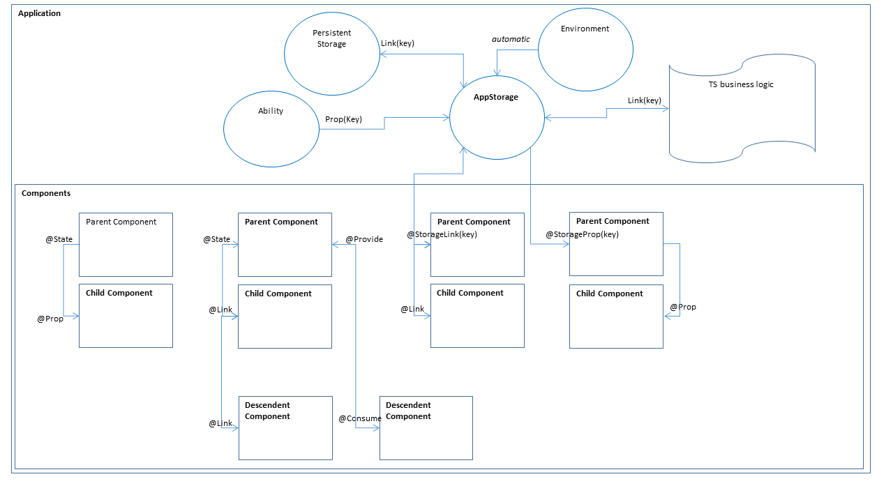

# Basic Concepts

In the declarative UI programming paradigm, the UI is a function in the specific application state, and you update a UI by modifying the current application state.

The development framework provides comprehensive application state management capabilities, as shown in the figure below.

## State Variable Decorators

-   **@State**: grants a component the state attribute. Each time the  **@State**  decorated variable changes, the component re-renders and updates the UI.
-   **@Link**: allows a component to depend on some state attributes of its parent component. Each time the data in one component is updated, the state of the other component is updated, and the parent and child components are rendered again.
-   **@Prop**: works in a way similar to that of  **@Link**. The only difference is that the changes made by a child component are not synchronized to the parent component.

## Application State Data

**AppStorage**  is the central store of the application states used in the entire UI. The UI framework creates a singleton  **AppStorage**  object for the application and provides the corresponding decorators and APIs for the application.

-   **@StorageLink**: works in a way similar to that of  **@Consume**. The difference is that the link object with the specified name is obtained from the  **AppStorage**. It establishes two-way binding between the UI component and  **AppStorage**  to synchronize data.
-   **@StorageProp**: synchronizes UI component attributes with the  **AppStorage**  unidirectionally. The value change in the  **AppStorage**  will trigger an update of the attribute value in the UI component, but the attribute value of the UI component will not cause an update of the attribute value in the  **AppStorage**.
-   Service logic implementation API: adds, reads, modifies, or deletes the state attributes of applications. The changes made by this API will be synchronized to the UI component for UI update.

