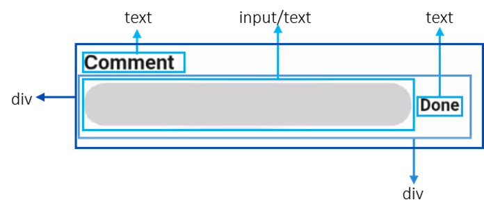

# Layout Description

The baseline width for page design is 720 logical px. The display width of a page element depends on the ratio of the screen width to the baseline width.

For example, when the width of a component is 100 px, its display width is converted as follows:

-   On a screen with the width of 720 physical px, the display width is 100 physical px.

-   On a screen with the width of 1440 physical px, the display width is 200 physical px.

Basic elements on the page include title, text, and image areas. Each basic element may contain multiple sub-elements. You can add components, such as buttons, switches, and progress bars, to these elements and sub-elements as required. When setting the layout, you need to consider the following for each basic element:

-   Size and arrangement
-   Overlapping with other elements
-   Alignment, padding, and margin
-   Sub-elements and their positions
-   Container components and their types

You can disassemble elements on the page first and then implement them in sequence. This reduces visual confusion and logical conflicts caused by element nesting and improves code readability for easier modification. For example, as shown below, you disassemble the page elements and elements in the comment area.

**Figure  1**  Page layout  

**Figure  2**  Layout of the comment area  

