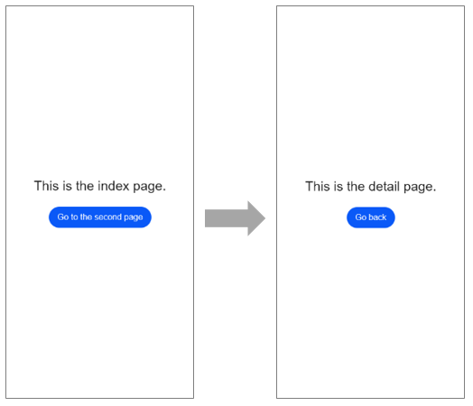

# Defining Page Routes


An application generally consist of more than one page. For example, in a music application, a user taps a song on a music list page to jump to the playback page of the song. You need to link these pages through the page router to implement redirection as required.


The page router finds the target page based on the page URI. The following describes how to implement redirection between two pages:


1. In the **Project** window of DevEco Studio, choose **entry** > **src** > **mainjsdefault**. Right-click the **pages** folder and choose **NewJS Page** from the shortcut menu to create the detail page.

2. Call **router.push()** to navigate users to the detail page.

3. Call **router.back()** to navigate users to the index page.


## Building the Page Layout

The index and detail pages each contains a &lt;text> component that specifies the current page, and a **\<button>** component that implements the switching between two pages. Example code in .hml files is as follows:


```
<!-- index.hml -->
<div class="container">
  <text class="title">This is the index page.</text>
  <button type="capsule" value="Go to the second page" class="button" onclick="launch"></button>
</div>
```


```
<!-- detail.hml -->
<div class="container">
  <text class="title">This is the detail page.</text>
  <button type="capsule" value="Go back" class="button" onclick="launch"></button>
</div>
```


## Setting Page Styles

Set styles for the index and detail pages. Center the **\<text>** and **\<button>** components and space the two components with 50 pixels. The CSS code for the two pages is as follows:


```
/* index.css */
/* detail.css */
.container {
  flex-direction: column;
  justify-content: center;
  align-items: center;
}

.title {
  font-size: 50px;
  margin-bottom: 50px;
}
```


## Implementing Redirection

To make the launch method of the **\<button>** component take effect, the redirection logic needs to be implemented in the .js file of the page. Call router.push() to add the page URI to the route stack, that is, to jump to the page specified by the URI. You need to import the router module before calling the router method. The sample code is as follows:


```
// index.js
import router from '@system.router';
export default {
  launch() {
    router.push ({
      uri: 'pages/detail/detail',
    });
  },
}
```


```
// detail.js
import router from '@system.router';
export default {
  launch() {
    router.back();
  },
}
```

The figure below shows the effect.

  

## Samples

The following sample is provided to help you better understand how to develop page routing: 

[`JsRouter`: Page Routing (JavaScript, API 7)](https://gitee.com/openharmony/app_samples/tree/master/UI/JsRouter)