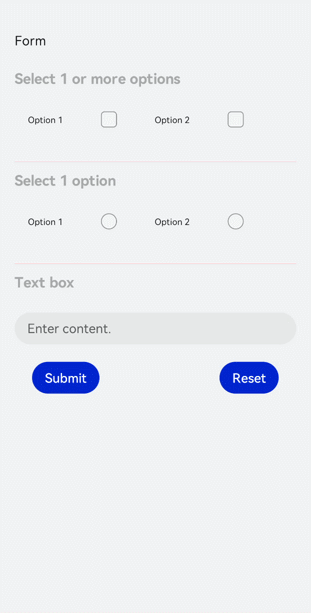

# Form<a name="EN-US_TOPIC_0000001201655789"></a>

The  **<form\>**  component allows the content in  [**<input\>**](../reference/arkui-js/js-components-basic-input.md)  components to be submitted and reset. For details, see  [form](../reference/arkui-js/js-components-container-form.md).

> **NOTE:** 
>This component is supported since API version 6.

## Creating a <form\> Component<a name="section1688401116367"></a>

Create a  **<form\>**  component in the  **.hml**  file under  **pages/index**.

```
<!-- xxx.hml -->
<div class="container">
  <form> 
    <input type="text" style="width:80%"></input>
  </form>
</div>
```

```
/* xxx.css */
.container {
  flex-direction: column;
  justify-content: center;
  align-items: center;
  background-color: #F1F3F5;
}
```


## Zooming In or Out on a Form<a name="section462755916266"></a>

To implement the zoom effect after a form is clicked, add the  **click-effect**  attribute to the  **<form\>**  component. For values of  **click-effect**, see  [Universal Attributes](../reference/arkui-js/js-components-common-attributes.md).

```
<!-- xxx.hml -->
<div class="container">
  <form  id="formId" class="formClass" click-effect="spring-large">
    <input type="text"></input>  
  </form>
</div>
```

## Setting the Form Style<a name="section17276142315293"></a>

Add the  **background-color**  and  **border**  attributes.

```
/* xxx.css */
.container {
  flex-direction: column;
  align-items: center;
  justify-content: center;
  background-color: #F1F3F5;
}
.formClass{
  width: 80%;
  padding: 10px;
  border: 1px solid #c3d3e7;
}
```


## Adding Response Events<a name="section1587614482301"></a>

To submit or reset a form, add the  **submit**  and  **reset**  events.

```
<!-- xxx.hml -->
<div class="container" style="background-color:#F1F3F5;">
  <form onsubmit='onSubmit' onreset='onReset' style="justify-content: center; align-items: center;text-align: center;">
    <div style="flex-direction: column;justify-content: center;align-self: center;">
      <div style="justify-content: center; align-items: center;">
        <label>Option 1</label>
        <input type='radio' name='radioGroup' value='radio1'></input>
        <label>Option 2</label>
        <input type='radio' name='radioGroup' value='radio2'></input>
      </div>
      <div style="margin-top: 30px;justify-content: center; align-items: center;">
        <input type="submit" value="Submit" style="width:100px; margin-right:20px;" ></input>
        <input type="reset" value="Reset" style="width:100px;"></input>
      </div>
    </div> 
  </form>
</div>
```

```
/* xxx.js */
import prompt from '@system.prompt';
export default{
  onSubmit(result) {
    prompt.showToast({
      message: result.value.radioGroup
    })
  },
  onReset() {
    prompt.showToast({
      message: 'Reset All'
    })
  }
}
```


## Example Scenario<a name="section54252520379"></a>

Select an option and submit or reset the form data.

Create  [**<input\>**](../reference/arkui-js/js-components-basic-input.md)  components, set their  **type**  attribute to  **checkbox**  and  **radio**, and use the  **onsubmit**  and  **onreset**  events of the  **<form\>**  component to submit and reset the form data.

```
<!-- xxx.hml -->
<div class="container">
   <form onsubmit="formSubmit" onreset="formReset">
 <text style="font-size: 30px; margin-bottom: 20px; margin-top: 100px;">
      <span > Form </span>
  </text>
    <div style="flex-direction: column;width: 90%;padding: 30px 0px;">
     <text class="txt">Select 1 or more options</text>
      <div style="width: 90%;height: 150px;align-items: center;justify-content: space-around;">
        <label target="checkbox1">Option 1</label>
        <input id="checkbox1" type="checkbox" name="checkbox1"></input>
        <label target="checkbox2">Option 2</label>
        <input id="checkbox2" type="checkbox" name="checkbox2"></input>
       </div>
       <divider style="margin: 20px 0px;color: pink;height: 5px;"></divider>
       <text class="txt">Select 1 option</text>
       <div style="width: 90%;height: 150px;align-items: center;justify-content: space-around;">
         <label target="radio1">Option 1</label>
         <input id="radio1" type="radio" name="myradio"></input>
         <label target="radio2">Option 2</label>
         <input id="radio2" type="radio" name="myradio"></input>
       </div>
       <divider style="margin: 20px 0px;color: pink;height: 5px;"></divider>
       <text class="txt">Text box</text>
       <input type="text" placeholder="Enter content." style="margin-top: 50px;"></input>
       <div style="width: 90%;align-items: center;justify-content: space-between;margin: 40px;">
         <input type="submit">Submit</input>
         <input type="reset">Reset</input>
       </div>
    </div>
  </form>
</div>
```

```
/* index.css */
.container {
  flex-direction:column;
  align-items:center;
  background-color:#F1F3F5;
}
.txt {
  font-size:33px;
  font-weight:bold;
  color:darkgray;
}
label{
  font-size: 20px;
}
```

```
/* xxx.js */
import prompt from '@system.prompt';
export default {
  formSubmit() {
    prompt.showToast({
      message: 'Submitted.'
    })
  },
  formReset() {
    prompt.showToast({
      message: 'Reset.'
    })
  }
}
```



