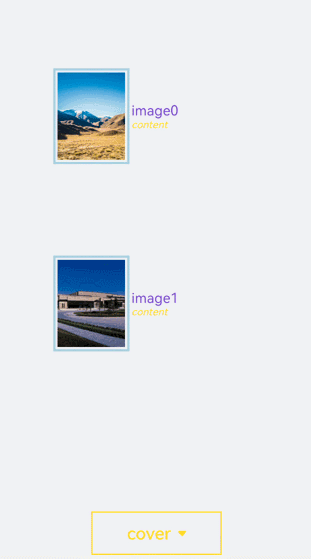

# Image<a name="EN-US_TOPIC_0000001202854311"></a>

The  **<image\>**  component is used to render and display images. For details, see  [image](../reference/arkui-js/js-components-basic-image.md).

## Creating an <image\> Component<a name="section1688401116367"></a>

Create an  **<image\>**  component in the  **.hml**  file under  **pages/index**.

```
<!-- index.hml -->
<div class="container">
  <image src="common/images/bg-tv.jpg"> </image>
</div>
```

```
/* xxx.css */
.container {
  flex-direction: column;
  justify-content: center;
  align-items: center;
  background-color: #F1F3F5;
}
```


## Setting the Image Style<a name="section17276142315293"></a>

Set the  **width**,  **height**, and  **object-fit**  attributes to define the width, height, and scale type of an image.

```
<!-- index.hml -->
<div class="container">
  <image src="common/images/bg-tv.jpg"> </image>
</div>
```

```
/* xxx.css */
.container {
  flex-direction: column;
  align-items: center;
  justify-content: center;
  background-color:#F1F3F5;
}
image{
  width: 80%;
  height: 500px;
  border: 5px solid saddlebrown;
  border-radius: 20px;
  object-fit: contain;
  match-text-direction:true;

}
```


## Display Multiple Images<a name="section297282517378"></a>

Define a  **for**  loop to display multiple images cyclically. Set  **option**  to specify the image scale style. For details about the scale styles, see the description of  [object-fit](../reference/arkui-js/js-components-basic-image.md#table175851535113711).

```
<!-- index.hml -->
<div class="page-container">
  <list>
    <list-item class="item-container" for="{{list}}">
      <image class="testimage" src="{{url[$idx]}}" style="object-fit: {{fit}};"></image>
      <div class="text-container">
        <text style="font-size: 32px;color:#7b68ee;">image{{$idx}}</text>
        <text style="font-size: 23px;color: orange;font-style: italic;">content</text>
      </div>
    </list-item>
  </list>
  <div style="width: 100%;height:100px;justify-content: center;margin-top: 100px;flex-shrink: 0;">
    <select id="slt2" style="border: 3px solid orange;color: orange;font-size: 40px;width:300px;height:160px;" onchange="setfit">
      <option for="{{fit_list}}" value="{{$item}}" style="font-size: 36px;">{{$item}}</option>
    </select>
  </div>
</div>
```

```
/* xxx.css */
.page-container {
  flex-direction:column;
  background-color:#F1F3F5;
}
.text-container {
  width: 300px;
  flex-direction: column;
  justify-content: center;
}
.item-container {
  flex-direction: row;
  align-items: center;
  justify-content:center;
  margin-top:200px;
}
.testimage {
  width: 175px;
  height: 220px;
  border: 5px solid #add8e6;
  padding: 5px 5px 5px 5px;
  margin: 5px 5px 5px 5px;
}
.testicon {
  width: 50px;
  height: 50px;
  margin-left: 150px;
  border-radius: 25px;
  background-color: orange;
}
```

```
/* index.js */
export default {
  data: {
    url:['common/images/bg-tv.jpg','common/images/img2.jpg'],
    list:[0,1],
    fit:'cover',
    fit_list:['cover','contain','fill','none','scale-down']
  },
  setfit(e) {
    this.fit = e.newValue
  }
}
```



## Loading Images<a name="section06913511375"></a>

When an image is successfully loaded, the  **complete**  event is triggered, and the loaded image is returned. If an exception occurs during image loading, the  **error**  event is triggered, and the image loading failure is printed.

```
<!-- index.hml -->
<div class="container" >
  <div>
    <image src="common/images/bg-tv.jpg" oncomplete="imageComplete(1)" onerror="imageError(1)"> </image>
  </div>
  <div>
    <image src="common/images/bg-tv1.jpg" oncomplete="imageComplete(2)" onerror="imageError(2)"> </image>
  </div>
</div>
```

```
/* xxx.css */
.container{
  flex-direction: column;
  justify-content: center;
  align-self: center;
  background-color: #F1F3F5;
}
.container div{
  margin-left: 10%;
  width: 80%;
  height: 300px;
  margin-bottom: 40px;
}
```

```
/* index.js */
import prompt from '@system.prompt';
export default {
  imageComplete(i,e){
    prompt.showToast({
      message: "Image "+i+"'s width"+ e.width+"----Image "+i+"'s height"+e.height,
      duration: 3000,
    })
  },
  imageError(i,e){
    setTimeout(()=>{
      prompt.showToast({
        message: "Failed to load image "+i+".",
        duration: 3000,
      })
    },3000)
  }
}
```


## Example Scenario<a name="section54252520379"></a>

In this example you touch and hold an image to gradually hide it. After the image is completely hidden, it will show in its original setting. Set a  **setInterval**  timer to change the image opacity at a specified interval so that it is hidden gradually. When the opacity changes to  **0**, the timer is cleared and the opacity is set to  **1**.

```
<!-- index.hml -->
<div class="page-container">
  <div class="content">
    <div class="image-container">
      <image class="testimage" src="{{testuri}}" style="display:{{displaytype}};opacity:{{imageopacity}};" onclick="changedisplaytype" onlongpress="changeopacity"> </image>
    </div>
    <div class="text-container">
      <text style="font-size: 37px;font-weight:bold;color:orange;text-align: center;width: 100%;">Touch and hold the image</text>
    </div>
  </div>
</div>
```

```
/* xxx.css */
.page-container {
  flex-direction:column;
  align-self: center;
  justify-content: center;
  background-color:#F1F3F5;
}
.content{
  flex-direction:column;
}
.image-container {
  width: 100%;
  height: 300px;
  align-items: center;
  justify-content: center;
}
.text-container {
  margin-top:50px;
  width: 100%;
  height: 60px;
  flex-direction: row;
  justify-content: space-between;
}
.testimage {
  width: 100%;
  height: 400px; 
  object-fit: scale-down;
  border-radius: 20px;
}
```

```
/* index.js */
import prompt from '@system.prompt';
export default {
  data: {
    testuri: 'common/images/bg-tv.jpg',
    imageopacity:1,
    timer: null
  },
  changeopacity: function () {
    prompt.showToast({
      message: 'Touch and hold the image.'
    })
    var opval = this.imageopacity * 20
    clearInterval(this.timer);
    this.timer = setInterval(()=>{
      opval--;
      this.imageopacity = opval / 20
      if (opval===0) {
        clearInterval(this.timer)
        this.imageopacity = 1
      }
    },100);
  }
}
```


