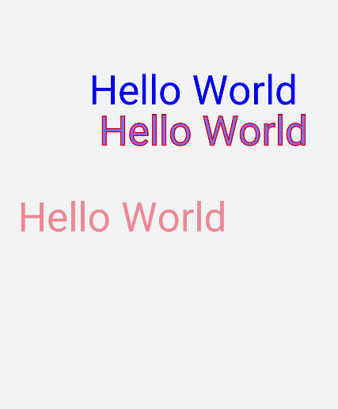
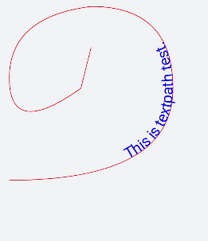

# Text Drawing


The **&lt;svg&gt;** component can also be used to draw text.


## Text

>  **NOTE:**
> - The text content must be written in the **&lt;text&gt;** area. The **&lt;tspan&gt;** child element label can be nested.
> 
> - **&lt;text&gt;** can be nested only by the parent element label **svg**.
> 
> - Only the default font **sans-serif** is supported.

Set the following attributes to define text styles: **x** (X coordinate), **y** (Y coordinate), **dx** (x-axis offset of the text), **dy** (y-axis offset of the text), **fill** (font fill color), **stroke** (text border color), and **stroke-width** (text border width).

  
```
<!-- xxx.hml -->
<div class="container">
  <svg>
    <text x="200" y="300" font-size="80px" fill="blue" >Hello World</text>
    <text x="200" y="300" dx="20" dy="80" font-size="80px" fill="blue" fill-opacity="0.5" stroke="red" stroke-width="2">Hello World</text>
    <text x="20" y="550" fill="#D2691E">
      <tspan dx="40" fill="red" font-size="80" fill-opacity="0.4">Hello World </tspan>
    </text>
  </svg>
</div>
```




## Drawing Text Along the Path

Set **textpath** to draw text along the path.

  
```
<!-- xxx.hml -->
<div class="container">
  <svg fill="#00FF00" x="100" y="400">
    <path d="M40,360 Q360,360 360,180 Q360,20 200,20 Q40,40 40,160 Q40,280 180,180 Q180,180 200,100" stroke="red" fill="none"></path>
      <text>
        <textpath fill="blue" startOffset="20%" path="M40,360 Q360,360 360,180 Q360,20 200,20 Q40,40 40,160 Q40,280 180,180 Q180,180 200,100" font-size="30px">
          This is textpath test.
        </textpath>
      </text>
  </svg>
</div>
```


