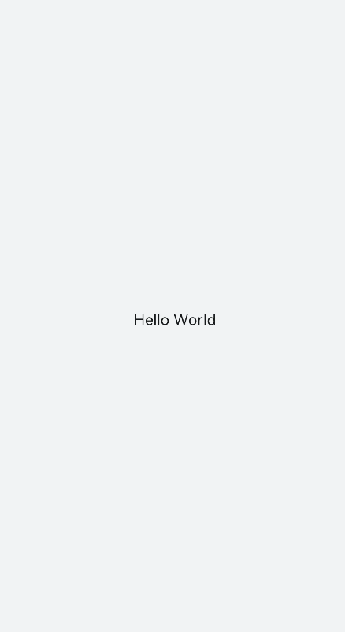
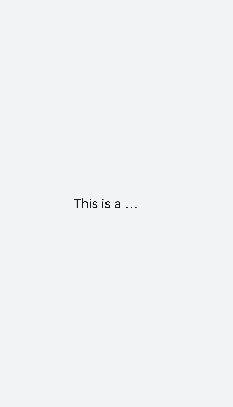
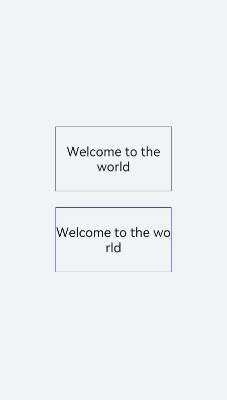
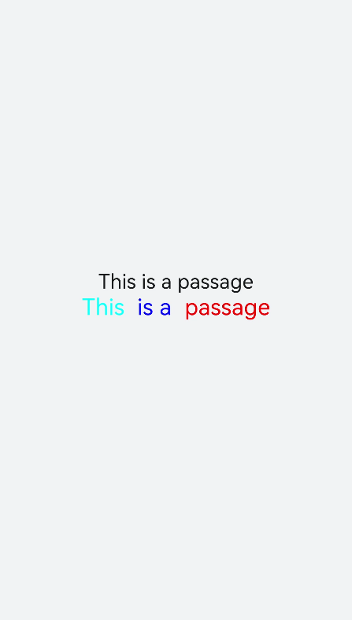
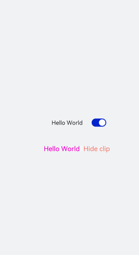

# Text<a name="EN-US_TOPIC_0000001157214238"></a>

The  **<text\>**  component is used to display a piece of textual information. For details, see  [text](../reference/arkui-js/js-components-basic-text.md).

## Creating a <text\> Component<a name="section1466515586539"></a>

Create a  **<text\>**  component in the  **.hml**  file under  **pages/index**.

```
<!-- xxx.hml -->
<div class="container" style="text-align: center;justify-content: center; align-items: center;">
  <text>   
     Hello World  
  </text>
</div>
```

```
/* xxx.css */
.container {
  flex-direction: column;
  align-items: center;
  justify-content: center;
  background-color: #F1F3F5;
}
```



## Setting the Text Style and Attributes<a name="section99161742155912"></a>

-   Adding a text style

Set the  **color**,  **font-size**, and  **allow-scale**  attributes.

```
<!-- xxx.hml -->
<div class="container" style="background-color:#F1F3F5;justify-content: center; align-items: center;">   
  <text style="color: blueviolet; font-size: 40px; allow-scale:true"> 
    This is a passage
  </text>
</div>
```


-   Adding a text modifier

Set the  **text-decoration**  attribute to add an underline, overline, line-through, or a combination of lines to selected text. For values of  **text-decoration**, see  [Text Styles](../reference/arkui-js/js-components-basic-text.md#section5775351116).

```
<!-- xxx.hml -->
<div class="container" style="background-color:#F1F3F5;">
  <text style="text-decoration:underline">
    This is a passage
  </text>
  <text style="text-decoration:line-through">
    This is a passage
  </text>
</div>
```

```
/* xxx.css */
.container {
  flex-direction: column;
  align-items: center;
  justify-content: center;
}
text{
  font-size: 50px;
}
```


-   Hiding text content

Set the  **text-overflow**  attribute to  **ellipsis**  so that overflowed text is displayed as an ellipsis.

```
<!-- xxx.hml -->
<div class="container">
  <text class="text">
    This is a passage
  </text>
</div>
```

```
/* xxx.css */
.container {
  flex-direction: column;
  align-items: center;
  background-color: #F1F3F5;
  justify-content: center;
}
.text{
  width: 200px;
  max-lines: 1;
  text-overflow:ellipsis;
}
```

> **NOTE:** 
>-   **text-overflow**  must be used together with  **max-lines**.
>-   **max-lines**  indicates the maximum number of lines in the text.



-   Setting the text line breaking mode

Set the  **word-break**  attribute to specify how to break lines of text. For values of  **word-break**, see  [Text Styles](../reference/arkui-js/js-components-basic-text.md#section5775351116).

```
<!-- xxx.hml -->
<div class="container">
  <div class="content">
    <text class="text1">
      Welcome to the world
    </text>
    <text class="text2">
      Welcome to the world
    </text>
  </div>
</div>
```

```
/* xxx.css */
.container {
  background-color: #F1F3F5;
  flex-direction: column;
  align-items: center;
  justify-content: center;
}
.content{
  width: 50%;
  flex-direction: column;
  align-items: center;
  justify-content: center;
}
.text1{
  height: 200px;
  border:1px solid #1a1919;
  margin-bottom: 50px;
  text-align: center;
  word-break: break-word;
  font-size: 40px;
}
.text2{
  height: 200px;
  border:1px solid #0931e8;
  text-align: center;
  word-break: break-all;
  font-size: 40px;
}
```



-   Setting the  [**<span\>**](../reference/arkui-js/js-components-basic-span.md)  child component

```
<!-- xxx.hml -->
<div class="container" style="justify-content: center; align-items: center;flex-direction: column;background-color: #F1F3F5;">
  <text style="font-size: 45px;">
    This is a passage
  </text>
  <text style="font-size: 45px;">
    <span style="color: aqua;">This </span>
    <span style="color: #F1F3F5;">
      1
    </span>
    <span style="color: blue;"> is a </span>
    <span style="color: #F1F3F5;">
      1
    </span>
    <span style="color: red;">  passage </span>
  </text>
</div>
```



> **NOTE:** 
>-   When the  **<span\>**  child component is used to form a text paragraph, incorrect settings of the  **<span\>**  attributes \(for example,  **font-weight**  set to  **1000**\) will result in abnormal display of the text paragraph.
>-   When the  **<span\>**  child component is being used, do not include any text you want to show in the  **<text\>**  component, as such text will not be displayed.

## Example Scenario<a name="section7280164491412"></a>

Use the  **<text\>**  component to display text content through data binding. Use the  **<span\>**  child component to hide or display text content by setting the  **show**  attribute.

```
<!-- xxx.hml -->
<div class="container">
  <div style="align-items: center;justify-content: center;">
    <text class="title">
      {{ content }}
    </text>
    <switch checked="true" onchange="test"></switch>
  </div>
  <text class="span-container" style="color: #ff00ff;">
    <span show="{{isShow}}">  {{ content  }}  </span>
    <span style="color: white;">
        1
    </span>
    <span style="color: #f76160">Hide clip </span>
  </text>
</div>
```

```
/* xxx.css */
.container {
  align-items: center;
  flex-direction: column;
  justify-content: center;
  background-color: #F1F3F5;
}
.title {
  font-size: 26px;
  text-align:center;
  width: 200px;
  height: 200px;
}
```

```
// xxx.js
export default {   
  data: {    
    isShow:true,    
    content: 'Hello World'
  },   
  onInit(){    },  
  test(e) {    
    this.isShow = e.checked  
  }
}
```



