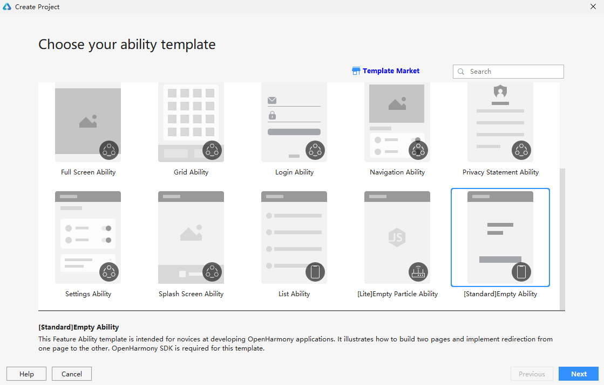
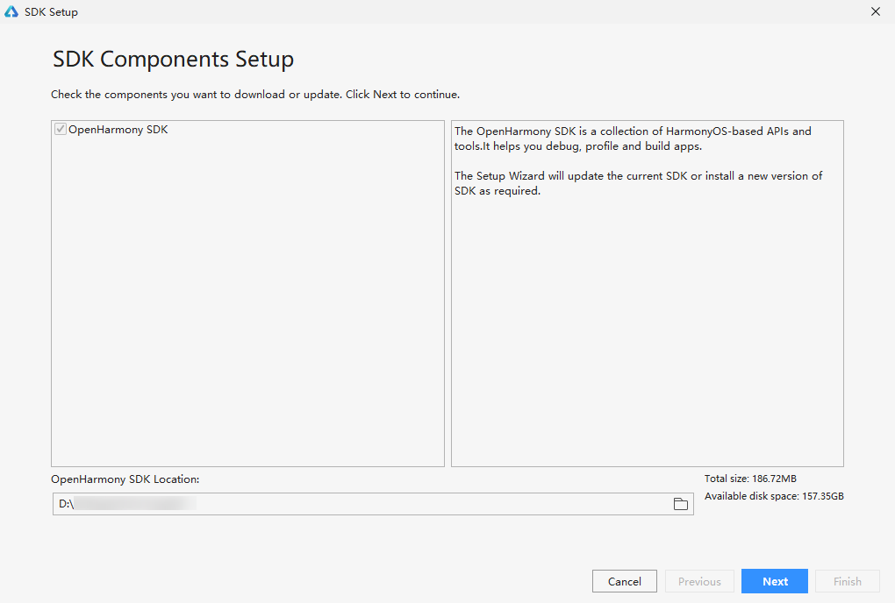
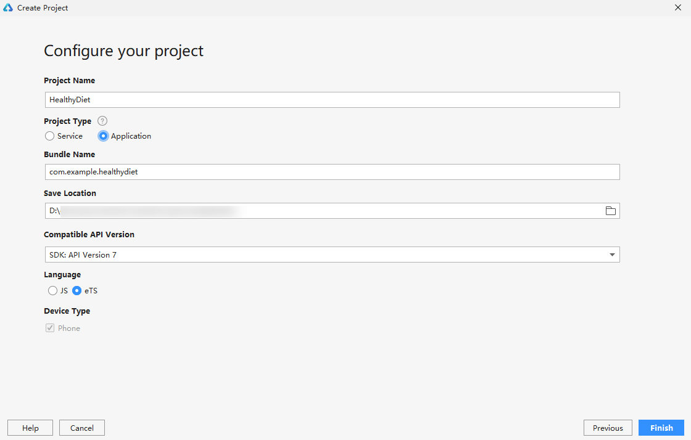
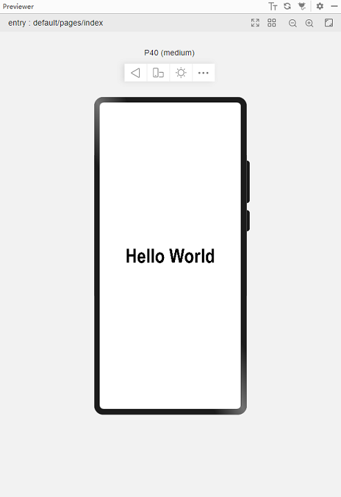

# Creating a Declarative UI Project


Before creating a project, you need to install DevEco Studio. 


1. Open DevEco Studio and click Create Project. If there is already a project, choose File > New > New project.
   

2. ​


   On the page for selecting an ability template, select [Standard]Empty Ability.

   

3. 
  Install the OpenHarmony SDK.

   

4. On the project configuration page, set Project Name to HealthyDiet, Project Type to Application, Device Type to Phone, Language to eTS, and Compatible API Version to SDK: API Version 7. By default, DevEco Studio saves the project to drive C. You can change the save path by setting Save Location. When you are done, click Finish.


   

5. After the project is created, open the app.ets file.
     The app.ets file provides the onCreate and onDestroy methods for the application lifecycle. onCreate is called when an application is created, and onDestroy is called when an application is destroyed. Global variables can be declared in the app.ets file, wherein the declared data and methods are shared by the entire application.

   ```
   export default {
       onCreate() {
           console.info('Application onCreate')
       },
       onDestroy() {
           console.info('Application onDestroy')
       },
   }
   ```

6. In the project navigation tree, open index.ets. This page displays the current UI description. The declarative UI framework automatically generates a component-based struct, which complies with the Builder API declaration. The current layout and components are declared in the build method.

   ```
   @Entry
   @Component
   struct MyComponent  {
     build() {
       Flex({ direction: FlexDirection.Column, alignItems: ItemAlign.Center, justifyContent: FlexAlign.Center }) {
         Text('Hello World')
           .fontSize(50)
           .fontWeight(FontWeight.Bold)
       }
       .width('100%')
       .height('100%')
     }
   }
   ```

7. Click Previewer on the right to open the Previewer window. Hello World is displayed in the middle and in bold.
   If the Previewer button is unavailable, choose Settings > SDK Manager >OpenHarmony SDK > Tools to check whether the Previewer is installed.

   

8. Install the application and run the application. Connect the device to the computer. After the IDE identifies the device, click Run'entry'.
   

   Before the installation, you must configure an application signature. For details, see Configuring the OpenHarmony App Signature. After the installation is complete, click the Run icon on the screen to open the application. Hello World is displayed in the center of the screen.

   
