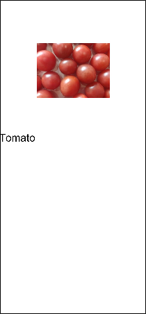
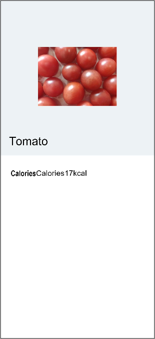
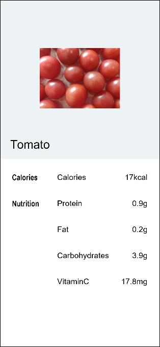

# Creating a Simple Page


In this section, we will develop an infographic food details page, by building custom components through the container components &lt;Stack&gt; and &lt;Flex&gt; as well as basic components &lt;Image&gt; and &lt;Text&gt;.


## Building the Stack Layout

1. Create a food name.
     Delete the code of the build method in the project template, create a &lt;Stack&gt; component, and place the &lt;Text&gt; component in the braces of the &lt;Stack&gt; component so that the &lt;Text&gt; component becomes a child component of the &lt;Stack&gt; component. A &lt;Stack&gt; component consists of one or more child components. The latter child component overwrites the former one.
     
   ```
   @Entry
   @Component
   struct MyComponent {
     build() {
       Stack() {
           Text('Tomato')
               .fontSize(26)
               .fontWeight(500)
       }
     }
   }
   ```

   

2. Display food pictures.
     Create an &lt;Image&gt; component and specify a URL for it. The &lt;Image&gt; and &lt;Text&gt; components are mandatory. To display the &lt;Text&gt; component above the &lt;Image&gt; component, you need to declare the &lt;Image&gt; component first. Image resources are stored in the rawfile folder in resources. When referencing the resources in the rawfile folder, use the $rawfile('_filename_ loaded) format, where filename indicates the relative path of the file in the rawfile folder. Currently, $rawfile only allows the &lt;Image&gt; component to reference image resources.
     
   ```
   @Entry
   @Component
   struct MyComponent {
     build() {
       Stack() {
           Image($rawfile('Tomato.png'))
           Text('Tomato')
               .fontSize(26)
               .fontWeight(500)
       }
     }
   }
   ```

   

3. Access images through resources.
   In addition to specifying the image path, you can also use the media resource symbol $r to reference resources based on the resource qualifier rules in the resources folder. Right-click the resources folder, choose New &gt; Resource Directory, set Resource Type to Media (image resource), and set the resource qualifier to Device-Phone (currently, phones are used).

   

   Click OK. The phone.media folder is generated in the resources folder. Place Tomato.png in the folder.

   

   You can then can reference the application resource in the $r('app.type.name') format, that is, $r('app.media.Tomato').

   
   ```
   @Entry
   @Component
   struct MyComponent {
     build() {
       Stack() {
           Image($r('app.media.Tomato'))
               .objectFit(ImageFit.Contain)
               .height(357)
           Text('Tomato')
               .fontSize(26)
               .fontWeight(500)
       }
     }
   }
   ```

4. Set the width and height of the image, and set the objectFit attribute of the image to ImageFit.Contain, which means to keep the aspect ratio of the image to ensure that the image is completely displayed within the boundary.
     If the image fills the entire screen, the possible causes are as follows:
   1. The width and height of the image are not set.
   
   2. The default attribute of objectFit of the image is ImageFit.Cover, that is, the image is zoomed in or zoomed out to fill the entire display boundary with the aspect ratio locked.

     
   ```
   @Entry
   @Component
   struct MyComponent {
     build() {
       Stack() {
           Image($r('app.media.Tomato'))
               .objectFit(ImageFit.Contain)
               .height(357)
           Text('Tomato')
               .fontSize(26)
               .fontWeight(500)
       }
     }
   }
   ```

   

5. Set the food image and name layout. Set the alignment mode of the stack to bottom alignment. By default, the stack is center aligned. Set alignContent to Alignment.BottomStart. Similar to FontWeight, Alignment is a built-in enumeration type provided by the framework.
  
   ```
   @Entry
   @Component
   struct MyComponent {
     build() {
       Stack({ alignContent: Alignment.BottomStart }) {
           Image($r('app.media.Tomato'))
               .objectFit(ImageFit.Contain)
               .height(357)
            Text('Tomato')
               .fontSize(26)
               .fontWeight(500)
       }
     }
   }
   ```

   

6. You can change the background color of the food image by setting the background color of the stack. You can set the background color in either of the following ways:
   1. By using the built-in enumeration value of Color provided by the framework. For example, backgroundColor(Color.Red) indicates that the background color is set to red.
   2. By using the parameter of the string type. The supported color formats are rgb, rgba, and HEX. For example, you can set the background color to blue by setting backgroundColor(??\#0000FF??) and set the background color to white by setting backgroundColor(??rgb(255, 255, 255)??).

     
   ```
   @Entry
   @Component
   struct MyComponent {
     build() {
       Stack({ alignContent: Alignment.BottomStart }) {
           Image($r('app.media.Tomato'))
               .objectFit(ImageFit.Contain)
               .height(357)
           Text('Tomato')
               .fontSize(26)
               .fontWeight(500)
       }
       .backgroundColor('#FFedf2f5')
     }
   }
   ```

   

7. Adjust the left and bottom margin of the &lt;Text&gt; component. Margin is a shorthand attribute. You can specify the margins of the four edges in a unified manner or separately. The configuration method is as follows:
   1. When the parameter is set to Length, the outer margins of the four edges are specified. For example, margin(20) indicates that the outer margins of the top, right, bottom, and left edges are all 20.
   2. {top?: Length, right?: Length, bottom?: Length, left?:Length} specifies the margins of the four edges. For example, margin({ left: 26, bottom: 17.4 }) indicates that the left margin is 26 and the bottom margin is 17.4.

     
   ```
   @Entry
   @Component
   struct MyComponent {
     build() {
       Stack({ alignContent: Alignment.BottomStart }) {
           Image($r('app.media.Tomato'))
               .objectFit(ImageFit.Contain)
               .height(357)
           Text('Tomato')
               .fontSize(26)
               .fontWeight(500)
               .margin({left: 26, bottom: 17.4})
       }
        .backgroundColor('#FFedf2f5')
     }
   }
   ```

   

8. Adjust the structure between components and semanticize component names. Create the FoodDetail page entry component, create a column in FoodDetail, and set the alignment to alignItems(HorizontalAlign.Center). Change the name of the MyComponent component to FoodImageDisplay, which is a child component of the FoodDetail component.
   A column is a container component whose child components are vertically arranged. It is a linear layout in essence. Therefore, only the alignment in the cross axis direction can be set.

   
   ```
   @Component
   struct FoodImageDisplay {
     build() {
       Stack({ alignContent: Alignment.BottomStart }) {
         Image($r('app.media.Tomato'))
           .objectFit(ImageFit.Contain)
         Text('Tomato')
           .fontSize(26)
           .fontWeight(500)
           .margin({ left: 26, bottom: 17.4 })
       }
       .height(357)
       .backgroundColor('#FFedf2f5')
     }
   }
   
   @Entry
   @Component
   struct FoodDetail {
     build() {
       Column() {
         FoodImageDisplay()
       }
       .alignItems(HorizontalAlign.Center)
     }
   }
   ```


## Building the Flex Layout

You can use the Flex layout to build a food composition table. In this way you do not need to worry about the width and height calculation. The size of different cells can be flexibly set based on the proportion.

1. Create a ContentTable component as a child component of the FoodDetail component.
  
   ```
   @Component
   struct FoodImageDisplay {
     build() {
       Stack({ alignContent: Alignment.BottomStart }) {
         Image($r('app.media.Tomato'))
           .objectFit(ImageFit.Contain)
           .height(357)
         Text('Tomato')
           .fontSize(26)
           .fontWeight(500)
           .margin({ left: 26, bottom: 17.4 })
       }
       .backgroundColor('#FFedf2f5')
     }
   }
   
   @Component
   struct ContentTable {
     build() {}
   }
   
   @Entry
   @Component
   struct FoodDetail {
     build() {
       Column() {
         FoodImageDisplay()
         ContentTable()
       }
       .alignItems(HorizontalAlign.Center)
     }
   }
   ```

2. Create a Flex component to display two food composition categories in the tomato: Calories and Nutrition.
   Calories contains information about calories. Nutrition contains information about protein, fat, carbohydrates, and vitamin C.

   Create the Calories class. Create a Flex component and set its height to 280, and the top, right, and left margins to 30. The Flex component contains three Text child components, which represent the category name (Calories), content name (Calories), and contain value (17 kcal), respectively. By default, child components in the Flex component are arranged horizontally.

   In the following example, code of FoodImageDisplay is omitted, and only code of ContentTable is provided.

   
   ```
   @Component
   struct ContentTable {
     build() {
       Flex() {
         Text('Calories')
           .fontSize(17.4)
           .fontWeight(FontWeight.Bold)
         Text('Calories')
           .fontSize(17.4)
         Text('17kcal')
           .fontSize(17.4)
       }
       .height(280)
       .padding({ top: 30, right: 30, left: 30 })
     }
   }
   
   @Entry
   @Component
   struct FoodDetail {
     build() {
       Column() {
         FoodImageDisplay()
         ContentTable()
       }
       .alignItems(HorizontalAlign.Center)
     }
   }
   ```

   

3. Adjust the layout and set the proportion (layoutWeight) of each part. Set the proportion of the category name to 1, and the total proportion of content name and content value to 2. The content name and content value are in a same Flex, and the content name occupies all remaining space flexGrow(1).
  
   ```
   @Component
   struct FoodImageDisplay {
     build() {
       Stack({ alignContent: Alignment.BottomStart }) {
         Image($m('Tomato.png'))
           .objectFit(ImageFit.Contain)
           .height(357)
         Text('Tomato')
           .fontSize(26)
           .fontWeight(500)
           .margin({ left: 26, bottom: 17.4 })
       }
       .backgroundColor('#FFedf2f5')
     }
   }
   
   @Component
   struct ContentTable {
     build() {
       Flex() {
         Text('Calories')
           .fontSize(17.4)
           .fontWeight(FontWeight.Bold)
           .layoutWeight(1)
         Flex() {
           Text('Calories')
             .fontSize(17.4)
             .flexGrow(1)
           Text('17kcal')
             .fontSize(17.4)
         }
         .layoutWeight(2)
       }
       .height(280)
       .padding({ top: 30, right: 30, left: 30 })
     }
   }
   
   @Entry
   @Component
   struct FoodDetail {
     build() {
       Column() {
         FoodImageDisplay()
         ContentTable()
       }
       .alignItems(HorizontalAlign.Center)
     }
   }
   ```

   

4. Create the Nutrient class in a similar process. Nutrition consists of four parts: Protein, Fat, Carbohydrates, and VitaminC. The names of the last three parts are omitted in the table and represented by spaces.
   Set FlexDirection.Column, FlexAlign.SpaceBetween, and ItemAlign.Start.

   
   ```
   @Component
   struct ContentTable {
     build() {
       Flex({ direction: FlexDirection.Column, justifyContent: FlexAlign.SpaceBetween, alignItems: ItemAlign.Start }) {
         Flex() {
           Text('Calories')
             .fontSize(17.4)
             .fontWeight(FontWeight.Bold)
             .layoutWeight(1)
           Flex() {
             Text('Calories')
               .fontSize(17.4)
               .flexGrow(1)
             Text('17kcal')
               .fontSize(17.4)
           }
           .layoutWeight(2)
         }
         Flex() {
           Text('Nutrition')
             .fontSize(17.4)
             .fontWeight(FontWeight.Bold)
             .layoutWeight(1)
           Flex() {
             Text('Protein')
               .fontSize(17.4)
               .flexGrow(1)
             Text('0.9g')
               .fontSize(17.4)
           }
           .layoutWeight(2)
         }
         Flex() {
           Text(' ')
             .fontSize(17.4)
             .fontWeight(FontWeight.Bold)
             .layoutWeight(1)
           Flex() {
             Text('Fat')
               .fontSize(17.4)
               .flexGrow(1)
             Text('0.2g')
               .fontSize(17.4)
           }
           .layoutWeight(2)
         }
         Flex() {
           Text(' ')
             .fontSize(17.4)
             .fontWeight(FontWeight.Bold)
             .layoutWeight(1)
           Flex() {
             Text('Carbohydrates')
               .fontSize(17.4)
               .flexGrow(1)
             Text('3.9g')
               .fontSize(17.4)
           }
           .layoutWeight(2)
         }
         Flex() {
           Text(' ')
             .fontSize(17.4)
             .fontWeight(FontWeight.Bold)
             .layoutWeight(1)
           Flex() {
             Text('vitaminC')
               .fontSize(17.4)
               .flexGrow(1)
             Text('17.8mg')
               .fontSize(17.4)
           }
           .layoutWeight(2)
         }
       }
       .height(280)
       .padding({ top: 30, right: 30, left: 30 })
     }
   }
   
   @Entry
   @Component
   struct FoodDetail {
       build() {
           Column() {
               FoodImageDisplay()
               ContentTable()
           }
           .alignItems(HorizontalAlign.Center)
       }
   }
   ```

5. Use the custom constructor @Builder to simplify the code. It can be found that the food groups in each food composition table are actually of the same UI structure.
   

   Currently, all food groups are declared, resulting in code duplication and redundancy. You can use @Builder to build a custom method and abstract the same UI structure declaration. The @Builder decorated method and the build method for the @Component decorated component are used to declare some UI rendering structures and comply with the same eTS syntax. You can define one or more methods decorated by @Builder, but a component decorated by @Component can have only one build method.

   Declare the IngredientItem method decorated by @Builder in ContentTable to declare the UI descriptions for the category name, content name, and content value.

   
   ```
   @Component
   struct ContentTable {
     @Builder IngredientItem(title:string, name: string, value: string) {
       Flex() {
         Text(title)
           .fontSize(17.4)
           .fontWeight(FontWeight.Bold)
           .layoutWeight(1)
         Flex({ alignItems: ItemAlign.Center }) {
           Circle({width: 6, height: 6})
             .margin({right: 12})
             .fill(colorValue)
           Text(name)
             .fontSize(17.4)
             .flexGrow(1)
           Text(value)
             .fontSize(17.4)
         }
         .layoutWeight(2)
       }
     }
   }
   ```

   When the IngredientItem API is called in the build method of ContentTable, this needs to be used to invoke the method in the scope of the component to distinguish the global method call.

   
   ```
   @Component
   struct ContentTable {
     ......
     build() {
       Flex({ direction: FlexDirection.Column, justifyContent: FlexAlign.SpaceBetween, alignItems: ItemAlign.Start }) {
         this.IngredientItem('Calories', 'Calories', '17kcal')
         this.IngredientItem('Nutrition', 'Protein', '0.9g')
         this.IngredientItem('', 'Fat', '0.2g')
         this.IngredientItem('', 'Carbohydrates', '3.9g')
         this.IngredientItem('', 'VitaminC', '17.8mg')
       }
       .height(280)
       .padding({ top: 30, right: 30, left: 30 })
     }
   }
   ```

   The overall code of the ContentTable component is as follows:

   
   ```
   @Component
   struct ContentTable {
     @Builder IngredientItem(title:string, name: string, value: string) {
       Flex() {
         Text(title)
           .fontSize(17.4)
           .fontWeight(FontWeight.Bold)
           .layoutWeight(1)
         Flex() {
           Text(name)
             .fontSize(17.4)
             .flexGrow(1)
           Text(value)
             .fontSize(17.4)
         }
         .layoutWeight(2)
       }
     }
   
     build() {
       Flex({ direction: FlexDirection.Column, justifyContent: FlexAlign.SpaceBetween, alignItems: ItemAlign.Start }) {
         this.IngredientItem('Calories', 'Calories', '17kcal')
         this.IngredientItem('Nutrition', 'Protein', '0.9g')
         this.IngredientItem('', 'Fat', '0.2g')
         this.IngredientItem('', 'Carbohydrates', '3.9g')
         this.IngredientItem('', 'VitaminC', '17.8mg')
       }
       .height(280)
       .padding({ top: 30, right: 30, left: 30 })
     }
   }
   
   @Entry
   @Component
   struct FoodDetail {
       build() {
           Column() {
               FoodImageDisplay()
               ContentTable()
           }
           .alignItems(HorizontalAlign.Center)
       }
   }
   ```

   

You've learned how to build a simple food details page. Read on to learn how to define the page layout and connection.

## Samples

The following sample is provided to help you better understand how to use build a simple page:

- [eTSBuildCommonView](https://gitee.com/openharmony/app_samples/tree/master/ETSUI/eTSBuildCommonView)

  This sample shows how to build a common view to display the picture of tomatoes and nutrition information, with the stack layout and flex layout.
