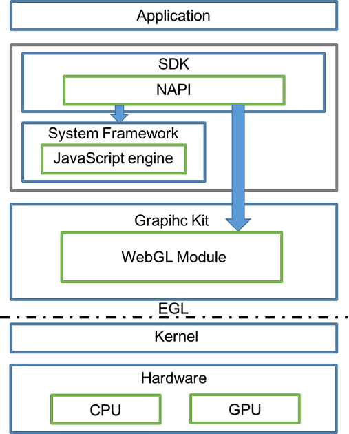

# WebGL Overview

Web Graphic Library (WebGL) is used for rendering interactive 2D and 3D graphics. WebGL used in OpenHarmony is based on OpenGL for Embedded Systems (OpenGL ES). It can be used in the **&lt;canvas&gt;** object of HTML5 without using plug-ins and supports cross-platform. WebGL is programmed by JavaScript code. Its APIs can implement graphics rendering and acceleration by using GPU hardware provided by the user equipment.

## Basic Concepts

### Shader

Shaders are instructions and data that run in a graphics card. In WebGL, shaders are written in the OpenGL Shading Language (GLSL).

There are vertex shaders and fragment shaders. The interaction between vertex shaders and fragment shaders involves rasterization.

- The vertex shader is mainly used to receive the coordinates of a point in a 3D space, process the coordinates into coordinates in a 2D space, and output the coordinates.

- The fragment shader is mainly used to output a color value for each pixel being processed.

- Rasterization is the process of converting the coordinates output by the vertex shader into pixels to be processed and passing the pixels to the fragment shader.

### Buffer

The buffer is a JavaScript object that resides in memory and stores the **attribute** object to be pushed to the shader.

### WebGLProgram

The WebGLProgram is a JavaScript object responsible for associating the shader with the buffer. A **WebGLProgram** object consists of two compiled WebGL shaders: a vertex shader and a fragment shader.

## Working Principles

  **Figure 1** WebGL working principles

- An application draws UI components using HTML5 at the foreground.

- Native APIs complete the interaction between JavaScript and C++ code.

- QuickJS and V8 are graphics frameworks that provide the **Surface** object for the WebGL module.

- The WebGL module exposes the GPU drawing APIs of OpenGL ES.

- The Embedded Graphics Library (EGL) implements adaptation to different platforms.
