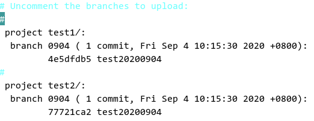
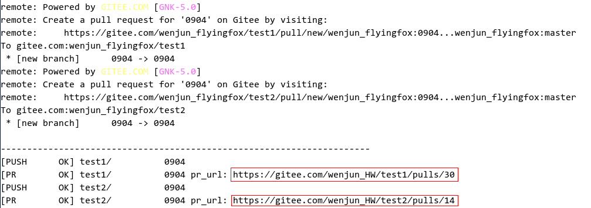

# Contribution Process<a name="EN-US_TOPIC_0000001052970939"></a>

## Preparations<a name="section124971410183614"></a>

-   Install, configure, and use Git. For details, visit  [https://gitee.com/help/categories/43](https://gitee.com/help/categories/43).
-   Register an SSH public key. For details, visit  [https://gitee.com/help/articles/4191](https://gitee.com/help/articles/4191).
-   Find the repository that you are interested in on the code hosting platform of OpenHarmony.

## Downloading Code<a name="section6125202333611"></a>

## Forking a Code Branch from the Cloud<a name="section8365811818"></a>

1.  Find and open the homepage of the repository.
2.  Click the  **Fork**  button in the upper right corner, and create an individual cloud fork branch as prompted.

## Downloading the Fork Repository to the Local Host<a name="section49051646201819"></a>

Perform the following steps to download the code in the repository to your computer:

1.  Create a local working directory.

    A local working directory is used for searching and managing local code.

    ```
    mkdir ${your_working_dir}
    ```

2.  Clone the remote repository to the local host.
    1.  Switch to the local path.

        ```
        mkdir -p ${your_working_dir}
        cd ${your_working_dir}
        ```

    2.  Clone the remote repository.
        -   You can copy the address of the remote repository on the repository page.

            **Figure  1** <a name="fig1772512534014"></a>  

        -   Run the following command on the local host:

            ```
            git clone $remote_link
            ```


## Using the repo Tool to Download Code Repositories in Batches<a name="section15763252468"></a>

1.  Download the repo tool. \(For details, see  [https://gitee.com/help/articles/4316](https://gitee.com/help/articles/4316).\)

    ```
    curl https://gitee.com/oschina/repo/raw/fork_flow/repo-py3 > /usr/local/bin/repo
    chmod a+x /usr/local/bin/repo
    pip install -i https://pypi.tuna.tsinghua.edu.cn/simple requests
    ```

2.  Download code repositories. \(There is no  **repo branch**  parameter.\)

    ```
    repo init -u https://gitee.com/openharmony/manifest.git -b master
    repo sync -c
    ```


## Committing Code<a name="section338918220422"></a>

## Committing a Repository \(git clone\)<a name="section669715742719"></a>

1.  **Update the branch.**

    Update your local branch.

    ```
    git remote add origin $remote_link
    git fetch origin
    git checkout master  
    git pull --rebase 
    ```

    Update the local debugging branch \(**myfeature**  branch\) based on the remote  **master**  branch.

    ```
    git branch myfeature origin/master
    git checkout myfeature  
    ```

    Then, edit and modify the code in the  **myfeature**  branch.

2.  **Commit the changes in the local working directory.**

    ```
    git add .
    git commit -sm "xxxxxx"  // Commit changes with a message containing the signoff email address.
    ```

    You may continue to edit and test more content after the previous commit. You can use  **commit --amend**  to commit these changes.

3.  **Push the changes to your remote directory.**

    If you plan to review \(or just establish a remote backup of your work\), push the branch to your fork repository:

    ```
    git push -f origin myfeature
    ```


## Committing Multiple Repositories \(repo init/sync\)<a name="section6560046192910"></a>

1. Configure the token of the global environment.

```
repo config --global repo.token {TOKEN}
```

The token is generated by choosing  **Settings**  \>  **Security Settings**  \>  [**Private Token**](https://gitee.com/profile/personal_access_tokens)  on Gitee. Example:

```
repo config --global repo.token 211XXXXXXXXXXXXXXXXXXXXXXXX
```

2. Create an issue under any repository to be modified on Gitee, and record the issue number \(for example, \#I1TVV4 in the following figure\). \(The issue provides a function similar to change ID of Gerrit and is used to associate multiple repositories to be modified. Skip this step if modification of multiple repositories is not involved.\)

3. Create a branch in the local code workspace, modify the code, and commit the changes.

```
repo start branchname --all
```

After the code is modified, run the following command in multiple repositories:

```
git add .
git commit -sm "xxxxxx"
```

Alternatively, use the repo tool to batch add or commit the changes in the root directory of the code project:

```
repo forall -c 'git add .'
repo forall -c 'git commit -sm "xxxxxx"'
```

4. Push the code. \(repo upload is not supported.\)

Specify whether to directly generate a pull request \(PR\) during code push. The value  **False**  indicates that a PR is not directly generated and needs to be manually generated in the fork warehouse. The value  **True**  indicates that a PR is generated when the code is pushed to the fork repository.

```
repo config repo.pullrequest {True/False}
```

For example, if the PR is generated when the push code is selected, run the following command:

```
repo config repo.pullrequest True
```

Run the following command to push the code:

```
repo push --br={BRANCH} --d={DEST_BRANCH} --content={PR_CONTENT}
```

**BRANCH**  indicates the local branch,  **DEST\_BRANCH**  indicates the destination branch \(trunk branch\), which is usually  **master**, and  **PR\_CONTENT**  indicates the PR description. If multi-repository committing is involved, the issue number must be entered. Example:

```
repo push --br="20200903" --d="master" --content="#I1TVV4"
```

On the editing page displayed, open the comment tags for the repository, branch, and commit.



Save the settings and exit. The repo tool automatically pushes the local branch to the remote fork repository \(creates a fork repository if there is no fork repository\) and generates a PR.



The tool automatically associates the PR with the issue.

## Creating a Pull Request<a name="section28261522124316"></a>

Access the fork repository on Gitee, click the button for creating a PR, and select the  **myfeature**  branch to generate a PR. \(Skip this step if a PR has been automatically created using the repo tool.\)

For details, visit  [https://gitee.com/help/articles/4128](https://gitee.com/help/articles/4128).

> **NOTICE:** 
>**How do I create PRs at the same time if multiple code repositories have compilation dependencies?**
>During the development of the operating system \(OS\), it is common that multiple code repositories have compilation dependencies. Therefore, the PRs need to be created and merged at the same time. For this reason, Gitee uses issues as the dependency identifiers for code repositories with compilation dependencies to commit the PRs. Follow the operations below:
>1.  Create an issue in any of the code repositories.
>2.  Associate PRs that need to be built and merged at the same time with the issue. For details, visit  [https://gitee.com/help/articles/4142](https://gitee.com/help/articles/4142).
>3.  After the build is triggered, the build center identifies the PRs associated with the same issue, downloads the build, and merges the PRs into the code library after the code is approved.

## Building Access Control<a name="section981124754415"></a>

## Creating an Issue<a name="section979820334458"></a>

1.  Go to the homepage of the repository.
2.  Click the  **Issues**  tab in the upper left corner. Then, click the issue creation button on the right, and create a dedicated task as prompted to execute continuous integration \(CI\) access control for associated code \(feature development/bug fixing\).

## Associating the Issue with the PR<a name="section5470144853615"></a>

When creating a PR or compiling an existing PR, enter  **\#+I+_five-digit issue ID_**  in the description box to associate the issue with the PR.

**Constraints**

-   One PR can be associated with only one issue. Otherwise, CI cannot be triggered.
-   If feature development or bug fixing involves multiple code repositories, multiple PRs can be associated with the same issue.
-   Among the PRs associated with the issue, no PR that has been merged or closed is allowed. Otherwise, the CI cannot be triggered.
-   If an issue has been associated with a merged or closed PR, the issue cannot be reused. In this case, create another issue and associate it with an open PR.

## Triggering Code Access Control<a name="section11163175420406"></a>

Comment "start build" in the PR to trigger CI access control.

If multiple PRs are associated with the same issue, the comment "start build" on any PR can trigger the CI access control of the issue.

After the access control is executed, the execution result will be automatically commented in all the PRs associated with the issue.

If the access control is passed, all PRs associated with the issue will be automatically marked as "Passed".

## CI Portal

The continuous integration (CI) portal is a platform where you can promptly view and analyze the execution results of code access control and daily build.

On the CI portal, you can detect code bugs in a timely manner to ensure code reliability and function stability. The CI portal provides the following functions:

- Code Access Control: After submitting a merge request to commit code, code access checks, such as the static code check, code build, and function test, are triggered. Code can be committed only after all checks are passed.


- Daily Build: The continuous integration pipeline is automatically executed every day to detect issues with static code, code build, and functions in advance, thereby allowing you to resolve these issues in time to ensure high code quality.

Visit [CI portal](http://ci.openharmony.cn/#/pipeLine).

## Reviewing Code<a name="section17823849145014"></a>

For details, visit [https://gitee.com/help/articles/4304](https://gitee.com/help/articles/4304).

Related topic: [FAQs](faqs.md)

