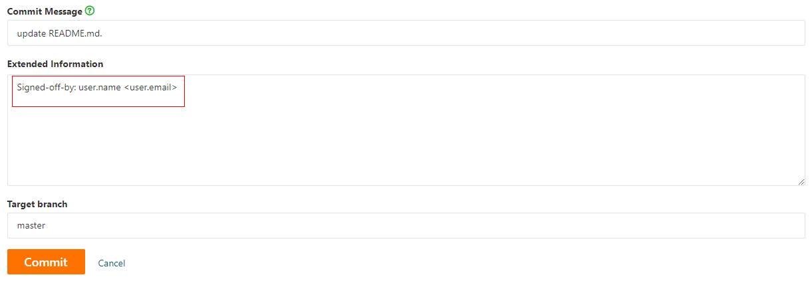

# Documentation Contribution

You are welcome to make contributions to OpenHarmony documentation, in any of the methods provided below. You can help us improve the existing documents or submit new, original content.

Excellent contributors will be awarded and the contributions will be publicized in the developer community.

-   [Contribution Methods](#contribution-methods)
-   [Writing Instructions](writing-instructions.md)

## Content Copyright

The content and images submitted by you must be original and must not infringe others' intellectual property rights.

OpenHarmony has the right to modify the adopted content according to the community regulations and specifications.

## License

[Creative Commons License version 4.0](https://creativecommons.org/licenses/by/4.0/legalcode)

## Contribution Methods

### Submitting Issues for Existing Documents

Your feedback matters. Submit issues and leave as detailed information as possible, so we can better fix the issues and improve our documents.

1.  On the Gitee page, click the **Issues** tab. On the displayed page, click **New issue**. Then enter the issue title and issue details.
2.  Click **New** to submit the issue. The Docs team will confirm the issue.

> **Note:**
>**How can I provide a high-quality issue?**  
>
>-   Provide a clear description of the issue, including the missing, outdated, incorrect, or to-be-improved content.
>-   Explain the impact of this issue on users.
>-   Limit the scope of the given issue to a specific task. If multiple fields are involved, break the issue down into smaller ones. For example, "Documents need to be optimized" is a broad issue, whereas "XX development guide lacks introduction to step XXX" is specific and operable.
>-   Search the list of existing issues to see if any related or similar issues have been submitted.
>-   If an issue is associated with another issue or a pull request (PR), you can use its full URL or the combination of the number sign (#) and PR number to reference it.

### Editing Existing Documents

You can perform the following steps to modify or supplement a file:

1.  In the upper right corner of the document page, click **Edit** to go to the source file page in the Gitee project.
2.  On the page of the source file in .md format, modify or supplement the file.
3.  After the modification, click **Preview** to confirm the modification result.
4.  Enter your comments, supplementary information, and Signed-off-by information in the **Extended Information** text box, and click **Commit**.

    Format of Signed-off-by information is as follows:

    Signed-off-by: user.name &lt;user.email&gt; // Note that *user.name* and *user.email* must be the same as those used for DCO signing.

The Docs team will review your edits and update the file accordingly.

For more information, see [Contribution Process](contribution-process.md).

### Contributing Documents to a Release

To help developers efficiently use each release, OpenHarmony provides related documents (such as development guidelines, API reference, codelabs, release notes, API changelog, and FAQs) based on the requirements planned for the release. Some requirements involve new features and documents, and some require updates to the existing features and documents.

You are welcome to contribute documents to the release. For details, see [Writing Documents for a Release](docs-release-process.md).

### Sharing Experience

You are welcome to share your experience and expertise with other developers to help them get started. For example, you can contribute tutorials and FAQs by using the following templates:

-   [Tutorial Template](template/tutorial-template.md). You can contribute tutorials in the `contribute/tutorial` folder.
-   [FAQ Template](template/faq-template.md). You can contribute FAQs in the `contribute/faqs` folder.

More writing templates are available in the **contribute** folder in the **Docs** repository.
