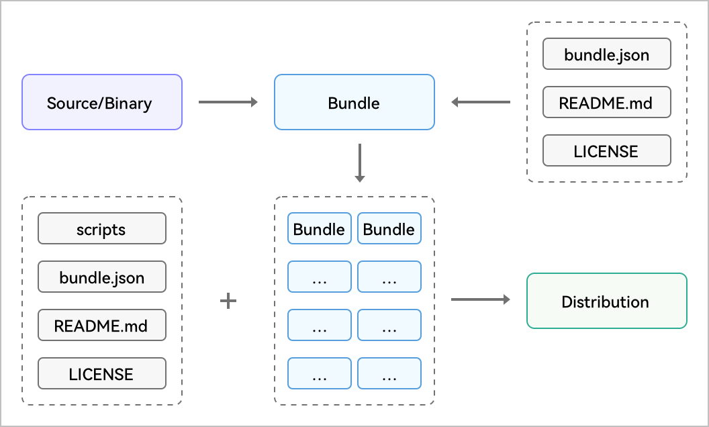

# Overview

This section describes the bundle-specific concepts in HarmonyOS. It uses an example to step you through how to create, develop, build, release, and install a bundle using the  **hpm-cli**  tool.

## Bundle

A bundle is a term used in HarmonyOS to indicate a distribution. A bundle is equivalent to a package and it usually contains the following contents:

-   Distributed binary file \(binary type\)
-   Distributed source code file \(source code/code snippet type\)
-   Build script \(distribution type\)
-   Bundle description files:
    -   **bundle.json**: metadata declaration \(name, version, dependency, etc.\)
    -   **LICENSE**: license agreement
    -   **README.md**: readme file
    -   **CHANGELOG.md**: change log \(optional\)

> **NOTE:** 
>Bundles can be classified into the following types: binary, source code, code snippet, template, plug-in, distribution, and so on. A bundle can depend on other bundles. The dependency relationship can be represented by a directed acyclic graph \(DAG\).

After you release a bundle on the  [HPM](https://hpm.harmonyos.com/#/en/home)  platform, other developers can download, install, and use the bundle through the HarmonyOS Package Manager \(hpm\).

A bundle must be uniquely named in the format  **@scope/name**  in the namespace. Independent evolution is supported for each bundle.

## Distribution

A distribution is a complete HarmonyOS release that integrates various bundles, including drivers, kernels, frameworks, and applications. A distribution can also be distributed on the  [HPM](https://hpm.harmonyos.com/#/en/home)  platform through bundles.

> **NOTE:** 
>The metadata of a distribution describes only the dependent bundles and build script compilation methods. It does not cover binary images of the distribution. When downloading a distribution, you also need to download the dependent bundles. You can obtain the system image file for burning only after finishing installation and compilation.
>A distribution is inheritable. Specifically, you can add bundles to or delete bundles from an existing distribution to create your own distribution.

**Figure  1**  Relationship between bundles and a distribution  

