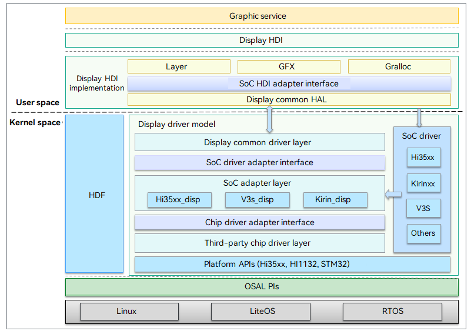
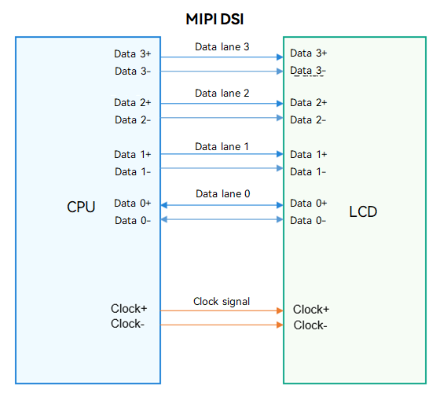
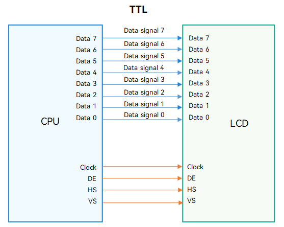

# LCD<a name="EN-US_TOPIC_0000001052857284"></a>

## Overview<a name="section141575391542"></a>

The Liquid Crystal Display \(LCD\) driver powers on the LCD and initializes internal LCD registers through APIs to enable the LCD to work properly. The display driver is developed based on the hardware driver foundation \([HDF](driver-hdf-overview.md)\). It provides power-on, power-off, and sending of the initialization sequence for LCD hardware across OSs and platforms. The display driver model is shown in  [Figure 1](#fig69138814229).

**Figure  1**  Architecture of the display driver model<a name="fig69138814229"></a>  


**Display Driver Model**

The display driver model consists of the display common driver layer, SoC adapter layer, and third-party chip driver layer. The display driver model is developed based on the HDF and hides the differences between kernel forms through platform and OSAL APIs so the LCD driver can be migrated between different OSs and chip platforms. The display driver connects to the display common HAL, supports the implementation of Hardware Driver Interfaces \(HDIs\), and provides various driver interfaces for the graphics service through the display HDI.

-   HDF display driver layer: connects to the display common HAL through the IOService data channel provided by the HDF to receive and process various upper-layer calls in a centralized manner.
-   SoC adapter layer: decouples the display driver from the SoC driver, configures parameters related to the chip platform, and passes the calls at the platform driver layer to the LCD driver layer.
-   LCD panel driver layer: provides LCD-related APIs for sending the initialization sequence, powering on/off, and setting the backlight.

The display driver model, capabilities, and APIs help you simplify the display driver development and improve the efficiency.

## API Description<a name="section53793327396"></a>

The LCD interfaces are classified into the Mobile Industry Processor Interface \(MIPI\) Display Serial Interface \(DSI\), Transistor-Transistor Logic \(TTL\) interfaces, and Low Voltage Differential Signaling \(LVDS\) interfaces. The MIPI DSI and TTL interfaces are commonly used. Here is a brief introduction to them.

-   MIPI DSI

    **Figure  2**  MIPI DSI<a name="fig6936451331"></a>  
    

    The MIPI DSI is defined by MIPI Alliance. It is mainly used for mobile terminal display. The MIPI DSI is used to transmit image data, in compliance with the MIPI protocol. Generally, control information of the MIPI DSI is sent to the peer IC in the form of MIPI packets through the MIPI DSI. No additional interface is required.

-   TTL interface

    **Figure  3**  TTL interface<a name="fig141611855635"></a>  
    

    TTL level signals are generated by TTL devices, which are a major type of digital integrated circuits. They are manufactured using the bipolar process and feature high speed, low power consumption, and multiple types.

    The TTL interface is used to transmit data in parallel mode under the control of control signals. It transmits data signals, clock signals, and control signals \(such as line synchronization signals, frame synchronization signals, and data validity signals\). Generally, the LCD of the TTL interface and the read/write of internal registers require additional peripheral interfaces, such as the Serial Peripheral Interface \(SPI\) and Inter-Integrated Circuit \(I2C\).


## How to Develop<a name="section12394223125615"></a>

The display driver model is developed based on the HDF, platform APIs, and APIs at the OS abstraction layer \(OSAL\), and provides a unified driver model for the LCD regardless of the OS \(LiteOS or Linux OS\) and chip platforms \(such as Hi35xx, Hi38xx, and V3S\).

1.  Add the LCD driver-related hardware descriptions.
2.  Add a driver that adapts to the chip at the SoC adapter layer.
3.  Add the LCD panel driver and register the panel driver functions in the driver entry function  **Init**. The functions provide capabilities for:
    -   Powering on/off the LCD device

        Based on the LCD hardware connection, use the GPIO interfaces provided by the platform to perform operations on the LCD pins, such as the reset pin and IOVCC pin. For details about the power-on sequence, see the SPEC provided by the LCD supplier.

    -   Sending the initialization sequence

        Based on the LCD hardware interfaces, use the I2C, SPI, and MIPI interfaces provided by the platform to download the LCD initialization sequence. For details, see the SPEC provided by the LCD supplier.

4.  Implement other HDF interfaces as required, for example, the  **Release**  interface.
5.  Use the HDF to create other device nodes for implementing service logic or debugging as required.

## Development Example<a name="section7441155155813"></a>

Add the device description.

```
/* Description of the display driver */
display :: host {
    hostName = "display_host";
    /* Description of the HDF display driver */
    device_hdf_disp :: device {
        device0 :: deviceNode {
            policy = 2;
            priority = 200;
            permission = 0660;
            moduleName = "HDF_DISP";
            serviceName = "hdf_disp";
        }
    }
    /* Description of the driver device at the SoC adapter layer */
    device_hi35xx_disp :: device {
        device0 :: deviceNode {
            policy = 0;
            priority = 199;
            moduleName = "HI351XX_DISP";
        }
    }
    /* Description of the LCD driver */
    device_lcd :: device {
        device0 :: deviceNode {
            policy = 0;
            priority = 100;
            preload = 0;
            moduleName = "LCD_Sample";
        }
        device1 :: deviceNode {
            policy = 0;
            priority = 100;
            preload = 2;
            moduleName = "LCD_SampleXX";
        }
    }
}
```

The following example shows how to adapt the MIPI device to the Hi35xx series chips at the SoC adapter layer:

```
static int32_t MipiDsiInit(struct PanelInfo *info)
{
    int32_t ret;
    struct DevHandle *mipiHandle = NULL;
    struct MipiCfg cfg;

    mipiHandle = MipiDsiOpen(0);
    if (mipiHandle == NULL) {
        HDF_LOGE("%s: MipiDsiOpen failure", __func__);
        return HDF_FAILURE;
    }
    cfg.lane = info->mipi.lane;
    cfg.mode = info->mipi.mode;
    cfg.format = info->mipi.format;
    cfg.burstMode = info->mipi.burstMode;
    cfg.timing.xPixels = info->width;
    cfg.timing.hsaPixels = info->hsw;
    cfg.timing.hbpPixels = info->hbp;
    cfg.timing.hlinePixels = info->width + info->hbp + info->hfp + info->hsw;
    cfg.timing.vsaLines = info->vsw;
    cfg.timing.vbpLines = info->vbp;
    cfg.timing.vfpLines = info->vfp;
    cfg.timing.ylines = info->height;
    /* 0 : no care */
    cfg.timing.edpiCmdSize = 0;
    cfg.pixelClk = CalcPixelClk(info);
    cfg.phyDataRate = CalcDataRate(info);
    /* config mipi device */
    ret = MipiDsiSetCfg(mipiHandle, &cfg);
    if (ret != HDF_SUCCESS) {
        HDF_LOGE("%s:MipiDsiSetCfg failure", __func__);
    }
    MipiDsiClose(mipiHandle);
    HDF_LOGI("%s:pixelClk = %d, phyDataRate = %d\n", __func__,
        cfg.pixelClk, cfg.phyDataRate);
    return ret;
}
```

The following example shows code for developing an LCD driver:

```
#define RESET_GPIO                5
#define MIPI_DSI0                 0
#define BLK_PWM1                  1
#define PWM_MAX_PERIOD            100000
/* backlight setting */
#define MIN_LEVEL                 0
#define MAX_LEVEL                 255
#define DEFAULT_LEVEL             100

#define WIDTH                     480
#define HEIGHT                    960
#define HORIZONTAL_BACK_PORCH     20
#define HORIZONTAL_FRONT_PORCH    20
#define HORIZONTAL_SYNC_WIDTH     10
#define VERTIACL_BACK_PORCH       14
#define VERTIACL_FRONT_PORCH      16
#define VERTIACL_SYNC_WIDTH       2
#define FRAME_RATE                60

/* PanelInfo structure */
struct PanelInfo {
    uint32_t width;
    uint32_t height;
    uint32_t hbp;
    uint32_t hfp;
    uint32_t hsw;
    uint32_t vbp;
    uint32_t vfp;
    uint32_t vsw;
    uint32_t frameRate;
    enum LcdIntfType intfType;
    enum IntfSync intfSync;
    struct MipiDsiDesc mipi;
    struct BlkDesc blk;
    struct PwmCfg pwm;
};

/* Initialization sequence of the LCD panel */
static uint8_t g_payLoad0[] = { 0xF0, 0x5A, 0x5A };
static uint8_t g_payLoad1[] = { 0xF1, 0xA5, 0xA5 };
static uint8_t g_payLoad2[] = { 0xB3, 0x03, 0x03, 0x03, 0x07, 0x05, 0x0D, 0x0F, 0x11, 0x13, 0x09, 0x0B };
static uint8_t g_payLoad3[] = { 0xB4, 0x03, 0x03, 0x03, 0x06, 0x04, 0x0C, 0x0E, 0x10, 0x12, 0x08, 0x0A };
static uint8_t g_payLoad4[] = { 0xB0, 0x54, 0x32, 0x23, 0x45, 0x44, 0x44, 0x44, 0x44, 0x60, 0x00, 0x60, 0x1C };
static uint8_t g_payLoad5[] = { 0xB1, 0x32, 0x84, 0x02, 0x87, 0x12, 0x00, 0x50, 0x1C };
static uint8_t g_payLoad6[] = { 0xB2, 0x73, 0x09, 0x08 };
static uint8_t g_payLoad7[] = { 0xB6, 0x5C, 0x5C, 0x05 };
static uint8_t g_payLoad8[] = { 0xB8, 0x23, 0x41, 0x32, 0x30, 0x03 };
static uint8_t g_payLoad9[] = { 0xBC, 0xD2, 0x0E, 0x63, 0x63, 0x5A, 0x32, 0x22, 0x14, 0x22, 0x03 };
static uint8_t g_payLoad10[] = { 0xb7, 0x41 };
static uint8_t g_payLoad11[] = { 0xC1, 0x0c, 0x10, 0x04, 0x0c, 0x10, 0x04 };
static uint8_t g_payLoad12[] = { 0xC2, 0x10, 0xE0 };
static uint8_t g_payLoad13[] = { 0xC3, 0x22, 0x11 };
static uint8_t g_payLoad14[] = { 0xD0, 0x07, 0xFF };
static uint8_t g_payLoad15[] = { 0xD2, 0x63, 0x0B, 0x08, 0x88 };
static uint8_t g_payLoad16[] = { 0xC6, 0x08, 0x15, 0xFF, 0x10, 0x16, 0x80, 0x60 };
static uint8_t g_payLoad17[] = { 0xc7, 0x04 };
static uint8_t g_payLoad18[] = {
    0xC8, 0x7C, 0x50, 0x3B, 0x2C, 0x25, 0x16, 0x1C, 0x08, 0x27, 0x2B, 0x2F, 0x52, 0x43, 0x4C, 0x40,
    0x3D, 0x30, 0x1E, 0x06, 0x7C, 0x50, 0x3B, 0x2C, 0x25, 0x16, 0x1C, 0x08, 0x27, 0x2B, 0x2F, 0x52,
    0x43, 0x4C, 0x40, 0x3D, 0x30, 0x1E, 0x06
};
static uint8_t g_payLoad19[] = { 0x11 };
static uint8_t g_payLoad20[] = { 0x29 };

struct DsiCmdDesc g_OnCmd[] = {
    { 0x29, 0, sizeof(g_payLoad0), g_payLoad0 },
    { 0x29, 0, sizeof(g_payLoad1), g_payLoad1 },
    { 0x29, 0, sizeof(g_payLoad2), g_payLoad2 },
    { 0x29, 0, sizeof(g_payLoad3), g_payLoad3 },
    { 0x29, 0, sizeof(g_payLoad4), g_payLoad4 },
    { 0x29, 0, sizeof(g_payLoad5), g_payLoad5 },
    { 0x29, 0, sizeof(g_payLoad6), g_payLoad6 },
    { 0x29, 0, sizeof(g_payLoad7), g_payLoad7 },
    { 0x29, 0, sizeof(g_payLoad8), g_payLoad8 },
    { 0x29, 0, sizeof(g_payLoad9), g_payLoad9 },
    { 0x23, 0, sizeof(g_payLoad10), g_payLoad10 },
    { 0x29, 0, sizeof(g_payLoad11), g_payLoad11 },
    { 0x29, 0, sizeof(g_payLoad12), g_payLoad12 },
    { 0x29, 0, sizeof(g_payLoad13), g_payLoad13 },
    { 0x29, 0, sizeof(g_payLoad14), g_payLoad14 },
    { 0x29, 0, sizeof(g_payLoad15), g_payLoad15 },
    { 0x29, 0, sizeof(g_payLoad16), g_payLoad16 },
    { 0x23, 0, sizeof(g_payLoad17), g_payLoad17 },
    { 0x29, 1, sizeof(g_payLoad18), g_payLoad18 },
    { 0x05, 120, sizeof(g_payLoad19), g_payLoad19 },
    { 0x05, 120, sizeof(g_payLoad20), g_payLoad20 },
};
static DevHandle g_mipiHandle = NULL;
static DevHandle g_pwmHandle = NULL;

/* Set the status of the reset pin. */
static int32_t LcdResetOn(void)
{
    int32_t ret;
    ret = GpioSetDir(RESET_GPIO, GPIO_DIR_OUT);
    if (ret != HDF_SUCCESS) {
        HDF_LOGE("GpioSetDir failure, ret:%d", ret);
        return HDF_FAILURE;
    }
    ret = GpioWrite(RESET_GPIO, GPIO_VAL_HIGH);
    if (ret != HDF_SUCCESS) {
        HDF_LOGE("GpioWrite failure, ret:%d", ret);
        return HDF_FAILURE;
    }
    /* delay 20ms */
    OsalMSleep(20);
    return HDF_SUCCESS;
}

static int32_t SampleInit(void)
{
    /* Obtain the MIPI DSI device handle. */
    g_mipiHandle = MipiDsiOpen(MIPI_DSI0);
    if (g_mipiHandle == NULL) {
        HDF_LOGE("%s: MipiDsiOpen failure", __func__);
        return HDF_FAILURE;
    }
    return HDF_SUCCESS;
}

static int32_t SampleOn(void)
{
    int32_t ret;
    /* Power on the LCD. */
    ret = LcdResetOn();
    if (ret != HDF_SUCCESS) {
        HDF_LOGE("%s: LcdResetOn failure", __func__);
        return HDF_FAILURE;
    }
    if (g_mipiHandle == NULL) {
        HDF_LOGE("%s: g_mipiHandle is null", __func__);
        return HDF_FAILURE;
    }
    /* Send the initialization sequence via MIPI. */
    int32_t count = sizeof(g_OnCmd) / sizeof(g_OnCmd[0]);
    int32_t i;
    for (i = 0; i < count; i++) {
        ret = MipiDsiTx(g_mipiHandle, &(g_OnCmd[i]));
        if (ret != HDF_SUCCESS) {
            HDF_LOGE("MipiDsiTx failure");
            return HDF_FAILURE;
        }
    }
    /* Set MIPI to the high speed (HS) mode. */
    MipiDsiSetHsMode(g_mipiHandle);
    return HDF_SUCCESS;
}

/* PanelInfo structure variables */
static struct PanelInfo g_panelInfo = {
    .width = WIDTH,                     /* width */
    .height = HEIGHT,                   /* height */
    .hbp = HORIZONTAL_BACK_PORCH,       /* horizontal back porch */
    .hfp = HORIZONTAL_FRONT_PORCH,      /* horizontal front porch */
    .hsw = HORIZONTAL_SYNC_WIDTH,       /* horizontal sync width */
    .vbp = VERTIACL_BACK_PORCH,         /* vertiacl back porch */
    .vfp = VERTIACL_FRONT_PORCH,        /* vertiacl front porch */
    .vsw = VERTIACL_SYNC_WIDTH,         /* vertiacl sync width */
    .frameRate = FRAME_RATE,            /* frame rate */
    .intfType = MIPI_DSI,               /* panel interface type */
    .intfSync = OUTPUT_USER,            /* output timming type */
    /* mipi config info */
    .mipi = { DSI_2_LANES, DSI_VIDEO_MODE, VIDEO_BURST_MODE, FORMAT_RGB_24_BIT },
    /* backlight config info */
    .blk = { BLK_PWM, MIN_LEVEL, MAX_LEVEL, DEFAULT_LEVEL },
    .pwm = { BLK_PWM1, PWM_MAX_PERIOD },
};

/* Basic APIs that need to be adapted for the chip driver */
static struct PanelData g_panelData = {
    .info = &g_panelInfo,
    .init = SampleInit,
    .on = SampleOn,
    .off = SampleOff,
    .setBacklight = SampleSetBacklight,
};

/* Entry function of the chip driver */
int32_t SampleEntryInit(struct HdfDeviceObject *object)
{
    HDF_LOGI("%s: enter", __func__);
    if (object == NULL) {
        HDF_LOGE("%s: param is null!", __func__);
        return HDF_FAILURE;
    }
    /* Register the chip driver APIs with the platform driver. */
    if (PanelDataRegister(&g_panelData) != HDF_SUCCESS) {
        HDF_LOGE("%s: PanelDataRegister error!", __func__);
        return HDF_FAILURE;
    }
    return HDF_SUCCESS;
}

struct HdfDriverEntry g_sampleDevEntry = {
    .moduleVersion = 1,
    .moduleName = "LCD_SAMPLE",
    .Init = SampleEntryInit,
};

HDF_INIT(g_sampleDevEntry);
```

