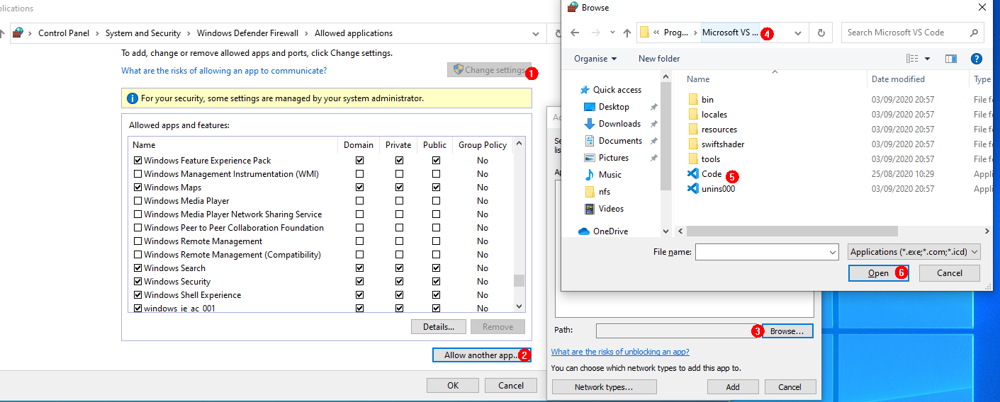

# Burning

## Mini and Small Systems

### "Error: Opening COMxx: Access denied" Displayed When I Start Burning

- **Symptom**
  **Error: Opening COMxx: Access denied** is displayed after clicking **Burn** and selecting a serial port.

    **Figure 1** Failed to open the serial port
    

- **Possible Causes**
  The serial port is in use.

- **Solution**

1. Search for the terminal using serial-xx from the drop-down list in the **TERMINAL** panel.
    

     **Figure 2** Checking whether the serial port is in use
     

2. Click the dustbin icon as shown below to disable the terminal using the serial port.
     
     **Figure 3** Disabling the terminal using the serial port

     

3. Click **Burn**, select the serial port, and start burning images again.
    
     **Figure 4** Restarting the burning task

     

### The Image Failed To Be Burnt

- **Symptom**
  The burning status is not displayed after clicking **Burn** and selecting a serial port.

- **Possible Causes**
  The IDE is not restarted after the DevEco plug-in is installed.

- **Solution**
  Restart the IDE.

### No Command Output Is Displayed

- **Symptom**
  The serial port shows that the connection has been established. After the board is restarted, nothing is displayed when you press **Enter**.

- **Possible Cause 1**
  The serial port is connected incorrectly.

- **Solution**
  Change the serial port number.

  Start **Device Manager** to check whether the serial port connected to the board is the same as that connected to the terminal device. If the serial ports are different, perform step 1 in the **Running an Image** section to change the serial port number.

- **Possible Cause 2**
  The U-Boot of the board is damaged.

- **Solution**
  Burn the U-Boot.

  If the fault persists after you perform the preceding operations, the U-Boot of the board may be damaged. You can burn the U-Boot by performing the following steps:

1. Obtain the U-Boot file.
   >  **NOTICE**
   > The U-Boot file of the two boards can be obtained from the following paths, respectively.
   > 
   > Hi3516D V300: **device\hisilicon\hispark_taurus\sdk_liteos\uboot\out\boot\u-boot-hi3516dv300.bin**
   > 
   > Hi3518E V300: **device\hisilicon\hispark_aries\sdk_liteos\uboot\out\boot\u-boot-hi3518ev300.bin**

2. Burn the U-Boot file by following the procedures for burning a U-Boot file over USB.
   Select the U-Boot files of the corresponding development board for burning by referring to [Burning to Hi3516D V300](../quick-start/quickstart-ide-lite-steps-hi3516-burn.md).

3. Log in to the serial port after the burning is complete.

     **Figure 5** Information displayed through the serial port after the U-Boot file is burnt

     

### Windows-based PC Failed to Be Connected to the Board

- **Symptom**
  The file image cannot be obtained after clicking **Burn** and selecting a serial port.

    **Figure 6** Failed to obtain the file image due to network disconnection
    
    

- **Possible Causes**
  The board is disconnected from the Windows-based PC.

  Windows Firewall does not allow Visual Studio Code to access the network.

- **Solution**

1. Check whether the network cable is properly connected.

2. Click **Windows Firewall**.
    
     **Figure 7** Setting the firewall
     
     

3. Click **Firewall & network protection**, and on the displayed page, click **Allow an app through the firewall**.
     
     **Figure 8** Firewall & network protection
     
     

4. Select Visual Studio Code.
     
     **Figure 9** Selecting Visual Studio Code
    
     

5. Select the **Private** and **Public** network access rights for Visual Studio Code.
     
     **Figure 10** Allowing Visual Studio Code to access the network
   
     
