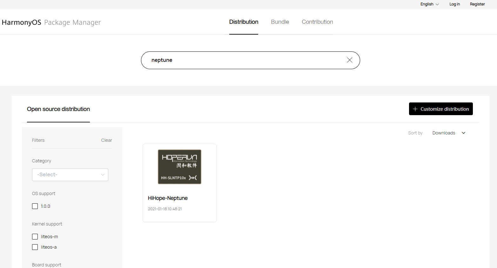
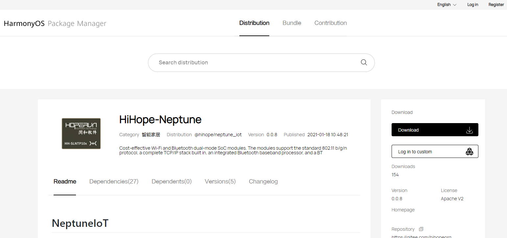
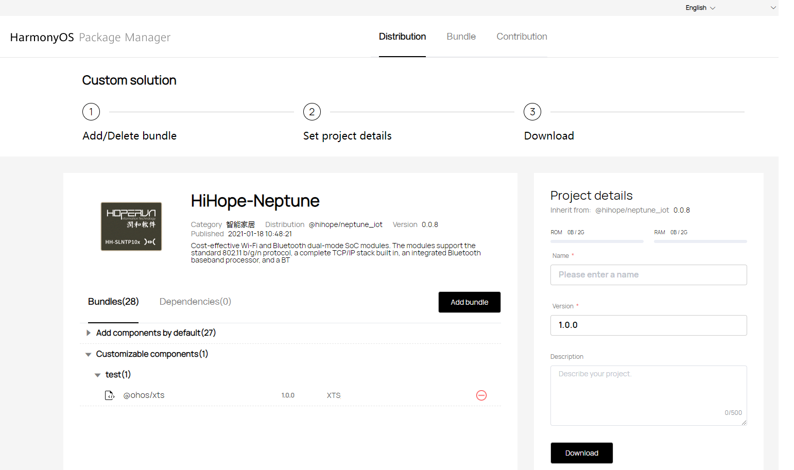

# Source Code Acquisition<a name="EN-US_TOPIC_0000001150448437"></a>

-   [About OpenHarmony](#section6370143622110)
-   [Overview of Source Code Acquisition](#section12763342204)
-   [Method 1: Acquiring Source Code from a Code Repository](#section537312010229)
    -   [When to Use](#section10881513459)
    -   [Prerequisites](#section102871547153314)
    -   [How to Use](#section429012478331)

-   [Method 2: Acquiring Source Code from HPM](#section463013147412)
    -   [When to Use](#section26661067443)
    -   [Prerequisites](#section17544943123315)
    -   [How to Use](#section954619433333)

-   [Method 3: Acquiring Source Code from Image Sites](#section1186691118430)
-   [Source Code Directories](#section1072115612811)

## About OpenHarmony<a name="section6370143622110"></a>

OpenHarmony is an open-source project launched by the OpenAtom Foundation. The purpose of this project is to build an open, distributed operating system \(OS\) framework for smart IoT devices in the full-scenario, full-connectivity, and full-intelligence era. 

The open-source code repositories are available at  [https://openharmony.gitee.com](https://openharmony.gitee.com).

> **NOTE:** 
>At present, OpenHarmony source code can only be compiled in the Linux environment.

## Overview of Source Code Acquisition<a name="section12763342204"></a>

This document describes how to acquire OpenHarmony source code and provides its directory structure. The OpenHarmony code is open to you as  [bundles](../bundles/bundles-standard-rules.md), which can be obtained in any of the following ways:

-   **Method 1**: Acquire the source code from a code repository. You can use the  **repo**  or  **git**  tool to download the latest code from the code repository.
-   **Method 2**: Obtain the source code from the HarmonyOS Package Manager \(HPM\). Visit the  [HPM](https://hpm.harmonyos.com/#/en/home)  website, search for your desired open-source distribution, and download the bundle list \(or customize bundles and download the bundle list\). Then use  **hpm-cli**  to download and install the bundles and compilation toolchain on your local PC.
-   **Method 3**: Download the compressed file of a distribution from an image site. This method provides a fast download speed, so you can also use this method for obtaining the source code of an earlier version.

## Method 1: Acquiring Source Code from a Code Repository<a name="section537312010229"></a>

### When to Use<a name="section10881513459"></a>

-   You want to establish a baseline based on stable OpenHarmony releases and distribute the baseline to your customers.

-   You have interconnected your software with OpenHarmony and need official certification from OpenHarmony.

-   You want to contribute code to the OpenHarmony community after obtaining official OpenHarmony certification for chips, modules, and applications.

-   You need to rectify OpenHarmony issues.

-   You want to learn OpenHarmony source code.


### Prerequisites<a name="section102871547153314"></a>

1.  Register your account with Gitee.
2.  Register an SSH public key for access to Gitee.
3.  Install the  [git client](http://git-scm.com/book/en/v2/Getting-Started-Installing-Git)  and  [git-lfs](https://gitee.com/vcs-all-in-one/git-lfs?_from=gitee_search#downloading), and configure basic user information.

    ```
    git config --global user.name "yourname"
    git config --global user.email "your-email-address"
    git config --global credential.helper store
    ```

4.  Run the following commands to install the  **repo**  tool:

    ```
    curl -s https://gitee.com/oschina/repo/raw/fork_flow/repo-py3 > /usr/local/bin/repo  # If you do not have the access permission to this directory, download the tool to any other accessible directory and configure the directory to the environment variable.
    chmod a+x /usr/local/bin/repo
    pip3 install -i https://repo.huaweicloud.com/repository/pypi/simple requests
    ```


### How to Use<a name="section429012478331"></a>

**Obtaining the Source Code for Mini/Small/Standard Systems \(2.0 Canary\)**

> **NOTE:** 
>You can obtain the latest features from the master code, and develop commercial functionalities based on the release code, which is more stable.

-   **Obtaining OpenHarmony master code**

    Method 1 \(recommended\): Use the  **repo**  tool to download the source code over SSH. \(You must have registered an SSH public key for access to Gitee.\)

    ```
    repo init -u git@gitee.com:openharmony/manifest.git -b master --no-repo-verify
    repo sync -c
    repo forall -c 'git lfs pull'
    ```

    Method 2 \(recommended\): Use the  **repo**  tool to download the source code over HTTPS.

    ```
    repo init -u https://gitee.com/openharmony/manifest.git -b master --no-repo-verify
    repo sync -c
    repo forall -c 'git lfs pull'
    ```


-   **Obtaining Latest OpenHarmony\_1.0.1\_release code**

    > **NOTE:** 
    >Currently, only the source code for mini and small systems can be obtained through this release.

    Use the  **repo**  tool to download the release code.

    ```
    repo init -u https://gitee.com/openharmony/manifest.git -b OpenHarmony_1.0.1_release --no-repo-verify
    repo sync -c  
    repo forall -c 'git lfs pull'
    ```

-   Obtaining the source code of other OpenHarmony releases

    For details about how to obtain the source code of other OpenHarmony releases, see the  [Release Notes](https://gitee.com/openharmony/docs/blob/master/en/release-notes/Readme.md).


## Method 2: Acquiring Source Code from HPM<a name="section463013147412"></a>

### When to Use<a name="section26661067443"></a>

If OpenHarmony is new to you, sample solutions are helpful to your development. You can obtain an open-source distribution from the  [HPM](https://hpm.harmonyos.com/#/en/home)  website, or customize a distribution by adding or deleting bundles of an open-source distribution. Then use  **hpm-cli**  to download and install the bundles and compilation toolchain on your local PC.

### Prerequisites<a name="section17544943123315"></a>

You must install  **Node.js**  and HPM on your local PC. The installation procedure is as follows:

1.  Install  **Node.js**.

    Download  **Node.js**  from its official website and install it on your local PC.

    You are advised to install  [Node.js](https://nodejs.org/)  12.x \(including npm 6.14.4\) or a later version \(12.13.0 or later is recommended\).

2.  Install the hpm-cli tool using  **npm**  delivered with  **Node.js**.

    Open the CMD window and run the following command:

    ```
    npm install -g @ohos/hpm-cli
    ```

3.  Run the following command to check whether the installation is successful. If the HPM version is displayed, the installation is successful.

    ```
    hpm -V or hpm --version
    ```

4.  Run the following command to upgrade the HPM version:

    ```
    npm update -g @ohos/hpm-cli
    ```


### How to Use<a name="section954619433333"></a>

1.  Search for distributions.
    1.  Access the  [HPM](https://hpm.harmonyos.com/#/en/home)  page, and click the  **Distribution**  tab, as shown in the following figure.
    2.  Enter a keyword \(for example:  **camera**\) in the search box. All matched distributions are found.
    3.  Specify filter criteria, such as the bundle type \(for example:  **Board support**  and  **Kernel support**\), to further filter the distributions.
    4.  Locate your desired distribution and click it to view details.

        **Figure  1**  HPM page<a name="fig838103114320"></a>  
        

        

2.  Learn more about the distribution.

    1.  Read carefully the information about the distribution to learn its application scenarios, features, bundles, usage, and customization methods, as shown in the following figure.
    2.  Click  **Download**  to download the distribution to your local PC.
    3.  Click  **Custom**  to add or delete bundles of the distribution.

    **Figure  2**  Example distribution<a name="fig1329851510414"></a>  
    

    

3.  Customize bundles.
    1.  Access the  **Custom solution**  page, as shown in the following figure.
    2.  Set the toggle switch next to a specific optional bundle to delete it from the distribution, or click  **Add bundle**  to add new bundles.
    3.  Enter the basic information about your project, including the bundle name, version, and description, on the right pane.
    4.  Click  **Download**. The system then generates the OpenHarmony code structure file \(for example,  **my\_cust\_dist.zip**\) and saves it to your local PC.

        **Figure  3**  Customizing bundles<a name="fig05036599014"></a>  
        

        

4.  Download and install bundles.
    1.  Decompress the downloaded file using the CLI tool CMD \(shell in Linux\).
    2.  In the generated directory, run the  **hpm install**  command.
    3.  The downloaded bundles are stored in the  **ohos\_bundles**  folder under the project directory. \(The source code of some bundles will be copied to a specified directory after the bundles are installed.\)


## Method 3: Acquiring Source Code from Image Sites<a name="section1186691118430"></a>

To ensure the download performance, you are advised to download the source code or the corresponding solution from the image library of the respective site listed in the table below.

> **NOTE:** 
>-   The table below provides only the sites for downloading the latest OpenHarmony master and LTS code. For details about how to obtain the source code of earlier versions, see the  [Release Notes](https://gitee.com/openharmony/docs/tree/master/en/release-notes/Readme.md).
>-   The Master 1.0 version is no longer maintained.

**Table  1**  Sites for acquiring source code from image sites

<a name="table17735923173912"></a>
<table><tbody><tr id="row1073515237392"><td class="cellrowborder" valign="top" width="25%"><p id="p5109183611392"><a name="p5109183611392"></a><a name="p5109183611392"></a><strong id="b1024917372278"><a name="b1024917372278"></a><a name="b1024917372278"></a>LTS Code</strong></p>
</td>
<td class="cellrowborder" valign="top" width="25%"><p id="p13109436103916"><a name="p13109436103916"></a><a name="p13109436103916"></a><strong id="b178520552564"><a name="b178520552564"></a><a name="b178520552564"></a>Version Information</strong></p>
</td>
<td class="cellrowborder" valign="top" width="25%"><p id="p610923616398"><a name="p610923616398"></a><a name="p610923616398"></a><strong id="b1571518441579"><a name="b1571518441579"></a><a name="b1571518441579"></a>Site</strong></p>
</td>
<td class="cellrowborder" valign="top" width="25%"><p id="p2109736133914"><a name="p2109736133914"></a><a name="p2109736133914"></a><strong id="b1777314471977"><a name="b1777314471977"></a><a name="b1777314471977"></a>SHA-256 Verification Code</strong></p>
</td>
</tr>
<tr id="row17736152318398"><td class="cellrowborder" valign="top" width="25%"><p id="p1110983610395"><a name="p1110983610395"></a><a name="p1110983610395"></a>Full code (for mini and small systems)</p>
</td>
<td class="cellrowborder" valign="top" width="25%"><p id="p151091536143915"><a name="p151091536143915"></a><a name="p151091536143915"></a>1.1.1</p>
</td>
<td class="cellrowborder" valign="top" width="25%"><p id="p17110133653913"><a name="p17110133653913"></a><a name="p17110133653913"></a><a href="https://repo.huaweicloud.com/harmonyos/os/1.1.1/code-v1.1.1-LTS.tar.gz" target="_blank" rel="noopener noreferrer">Download</a></p>
</td>
<td class="cellrowborder" valign="top" width="25%"><p id="p1911083643914"><a name="p1911083643914"></a><a name="p1911083643914"></a><a href="https://repo.huaweicloud.com/harmonyos/os/1.1.1/code-v1.1.1-LTS.tar.gz.sha256" target="_blank" rel="noopener noreferrer">Download</a></p>
</td>
</tr>
<tr id="row473612318396"><td class="cellrowborder" valign="top" width="25%"><p id="p511014369394"><a name="p511014369394"></a><a name="p511014369394"></a>Hi3861 solution (binary)</p>
</td>
<td class="cellrowborder" valign="top" width="25%"><p id="p0110036193911"><a name="p0110036193911"></a><a name="p0110036193911"></a>1.1.1</p>
</td>
<td class="cellrowborder" valign="top" width="25%"><p id="p101106361397"><a name="p101106361397"></a><a name="p101106361397"></a><a href="https://repo.huaweicloud.com/harmonyos/os/1.1.1/wifiiot-1.1.0.tar.gz" target="_blank" rel="noopener noreferrer">Download</a></p>
</td>
<td class="cellrowborder" valign="top" width="25%"><p id="p7110183617391"><a name="p7110183617391"></a><a name="p7110183617391"></a><a href="https://repo.huaweicloud.com/harmonyos/os/1.1.1/wifiiot-1.1.0.tar.gz.sha256" target="_blank" rel="noopener noreferrer">Download</a></p>
</td>
</tr>
<tr id="row873614239395"><td class="cellrowborder" valign="top" width="25%"><p id="p11110113633913"><a name="p11110113633913"></a><a name="p11110113633913"></a>Hi3518 solution (binary)</p>
</td>
<td class="cellrowborder" valign="top" width="25%"><p id="p18110193613391"><a name="p18110193613391"></a><a name="p18110193613391"></a>1.1.1</p>
</td>
<td class="cellrowborder" valign="top" width="25%"><p id="p611013618398"><a name="p611013618398"></a><a name="p611013618398"></a><a href="https://repo.huaweicloud.com/harmonyos/os/1.1.0/ipcamera_hi3518ev300-1.1.0.tar.gz" target="_blank" rel="noopener noreferrer">Download</a></p>
</td>
<td class="cellrowborder" valign="top" width="25%"><p id="p411023616393"><a name="p411023616393"></a><a name="p411023616393"></a><a href="https://repo.huaweicloud.com/harmonyos/os/1.1.1/ipcamera_hi3518ev300-1.1.1.tar.gz.sha256" target="_blank" rel="noopener noreferrer">Download</a></p>
</td>
</tr>
<tr id="row1273682343914"><td class="cellrowborder" valign="top" width="25%"><p id="p15110123693919"><a name="p15110123693919"></a><a name="p15110123693919"></a>Hi3516 solution (binary)</p>
</td>
<td class="cellrowborder" valign="top" width="25%"><p id="p1211012362396"><a name="p1211012362396"></a><a name="p1211012362396"></a>1.1.1</p>
</td>
<td class="cellrowborder" valign="top" width="25%"><p id="p6110163613918"><a name="p6110163613918"></a><a name="p6110163613918"></a><a href="https://repo.huaweicloud.com/harmonyos/os/1.1.1/ipcamera_hi3516dv300-1.1.1.tar.gz" target="_blank" rel="noopener noreferrer">Download</a></p>
</td>
<td class="cellrowborder" valign="top" width="25%"><p id="p10110183620394"><a name="p10110183620394"></a><a name="p10110183620394"></a><a href="https://repo.huaweicloud.com/harmonyos/os/1.1.1/ipcamera_hi3516dv300-1.1.1.tar.gz.sha256" target="_blank" rel="noopener noreferrer">Download</a></p>
</td>
</tr>
<tr id="row167371123163914"><td class="cellrowborder" valign="top" width="25%"><p id="p10110143610393"><a name="p10110143610393"></a><a name="p10110143610393"></a>RELEASE-NOTES</p>
</td>
<td class="cellrowborder" valign="top" width="25%"><p id="p141101436193911"><a name="p141101436193911"></a><a name="p141101436193911"></a>1.1.1</p>
</td>
<td class="cellrowborder" valign="top" width="25%"><p id="p10111636193919"><a name="p10111636193919"></a><a name="p10111636193919"></a><a href="https://repo.huaweicloud.com/harmonyos/os/1.1.1/OpenHarmony_Release_Notes_1.1.1_LTS.md" target="_blank" rel="noopener noreferrer">Download</a></p>
</td>
<td class="cellrowborder" valign="top" width="25%"><p id="p20111163663918"><a name="p20111163663918"></a><a name="p20111163663918"></a>-</p>
</td>
</tr>
<tr id="row573719239393"><td class="cellrowborder" valign="top" width="25%"><p id="p104146493390"><a name="p104146493390"></a><a name="p104146493390"></a><strong id="b16812121192918"><a name="b16812121192918"></a><a name="b16812121192918"></a>Master Code</strong></p>
</td>
<td class="cellrowborder" valign="top" width="25%"><p id="p194141849163919"><a name="p194141849163919"></a><a name="p194141849163919"></a><strong id="b1094411391670"><a name="b1094411391670"></a><a name="b1094411391670"></a>Version Information</strong></p>
</td>
<td class="cellrowborder" valign="top" width="25%"><p id="p8414649193919"><a name="p8414649193919"></a><a name="p8414649193919"></a><strong id="b1143579324"><a name="b1143579324"></a><a name="b1143579324"></a>Site</strong></p>
</td>
<td class="cellrowborder" valign="top" width="25%"><p id="p13415149133914"><a name="p13415149133914"></a><a name="p13415149133914"></a><strong id="b2069403304"><a name="b2069403304"></a><a name="b2069403304"></a>SHA-256 Verification Code</strong></p>
</td>
</tr>
<tr id="row4769431134919"><td class="cellrowborder" valign="top" width="25%"><p id="p97691031124913"><a name="p97691031124913"></a><a name="p97691031124913"></a>Full code (for standard systems)</p>
</td>
<td class="cellrowborder" valign="top" width="25%"><p id="p1076916315492"><a name="p1076916315492"></a><a name="p1076916315492"></a>2.0 Canary</p>
</td>
<td class="cellrowborder" valign="top" width="25%"><p id="p67696314491"><a name="p67696314491"></a><a name="p67696314491"></a><a href="https://repo.huaweicloud.com/harmonyos/os/2.0/code-2.0-canary_20210601.tar.gz" target="_blank" rel="noopener noreferrer">Download (Site 1)</a> <a href="https://mirror.iscas.ac.cn/OpenHarmony/os/2.0/code-2.0-canary.tar.gz" target="_blank" rel="noopener noreferrer">Download (Site 2)</a></p>
</td>
<td class="cellrowborder" valign="top" width="25%"><p id="p4769123184918"><a name="p4769123184918"></a><a name="p4769123184918"></a><a href="https://repo.huaweicloud.com/harmonyos/os/2.0/code-2.0-canary_20210601.tar.gz.sha256" target="_blank" rel="noopener noreferrer">Download</a></p>
</td>
</tr>
<tr id="row273762316398"><td class="cellrowborder" valign="top" width="25%"><p id="p54150491393"><a name="p54150491393"></a><a name="p54150491393"></a>Full code (for mini and small systems)</p>
</td>
<td class="cellrowborder" valign="top" width="25%"><p id="p16415124923914"><a name="p16415124923914"></a><a name="p16415124923914"></a>1.0 (no longer maintained)</p>
</td>
<td class="cellrowborder" valign="top" width="25%"><p id="p44151449203917"><a name="p44151449203917"></a><a name="p44151449203917"></a><a href="https://repo.huaweicloud.com/harmonyos/os/1.0/code-1.0.tar.gz" target="_blank" rel="noopener noreferrer">Download</a></p>
</td>
<td class="cellrowborder" valign="top" width="25%"><p id="p1441515495392"><a name="p1441515495392"></a><a name="p1441515495392"></a><a href="https://repo.huaweicloud.com/harmonyos/os/1.0/code-1.0.tar.gz.sha256" target="_blank" rel="noopener noreferrer">Download</a></p>
</td>
</tr>
<tr id="row107374239397"><td class="cellrowborder" valign="top" width="25%"><p id="p5415949123910"><a name="p5415949123910"></a><a name="p5415949123910"></a>Hi3861 solution (binary)</p>
</td>
<td class="cellrowborder" valign="top" width="25%"><p id="p15415949183914"><a name="p15415949183914"></a><a name="p15415949183914"></a>1.0 (no longer maintained)</p>
</td>
<td class="cellrowborder" valign="top" width="25%"><p id="p1415649123916"><a name="p1415649123916"></a><a name="p1415649123916"></a><a href="https://repo.huaweicloud.com/harmonyos/os/1.0/wifiiot-1.0.tar.gz" target="_blank" rel="noopener noreferrer">Download</a></p>
</td>
<td class="cellrowborder" valign="top" width="25%"><p id="p11415549153913"><a name="p11415549153913"></a><a name="p11415549153913"></a><a href="https://repo.huaweicloud.com/harmonyos/os/1.0/wifiiot-1.0.tar.gz.sha256" target="_blank" rel="noopener noreferrer">Download</a></p>
</td>
</tr>
<tr id="row9738182319392"><td class="cellrowborder" valign="top" width="25%"><p id="p241524910391"><a name="p241524910391"></a><a name="p241524910391"></a>Hi3518 solution (binary)</p>
</td>
<td class="cellrowborder" valign="top" width="25%"><p id="p6415849193915"><a name="p6415849193915"></a><a name="p6415849193915"></a>1.0 (no longer maintained)</p>
</td>
<td class="cellrowborder" valign="top" width="25%"><p id="p841584919394"><a name="p841584919394"></a><a name="p841584919394"></a><a href="https://repo.huaweicloud.com/harmonyos/os/1.0/ipcamera_hi3518ev300-1.0.tar.gz" target="_blank" rel="noopener noreferrer">Download</a></p>
</td>
<td class="cellrowborder" valign="top" width="25%"><p id="p9415124983911"><a name="p9415124983911"></a><a name="p9415124983911"></a><a href="https://repo.huaweicloud.com/harmonyos/os/1.0/ipcamera_hi3518ev300-1.0.tar.gz.sha256" target="_blank" rel="noopener noreferrer">Download</a></p>
</td>
</tr>
<tr id="row17381233399"><td class="cellrowborder" valign="top" width="25%"><p id="p44151149153918"><a name="p44151149153918"></a><a name="p44151149153918"></a>Hi3516 solution (binary)</p>
</td>
<td class="cellrowborder" valign="top" width="25%"><p id="p15415164917397"><a name="p15415164917397"></a><a name="p15415164917397"></a>1.0 (no longer maintained)</p>
</td>
<td class="cellrowborder" valign="top" width="25%"><p id="p154151049113914"><a name="p154151049113914"></a><a name="p154151049113914"></a><a href="https://repo.huaweicloud.com/harmonyos/os/1.0/ipcamera_hi3516dv300-1.0.tar.gz" target="_blank" rel="noopener noreferrer">Download</a></p>
</td>
<td class="cellrowborder" valign="top" width="25%"><p id="p164164491394"><a name="p164164491394"></a><a name="p164164491394"></a><a href="https://repo.huaweicloud.com/harmonyos/os/1.0/ipcamera_hi3516dv300-1.0.tar.gz.sha256" target="_blank" rel="noopener noreferrer">Download</a></p>
</td>
</tr>
<tr id="row1873817234394"><td class="cellrowborder" valign="top" width="25%"><p id="p1341618491393"><a name="p1341618491393"></a><a name="p1341618491393"></a>RELEASE-NOTES</p>
</td>
<td class="cellrowborder" valign="top" width="25%"><p id="p7416184953916"><a name="p7416184953916"></a><a name="p7416184953916"></a>1.0 (no longer maintained)</p>
</td>
<td class="cellrowborder" valign="top" width="25%"><p id="p194161849133911"><a name="p194161849133911"></a><a name="p194161849133911"></a><a href="https://repo.huaweicloud.com/harmonyos/os/1.0/RELEASE-NOTES.txt" target="_blank" rel="noopener noreferrer">Download</a></p>
</td>
<td class="cellrowborder" valign="top" width="25%"><p id="p1841619490395"><a name="p1841619490395"></a><a name="p1841619490395"></a>-</p>
</td>
</tr>
<tr id="row19937626418"><td class="cellrowborder" valign="top" width="25%"><p id="p1938221842"><a name="p1938221842"></a><a name="p1938221842"></a><strong id="b1349173911553"><a name="b1349173911553"></a><a name="b1349173911553"></a>Compiler Toolchain</strong></p>
</td>
<td class="cellrowborder" valign="top" width="25%"><p id="p1093810218417"><a name="p1093810218417"></a><a name="p1093810218417"></a><strong id="b1124015405556"><a name="b1124015405556"></a><a name="b1124015405556"></a>Version Information</strong></p>
</td>
<td class="cellrowborder" valign="top" width="25%"><p id="p9938132648"><a name="p9938132648"></a><a name="p9938132648"></a><strong id="b446453043"><a name="b446453043"></a><a name="b446453043"></a>Site</strong></p>
</td>
<td class="cellrowborder" valign="top" width="25%"><p id="p12520113711011"><a name="p12520113711011"></a><a name="p12520113711011"></a><strong id="b19256751175516"><a name="b19256751175516"></a><a name="b19256751175516"></a>SHA-256 Verification Code</strong></p>
</td>
</tr>
<tr id="row204197817410"><td class="cellrowborder" valign="top" width="25%"><p id="p8419118242"><a name="p8419118242"></a><a name="p8419118242"></a>Compiler toolchain</p>
</td>
<td class="cellrowborder" valign="top" width="25%"><p id="p10876124517162"><a name="p10876124517162"></a><a name="p10876124517162"></a>-</p>
</td>
<td class="cellrowborder" valign="top" width="25%"><p id="p1542078742"><a name="p1542078742"></a><a name="p1542078742"></a><a href="https://repo.huaweicloud.com/harmonyos/os/2.0/tool_chain/" target="_blank" rel="noopener noreferrer">Download</a></p>
</td>
<td class="cellrowborder" valign="top" width="25%"><p id="p134201881147"><a name="p134201881147"></a><a name="p134201881147"></a>-</p>
</td>
</tr>
</tbody>
</table>

## Source Code Directories<a name="section1072115612811"></a>

The following table describes the OpenHarmony source code directories.

**Table  2**  Source code directories

<a name="table3815144702820"></a>
<table><thead align="left"><tr id="row198162047192810"><th class="cellrowborder" valign="top" width="50%" id="mcps1.2.3.1.1"><p id="p690319291299"><a name="p690319291299"></a><a name="p690319291299"></a>Name</p>
</th>
<th class="cellrowborder" valign="top" width="50%" id="mcps1.2.3.1.2"><p id="p5903122962918"><a name="p5903122962918"></a><a name="p5903122962918"></a>Description</p>
</th>
</tr>
</thead>
<tbody><tr id="row1981674719280"><td class="cellrowborder" valign="top" width="50%" headers="mcps1.2.3.1.1 "><p id="p69031429162912"><a name="p69031429162912"></a><a name="p69031429162912"></a>applications</p>
</td>
<td class="cellrowborder" valign="top" width="50%" headers="mcps1.2.3.1.2 "><p id="p090352912914"><a name="p090352912914"></a><a name="p090352912914"></a>Application samples, for example, <strong id="b689814231158"><a name="b689814231158"></a><a name="b689814231158"></a>camera</strong></p>
</td>
</tr>
<tr id="row5816747132817"><td class="cellrowborder" valign="top" width="50%" headers="mcps1.2.3.1.1 "><p id="p99031129112918"><a name="p99031129112918"></a><a name="p99031129112918"></a>base</p>
</td>
<td class="cellrowborder" valign="top" width="50%" headers="mcps1.2.3.1.2 "><p id="p790472962914"><a name="p790472962914"></a><a name="p790472962914"></a>Basic software service subsystem set and hardware service subsystem set</p>
</td>
</tr>
<tr id="row1134218692910"><td class="cellrowborder" valign="top" width="50%" headers="mcps1.2.3.1.1 "><p id="p4904112910295"><a name="p4904112910295"></a><a name="p4904112910295"></a>build</p>
</td>
<td class="cellrowborder" valign="top" width="50%" headers="mcps1.2.3.1.2 "><p id="p1090482942911"><a name="p1090482942911"></a><a name="p1090482942911"></a>Bundle-based compilation, building, and configuration scripts</p>
</td>
</tr>
<tr id="row8166154261316"><td class="cellrowborder" valign="top" width="50%" headers="mcps1.2.3.1.1 "><p id="p1216719425130"><a name="p1216719425130"></a><a name="p1216719425130"></a>docs</p>
</td>
<td class="cellrowborder" valign="top" width="50%" headers="mcps1.2.3.1.2 "><p id="p17167134217134"><a name="p17167134217134"></a><a name="p17167134217134"></a>Reference documents</p>
</td>
</tr>
<tr id="row1841618902919"><td class="cellrowborder" valign="top" width="50%" headers="mcps1.2.3.1.1 "><p id="p1390462902910"><a name="p1390462902910"></a><a name="p1390462902910"></a>domains</p>
</td>
<td class="cellrowborder" valign="top" width="50%" headers="mcps1.2.3.1.2 "><p id="p1390432914296"><a name="p1390432914296"></a><a name="p1390432914296"></a>Enhanced software service subsystem set</p>
</td>
</tr>
<tr id="row841620912298"><td class="cellrowborder" valign="top" width="50%" headers="mcps1.2.3.1.1 "><p id="p119041629182919"><a name="p119041629182919"></a><a name="p119041629182919"></a>drivers</p>
</td>
<td class="cellrowborder" valign="top" width="50%" headers="mcps1.2.3.1.2 "><p id="p9904629132911"><a name="p9904629132911"></a><a name="p9904629132911"></a>Driver subsystem</p>
</td>
</tr>
<tr id="row164164992915"><td class="cellrowborder" valign="top" width="50%" headers="mcps1.2.3.1.1 "><p id="p79042298298"><a name="p79042298298"></a><a name="p79042298298"></a>foundation</p>
</td>
<td class="cellrowborder" valign="top" width="50%" headers="mcps1.2.3.1.2 "><p id="p18904132922915"><a name="p18904132922915"></a><a name="p18904132922915"></a>Basic system capability subsystem set</p>
</td>
</tr>
<tr id="row1441610922915"><td class="cellrowborder" valign="top" width="50%" headers="mcps1.2.3.1.1 "><p id="p490402916299"><a name="p490402916299"></a><a name="p490402916299"></a>kernel</p>
</td>
<td class="cellrowborder" valign="top" width="50%" headers="mcps1.2.3.1.2 "><p id="p1904112932912"><a name="p1904112932912"></a><a name="p1904112932912"></a>Kernel subsystem</p>
</td>
</tr>
<tr id="row194175972917"><td class="cellrowborder" valign="top" width="50%" headers="mcps1.2.3.1.1 "><p id="p1904132912910"><a name="p1904132912910"></a><a name="p1904132912910"></a>prebuilts</p>
</td>
<td class="cellrowborder" valign="top" width="50%" headers="mcps1.2.3.1.2 "><p id="p390492919296"><a name="p390492919296"></a><a name="p390492919296"></a>Compiler and tool chain subsystem</p>
</td>
</tr>
<tr id="row841718942913"><td class="cellrowborder" valign="top" width="50%" headers="mcps1.2.3.1.1 "><p id="p12904929202919"><a name="p12904929202919"></a><a name="p12904929202919"></a>test</p>
</td>
<td class="cellrowborder" valign="top" width="50%" headers="mcps1.2.3.1.2 "><p id="p4904152912297"><a name="p4904152912297"></a><a name="p4904152912297"></a>Testing subsystem</p>
</td>
</tr>
<tr id="row24175915294"><td class="cellrowborder" valign="top" width="50%" headers="mcps1.2.3.1.1 "><p id="p13904162992916"><a name="p13904162992916"></a><a name="p13904162992916"></a>third_party</p>
</td>
<td class="cellrowborder" valign="top" width="50%" headers="mcps1.2.3.1.2 "><p id="p6904829112917"><a name="p6904829112917"></a><a name="p6904829112917"></a>Open-source third-party software</p>
</td>
</tr>
<tr id="row334210652914"><td class="cellrowborder" valign="top" width="50%" headers="mcps1.2.3.1.1 "><p id="p1390442918299"><a name="p1390442918299"></a><a name="p1390442918299"></a>utils</p>
</td>
<td class="cellrowborder" valign="top" width="50%" headers="mcps1.2.3.1.2 "><p id="p690412296297"><a name="p690412296297"></a><a name="p690412296297"></a>Commonly used development tools</p>
</td>
</tr>
<tr id="row73421664298"><td class="cellrowborder" valign="top" width="50%" headers="mcps1.2.3.1.1 "><p id="p7905172920292"><a name="p7905172920292"></a><a name="p7905172920292"></a>vendor</p>
</td>
<td class="cellrowborder" valign="top" width="50%" headers="mcps1.2.3.1.2 "><p id="p290510290293"><a name="p290510290293"></a><a name="p290510290293"></a>Vendor-provided software</p>
</td>
</tr>
<tr id="row734319617292"><td class="cellrowborder" valign="top" width="50%" headers="mcps1.2.3.1.1 "><p id="p09056291290"><a name="p09056291290"></a><a name="p09056291290"></a>build.py</p>
</td>
<td class="cellrowborder" valign="top" width="50%" headers="mcps1.2.3.1.2 "><p id="p1790542912290"><a name="p1790542912290"></a><a name="p1790542912290"></a>Compilation script file</p>
</td>
</tr>
</tbody>
</table>

