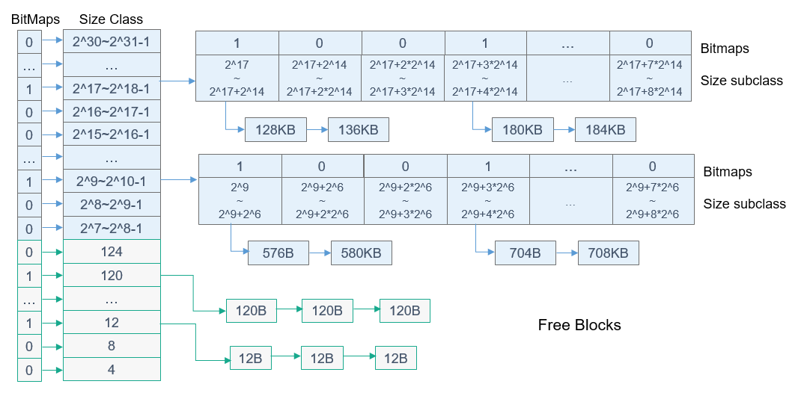
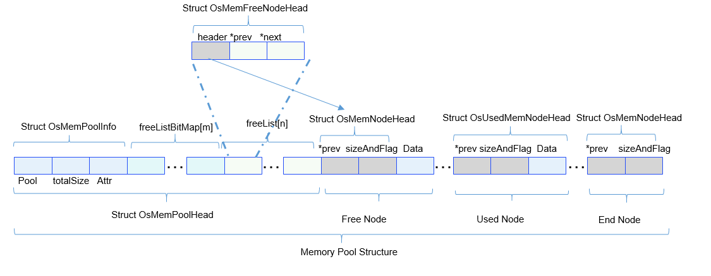

# Dynamic Memory<a name="EN-US_TOPIC_0000001123763647"></a>

-   [Working Principles](#section328282013571)
-   [Development Guidelines](#section7921151015814)
    -   [When to Use](#section326917198583)
    -   [Available APIs](#section1032331584)
    -   [How to Develop](#section07271773592)
    -   [Development Example](#section84931234145913)
    -   [Verification](#section165233233917)


## Working Principles<a name="section328282013571"></a>

Dynamic memory management allows memory blocks of any size to be allocated from a large contiguous memory \(memory pool or heap memory\) configured in the system based on user demands when memory resources are sufficient. The memory block can be released for further use when not required. Compared with static memory management, dynamic memory management allows memory allocation on demand but causes fragmentation of memory.

The dynamic memory of the OpenHarmony LiteOS-M has optimized the memory space partitioning based on the Two-Level Segregate Fit \(TLSF\) algorithm to achieve higher performance and minimize fragmentation.  [Figure 1](#fig14558185217397)  shows the core algorithm of the dynamic memory.

**Figure  1**  Dynamic memory core algorithm<a name="fig14558185217397"></a>  


Multiple free lists are used for management based on the size of the free memory block. The free memory blocks are divided into two parts: \[4, 127\] and \[2<sup>7</sup>, 2<sup>31</sup>\], as indicated by the size class in  [Figure 1](#fig14558185217397).

1.  The memory in the range of \[4, 127\] \(lower part in  [Figure 1](#fig14558185217397)\) is divided into 31 parts. The size of the memory block corresponding to each part is a multiple of 4 bytes. Each part corresponds to a free list and a bit that indicates whether the free list is empty. The value  **1**  indicates that the free list is not empty. There are 31 bits corresponding to the 31 memory parts in the range of \[4, 127\].
2.  The memory greater than 127 bytes is managed in power of two increments. The size of each range is \[2^n, 2^\(n+1\)-1\], where n is an integer in \[7, 30\]. This range is divided into 24 parts, each of which is further divided into 8 second-level \(L2\) ranges, as shown in Size Class and Size SubClass in the upper part of  [Figure 1](#fig14558185217397). Each L2 range corresponds to a free list and a bit that indicates whether the free list is empty. There are a total of 192 \(24 x 8\) L2 ranges, corresponding to 192 free lists and 192 bits.

For example, insert 40-byte free memory to a free list. The 40-byte free memory corresponds to the 10th free list in the range of \[40, 43\], and the 10th bit indicates the use of the free list. The system inserts the 40-byte free memory to the 10th free list and determines whether to update the bitmap flag. When 40-byte memory is requested, the system obtains the free list corresponding to the memory block of the requested size based on the bitmap flag, and then obtains a free memory node from the free list. If the size of the allocated node is greater than the memory requested, the system splits the node and inserts the remaining node to the free list. If 580-byte free memory needs to be inserted to a free list, the 580-byte free memory corresponds to the 47th \(31 + 2 x 8\) free list in L2 range \[2^9, 2^9+2^6\], and the 47th bit indicates the use of the free list. The system inserts the 580-byte free memory to the 47th free list and determines whether to update the bitmap flag. When 580-byte memory is requested, the system obtains the free list corresponding to the memory block of the requested size based on the bitmap flag, and then obtains a free memory node from the free list. If the size of the allocated node is greater than the memory requested, the system splits the node and inserts the remaining node to the free list. If the corresponding free list is empty, the system checks for a free list meeting the requirements in a larger memory range. In actual application, the system can locate the free list that meets the requirements at a time.

[Figure 2](#fig5395115964114)  shows the memory management structure.

**Figure  2**  Dynamic memory management structure<a name="fig5395115964114"></a>  


-   Memory pool header

    The memory pool header contains the memory pool information, bitmap flag array, and free list array. The memory pool information includes the start address of the memory pool, total size of the heap memory, and attributes of the memory pool. The bitmap flag array consists of seven 32-bit unsigned integers. Each bit indicates whether the free list is inserted with free memory block nodes. The free list contains information about 223 free memory head nodes. The free memory head node information contains a memory node header and information about the previous and next nodes in the free list.

-   Memory pool nodes

    There are three types of nodes: free node, used node, and end node. Each memory node maintains the size and use flag of the memory node and a pointer to the previous memory node in the memory pool. The free nodes and used nodes have a data area, but the end node has no data area.


## Development Guidelines<a name="section7921151015814"></a>

### When to Use<a name="section326917198583"></a>

Dynamic memory management allocates and manages memory resources requested by users dynamically. It is a good choice when users need memory blocks of different sizes. You can call the dynamic memory allocation function of the OS to request a memory block of the specified size. You can call the dynamic memory release function to release the memory at any time.

### Available APIs<a name="section1032331584"></a>

The following table describes APIs available for OpenHarmony LiteOS-M dynamic memory management. For more details about the APIs, see the API reference.

**Table  1**  APIs of the dynamic memory module

<a name="table1415203765610"></a>
<table><thead align="left"><tr id="row134151837125611"><th class="cellrowborder" valign="top" width="12.85128512851285%" id="mcps1.2.4.1.1"><p id="p16415637105612"><a name="p16415637105612"></a><a name="p16415637105612"></a>Category</p>
</th>
<th class="cellrowborder" valign="top" width="29.8029802980298%" id="mcps1.2.4.1.2"><p id="p11415163718562"><a name="p11415163718562"></a><a name="p11415163718562"></a>API</p>
</th>
<th class="cellrowborder" valign="top" width="57.34573457345735%" id="mcps1.2.4.1.3"><p id="p1641533755612"><a name="p1641533755612"></a><a name="p1641533755612"></a>Description</p>
</th>
</tr>
</thead>
<tbody><tr id="row0415737175610"><td class="cellrowborder" rowspan="2" valign="top" width="12.85128512851285%" headers="mcps1.2.4.1.1 "><p id="p6485848217"><a name="p6485848217"></a><a name="p6485848217"></a>Initializing or deleting a memory pool</p>
</td>
<td class="cellrowborder" valign="top" width="29.8029802980298%" headers="mcps1.2.4.1.2 "><p id="p1448511481314"><a name="p1448511481314"></a><a name="p1448511481314"></a>LOS_MemInit</p>
</td>
<td class="cellrowborder" valign="top" width="57.34573457345735%" headers="mcps1.2.4.1.3 "><p id="p94857483110"><a name="p94857483110"></a><a name="p94857483110"></a>Initializes a dynamic memory pool of the specified size.</p>
</td>
</tr>
<tr id="row1841519376561"><td class="cellrowborder" valign="top" headers="mcps1.2.4.1.1 "><p id="p20485134810119"><a name="p20485134810119"></a><a name="p20485134810119"></a>LOS_MemDeInit</p>
</td>
<td class="cellrowborder" valign="top" headers="mcps1.2.4.1.2 "><p id="p154851348113"><a name="p154851348113"></a><a name="p154851348113"></a>Deletes a memory pool. It is valid only when <strong id="b68821856145419"><a name="b68821856145419"></a><a name="b68821856145419"></a>LOSCFG_MEM_MUL_POOL</strong> is enabled.</p>
</td>
</tr>
<tr id="row1187514443616"><td class="cellrowborder" rowspan="4" valign="top" width="12.85128512851285%" headers="mcps1.2.4.1.1 "><p id="p19661710214"><a name="p19661710214"></a><a name="p19661710214"></a>Allocating or releasing dynamic memory</p>
</td>
<td class="cellrowborder" valign="top" width="29.8029802980298%" headers="mcps1.2.4.1.2 "><p id="p66111714213"><a name="p66111714213"></a><a name="p66111714213"></a>LOS_MemAlloc</p>
</td>
<td class="cellrowborder" valign="top" width="57.34573457345735%" headers="mcps1.2.4.1.3 "><p id="p4661715214"><a name="p4661715214"></a><a name="p4661715214"></a>Allocates memory of the specified size from the dynamic memory pool.</p>
</td>
</tr>
<tr id="row1745415527441"><td class="cellrowborder" valign="top" headers="mcps1.2.4.1.1 "><p id="p116111718218"><a name="p116111718218"></a><a name="p116111718218"></a>LOS_MemFree</p>
</td>
<td class="cellrowborder" valign="top" headers="mcps1.2.4.1.2 "><p id="p1569175218"><a name="p1569175218"></a><a name="p1569175218"></a>Releases the memory allocated from the specified dynamic memory.</p>
</td>
</tr>
<tr id="row19101718144518"><td class="cellrowborder" valign="top" headers="mcps1.2.4.1.1 "><p id="p161417225"><a name="p161417225"></a><a name="p161417225"></a>LOS_MemRealloc</p>
</td>
<td class="cellrowborder" valign="top" headers="mcps1.2.4.1.2 "><p id="p56181718219"><a name="p56181718219"></a><a name="p56181718219"></a>Re-allocates a memory block of the required size and copies data from the original block to the newly allocated bock. If the new memory block is successfully allocated, the original memory block will be released.</p>
</td>
</tr>
<tr id="row1346314166464"><td class="cellrowborder" valign="top" headers="mcps1.2.4.1.1 "><p id="p10610171528"><a name="p10610171528"></a><a name="p10610171528"></a>LOS_MemAllocAlign</p>
</td>
<td class="cellrowborder" valign="top" headers="mcps1.2.4.1.2 "><p id="p26171714214"><a name="p26171714214"></a><a name="p26171714214"></a>Allocates the memory of the specified size and aligned based on the specified bytes from a dynamic memory pool.</p>
</td>
</tr>
<tr id="row28531740101112"><td class="cellrowborder" rowspan="4" valign="top" width="12.85128512851285%" headers="mcps1.2.4.1.1 "><p id="p39818810129"><a name="p39818810129"></a><a name="p39818810129"></a>Obtaining memory pool information</p>
</td>
<td class="cellrowborder" valign="top" width="29.8029802980298%" headers="mcps1.2.4.1.2 "><p id="p16981986123"><a name="p16981986123"></a><a name="p16981986123"></a>LOS_MemPoolSizeGet</p>
</td>
<td class="cellrowborder" valign="top" width="57.34573457345735%" headers="mcps1.2.4.1.3 "><p id="p129820881212"><a name="p129820881212"></a><a name="p129820881212"></a>Obtains the total size of the specified dynamic memory pool.</p>
</td>
</tr>
<tr id="row34281341171114"><td class="cellrowborder" valign="top" headers="mcps1.2.4.1.1 "><p id="p0987831214"><a name="p0987831214"></a><a name="p0987831214"></a>LOS_MemTotalUsedGet</p>
</td>
<td class="cellrowborder" valign="top" headers="mcps1.2.4.1.2 "><p id="p1598889124"><a name="p1598889124"></a><a name="p1598889124"></a>Obtains the total memory usage of the specified dynamic memory pool.</p>
</td>
</tr>
<tr id="row112644551119"><td class="cellrowborder" valign="top" headers="mcps1.2.4.1.1 "><p id="p398208201215"><a name="p398208201215"></a><a name="p398208201215"></a>LOS_MemInfoGet</p>
</td>
<td class="cellrowborder" valign="top" headers="mcps1.2.4.1.2 "><p id="p139815820126"><a name="p139815820126"></a><a name="p139815820126"></a>Obtains the memory structure information of the specified memory pool, including the free memory, used memory, number of free memory blocks, number of used memory blocks, and maximum size of the free memory block.</p>
</td>
</tr>
<tr id="row1357684518110"><td class="cellrowborder" valign="top" headers="mcps1.2.4.1.1 "><p id="p3981383125"><a name="p3981383125"></a><a name="p3981383125"></a>LOS_MemPoolList</p>
</td>
<td class="cellrowborder" valign="top" headers="mcps1.2.4.1.2 "><p id="p998148101218"><a name="p998148101218"></a><a name="p998148101218"></a>Prints information about all initialized memory pools in the system, including the start address, size, total free memory, used memory, maximum size of the free memory block, number of free memory blocks, and number of used memory blocks of each memory pool. It is valid only when <strong id="b899016549611"><a name="b899016549611"></a><a name="b899016549611"></a>LOSCFG_MEM_MUL_POOL</strong> is enabled.</p>
</td>
</tr>
<tr id="row14824879135"><td class="cellrowborder" rowspan="2" valign="top" width="12.85128512851285%" headers="mcps1.2.4.1.1 "><p id="p1058973361319"><a name="p1058973361319"></a><a name="p1058973361319"></a>Obtaining memory block information</p>
</td>
<td class="cellrowborder" valign="top" width="29.8029802980298%" headers="mcps1.2.4.1.2 "><p id="p989115206287"><a name="p989115206287"></a><a name="p989115206287"></a>LOS_MemFreeNodeShow</p>
</td>
<td class="cellrowborder" valign="top" width="57.34573457345735%" headers="mcps1.2.4.1.3 "><p id="p437618158141"><a name="p437618158141"></a><a name="p437618158141"></a>Prints the size and number of free memory blocks in the specified memory pool.</p>
</td>
</tr>
<tr id="row525917259143"><td class="cellrowborder" valign="top" headers="mcps1.2.4.1.1 "><p id="p0260025151415"><a name="p0260025151415"></a><a name="p0260025151415"></a>LOS_MemUsedNodeShow</p>
</td>
<td class="cellrowborder" valign="top" headers="mcps1.2.4.1.2 "><p id="p19976124812146"><a name="p19976124812146"></a><a name="p19976124812146"></a>Prints the size and number of used memory blocks in the specified memory pool.</p>
</td>
</tr>
<tr id="row0715201211155"><td class="cellrowborder" valign="top" width="12.85128512851285%" headers="mcps1.2.4.1.1 "><p id="p13599202711513"><a name="p13599202711513"></a><a name="p13599202711513"></a>Checking memory pool integrity</p>
</td>
<td class="cellrowborder" valign="top" width="29.8029802980298%" headers="mcps1.2.4.1.2 "><p id="p5784183891513"><a name="p5784183891513"></a><a name="p5784183891513"></a>LOS_MemIntegrityCheck</p>
</td>
<td class="cellrowborder" valign="top" width="57.34573457345735%" headers="mcps1.2.4.1.3 "><p id="p15644611153"><a name="p15644611153"></a><a name="p15644611153"></a>Checks the integrity of the specified memory pool. It is valid only when <strong id="b1215338788"><a name="b1215338788"></a><a name="b1215338788"></a>LOSCFG_BASE_MEM_NODE_INTEGRITY_CHECK</strong> is enabled.</p>
</td>
</tr>
</tbody>
</table>

> **NOTE:** 
>-   The dynamic memory module manages memory through control block structures, which consume extra memory. Therefore, the actual memory space available to users is less than the value of  **OS\_SYS\_MEM\_SIZE**.
>-   The  **LOS\_MemAllocAlign**  and  **LOS\_MemMallocAlign**  APIs consume extra memory for memory alignment, which may cause memory loss. When the memory used for alignment is freed up, the lost memory will be reclaimed.

### How to Develop<a name="section07271773592"></a>

The typical development process of dynamic memory is as follows:

1.  Call the  **LOS\_MemInit**  API to initialize a memory pool.

    After a memory pool is initialized, a memory pool control header and end node will be generated, and the remaining memory is marked as free nodes. The end node is the last node in the memory pool, and its size is  **0**.


1.  Call the  **LOS\_MemAlloc**  API to allocate dynamic memory of any size.

    The system checks whether the dynamic memory pool has free memory blocks greater than the requested size. If yes, the system allocates a memory block and returns the pointer to the memory block. If no, the system returns NULL. If the memory block allocated is greater than the requested size, the system splits the memory block and inserts the remaining memory block to the free list.


1.  Call the  **LOS\_MemFree**  API to release dynamic memory.

    The released memory block can be reused. When  **LOS\_MemFree**  is called, the memory block will be reclaimed and marked as free nodes. When memory blocks are reclaimed, adjacent free nodes are automatically merged.


### Development Example<a name="section84931234145913"></a>

The example below implements the following:

1.  Initialize a dynamic memory pool.
2.  Allocate a memory block from the dynamic memory pool.
3.  Store a piece of data in the memory block.
4.  Print the data in the memory block.
5.  Release the memory block.

The sample code is as follows:

```
#include "los_memory.h"

#define TEST_POOL_SIZE (2*1024)
__attribute__((aligned(4))) UINT8 g_testPool[TEST_POOL_SIZE];

VOID Example_DynMem(VOID)
{
    UINT32 *mem = NULL;
    UINT32 ret;

 /* Initialize the memory pool. */
    ret = LOS_MemInit(g_testPool, TEST_POOL_SIZE);
    if (LOS_OK  == ret) {
        printf("Memory pool initialized.\n");
    } else {
        printf("Memory pool initialization failed.\n");
        return;
    }

    /* Allocate memory.*/
    mem = (UINT32 *)LOS_MemAlloc(g_testPool, 4);
    if (NULL == mem) {
        printf("Memory allocation failed.\n");
        return;
    }
    printf("Memory allocated.\n");

    /* Assign a value.*/
    *mem = 828;
    printf("*Memory = %d\n", *mem);

    /* Release memory.*/
    ret = LOS_MemFree(g_testPool, mem);
    if (LOS_OK == ret) {
        printf("Memory released.\n");
    } else {
        printf("Memory release failed.\n");
    }

    return;
}
```

### Verification<a name="section165233233917"></a>

The output is as follows:

```
Memory pool initialized.
Memory allocated.
*Memory = 828
Memory released.
```

