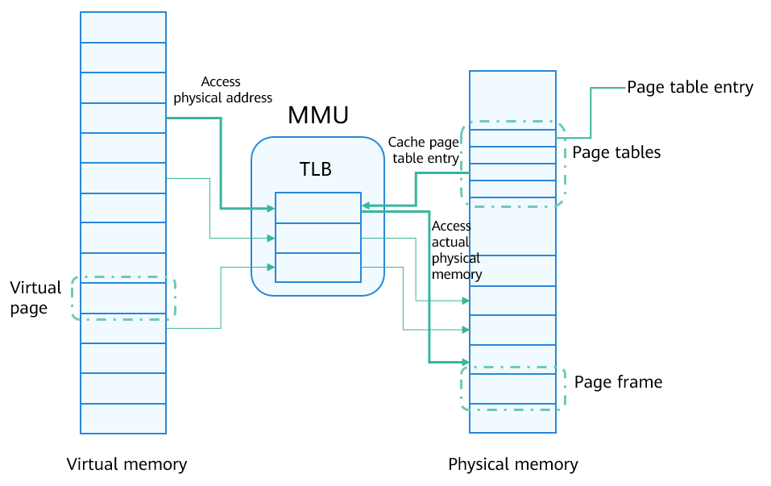

# Virtual-to-Physical Mapping

-   [Basic Concepts](#section9108144913615)
-   [Working Principles](#section12392621871)
-   [Development Guidelines](#section10264102013713)
    -   [Available APIs](#section195320251578)
    -   [How to Develop](#section152774210712)

## Basic Concepts

The Memory Management Unit \(MMU\) is used to map the virtual addresses in the process space and the actual physical addresses and specify corresponding access permissions and cache attributes. When a program is executed, the CPU accesses the virtual memory, locates the corresponding physical memory based on the MMU page table entry, and executes the code or performs data read/write operations. The page tables of the MMU store the mappings between virtual and physical addresses and the access permission. A page table is created when each process is created. The page table contains page table entries \(PTEs\), and each PTE describes a mapping between a virtual address region and a physical address region. The MMU has a Translation Lookaside Buffer \(TLB\) for address translation. During address translation, the MMU first searches the TLB for the corresponding PTE. If a match is found, the address can be returned directly. The following figure illustrates how the CPU accesses the memory or peripherals.

**Figure  1**  CPU accessing the memory or peripheral  

## Working Principles

Virtual-to-physical address mapping is a process of establishing page tables. The MMU supports multi-level page tables. The LiteOS-A kernel uses the level-2 page tables to describe the process space. Each level-1 PTE descriptor occupies 4 bytes, which indicate a mapping record of 1 MiB memory space. The 1 GiB user space of the LiteOS-A kernel has 1024 level-1 PTEs. When a user process is created, a 4 KiB memory block is requested from the memory as the storage area of the level-1 page table. Memory is dynamically allocated for the level-2 page table based on requirements of the process.

-   When a user program is loaded and started, the code segment and data segment are mapped to the virtual memory space \(for details, see  [Dynamic Loading and Linking](kernel-small-bundles-linking.md)\). At that time, no physical page is mapped.
-   When the program is executed, as shown by the bold arrow in the following figure, the CPU accesses the virtual address and checks for the corresponding physical memory in the MMU. If the virtual address does not have the corresponding physical address, a page missing fault is triggered. The kernel requests the physical memory, writes the virtual-physical address mapping and the related attributes to the page table, and caches the PTE in the TLB. Then, the CPU can directly access the actual physical memory.
-   If the PTE already exists in the TLB, the CPU can access the physical memory without accessing the page table stored in the memory.

**Figure  2**  CPU accessing the memory  

## Development Guidelines

### Available APIs

**Table  1**  APIs of the virtual-to-physical address mapping module

<table><thead align="left"><tr id="row134151837125611"><th class="cellrowborder" valign="top" width="12.821282128212822%" id="mcps1.2.4.1.1">
Function

</th>
<th class="cellrowborder" valign="top" width="29.832983298329836%" id="mcps1.2.4.1.2">
API

</th>
<th class="cellrowborder" valign="top" width="57.34573457345735%" id="mcps1.2.4.1.3">
Description

</th>
</tr>
</thead>
<tbody><tr id="row12171174434013"><td class="cellrowborder" rowspan="5" valign="top" width="12.821282128212822%" headers="mcps1.2.4.1.1 ">
MMU operations

</td>
<td class="cellrowborder" valign="top" width="29.832983298329836%" headers="mcps1.2.4.1.2 ">
LOS_ArchMmuQuery

</td>
<td class="cellrowborder" valign="top" width="57.34573457345735%" headers="mcps1.2.4.1.3 ">
Obtains the physical address and attributes corresponding to the virtual address of the process space.

</td>
</tr>
<tr id="row17223043124018"><td class="cellrowborder" valign="top" headers="mcps1.2.4.1.1 ">
LOS_ArchMmuMap

</td>
<td class="cellrowborder" valign="top" headers="mcps1.2.4.1.2 ">
Maps the virtual address region of the process space and the physical address region.

</td>
</tr>
<tr id="row536885134010"><td class="cellrowborder" valign="top" headers="mcps1.2.4.1.1 ">
LOS_ArchMmuUnmap

</td>
<td class="cellrowborder" valign="top" headers="mcps1.2.4.1.2 ">
Removes the mapping between the virtual address region of the process space and the physical address region.

</td>
</tr>
<tr id="row11567448194112"><td class="cellrowborder" valign="top" headers="mcps1.2.4.1.1 ">
LOS_ArchMmuChangeProt

</td>
<td class="cellrowborder" valign="top" headers="mcps1.2.4.1.2 ">
Modifies the mapping attributes of the virtual address region of the process space.

</td>
</tr>
<tr id="row1141513373562"><td class="cellrowborder" valign="top" headers="mcps1.2.4.1.1 ">
LOS_ArchMmuMove

</td>
<td class="cellrowborder" valign="top" headers="mcps1.2.4.1.2 ">
Moves a mapping record of a virtual address region in the process space to another unused virtual address region for remapping.

</td>
</tr>
</tbody>
</table>

### How to Develop

To use virtual-to-physical address mapping APIs:

1.  Call  **LOS\_ArchMmuMap**  to map a physical memory block.
2.  Perform the following operations on the mapped address region:
    -   Call  **LOS\_ArchMmuQuery**  to query the physical address region corresponding to a virtual address region and the mapping attributes.

    -   Call  **LOS\_ArchMmuChangeProt**  to modify the mapping attributes.
    -   Call  **LOS\_ArchMmuMove**  to remap the virtual address region.

3.  Call  **LOS\_ArchMmuUnmap**  to remove the mapping.

> **NOTE:** 
>The preceding APIs can be used after the MMU initialization is complete and the page tables of the related process are created. The MMU initialization is complete during system startup, and page tables are created when the processes are created. You do not need to perform any operation. 

