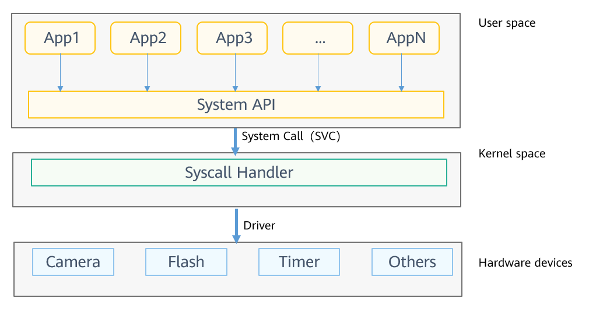

# System Call<a name="EN-US_TOPIC_0000001123520159"></a>

## Basic Concepts<a name="section889710401734"></a>

The OpenHarmony LiteOS-A isolates the user space and kernel space. User-space programs cannot directly access kernel resources. System calls provide a channel for user-space programs to access kernel resources and interact with the kernel.

## Working Principles<a name="section195177541314"></a>

As shown in the following figure, a user program calls the System API \(a POSIX interface provided by the system\) to access kernel resources and interacts with the kernel. An SVC/SWI exception is triggered inside the POSIX interface to complete switching of the system from the user space to the kernel space. Then, the kernel Syscall Handler \(unified system call interface\) parses parameters received and distributes the parameters to the specific kernel functions for processing.

**Figure  1**  System call<a name="fig165662915310"></a>  


The Syscall Handler is implemented by the  **OsArmA32SyscallHandle**  function in  **kernel/liteos\_a/syscall/los\_syscall.c**. This function is called when a system software interrupt occurs. The input parameters of system calls are parsed according to the list in  **kernel/liteos\_a/syscall/syscall\_lookup.h**  so that the specific kernel functions are executed.

> **NOTE:** 
>-   System calls implement basic interaction between user-space programs and the kernel. You are advised to use the POSIX APIs provided by the kernel instead of system call APIs. If you want to add system call APIs, see the development guide.
>-   For details about the system call APIs provided by the kernel for the user space, see  **kernel/liteos\_a/syscall/syscall\_lookup.h**. For details about the system call functions provided by the kernel, see  **kernel/liteos\_a/syscall/los\_syscall.h**.

## Development Guidelines<a name="section193492047135419"></a>

### How to Develop<a name="section7165741122210"></a>

The typical development process of adding a system call API is as follows:

1.  Determine and add the new system call number to the LibC library.
2.  Add the declaration and implementation of the new user-space function API to the LibC library.
3.  Add the new system call number and the declaration of the corresponding kernel processing function to the kernel system call header file.
4.  Add the kernel processing function corresponding to the system call to the kernel.

### Development Example<a name="section107131418224"></a>

**Sample Code**

1.  Add the system call number to  **syscall.h.in**  in the LibC library.

    In the following example,  **\_\_NR\_new\_syscall\_sample**  specifies the system call number added.

    ```
    ...
    /* Current system call list */
    /* OHOS customized syscalls, not compatible with ARM EABI */
    #define __NR_OHOS_BEGIN         500
    #define __NR_pthread_set_detach (__NR_OHOS_BEGIN + 0)
    #define __NR_pthread_join       (__NR_OHOS_BEGIN + 1)
    #define __NR_pthread_deatch     (__NR_OHOS_BEGIN + 2)
    #define __NR_creat_user_thread  (__NR_OHOS_BEGIN + 3)
    #define __NR_processcreat       (__NR_OHOS_BEGIN + 4)
    #define __NR_processtart        (__NR_OHOS_BEGIN + 5)
    #define __NR_printf             (__NR_OHOS_BEGIN + 6)
    #define __NR_dumpmemory         (__NR_OHOS_BEGIN + 13)
    #define __NR_mkfifo             (__NR_OHOS_BEGIN + 14)
    #define __NR_mqclose            (__NR_OHOS_BEGIN + 15)
    #define __NR_realpath           (__NR_OHOS_BEGIN + 16)
    #define __NR_format             (__NR_OHOS_BEGIN + 17)
    #define __NR_shellexec          (__NR_OHOS_BEGIN + 18)
    #define __NR_ohoscapget         (__NR_OHOS_BEGIN + 19)
    #define __NR_ohoscapset         (__NR_OHOS_BEGIN + 20)
    
    #define __NR_new_syscall_sample (__NR_OHOS_BEGIN + 21) /* Add the new system call number: __NR_new_syscall_sample:521 */
    
    #define __NR_syscallend         (__NR_OHOS_BEGIN + 22)
    ...
    ```

2.  Add the declaration and implementation of the new user-space API to the LibC library.

    ```
    #include "stdio_impl.h"
    #include "syscall.h"
    ...
    /* Add the implementation of the new user-space system call API.*/
    void newSyscallSample(int num)
    {
         printf("user mode: num = %d\n", num);
         __syscall(SYS_new_syscall_sample, num);
         return;
    }
    ```

3.  Add the system call number to the kernel system call header file.

    In the  **third\_party/musl/porting/liteos\_a/kernel/include/bits/syscall.h**  file,  **\_\_NR\_new\_syscall\_sample**  specifies the new system call number .

    ```
    ...
    /* Current system call list */
    /* OHOS customized syscalls, not compatible with ARM EABI */
    #define __NR_OHOS_BEGIN         500
    #define __NR_pthread_set_detach (__NR_OHOS_BEGIN + 0)
    #define __NR_pthread_join       (__NR_OHOS_BEGIN + 1)
    #define __NR_pthread_deatch     (__NR_OHOS_BEGIN + 2)
    #define __NR_creat_user_thread  (__NR_OHOS_BEGIN + 3)
    #define __NR_processcreat       (__NR_OHOS_BEGIN + 4)
    #define __NR_processtart        (__NR_OHOS_BEGIN + 5)
    #define __NR_printf             (__NR_OHOS_BEGIN + 6)
    #define __NR_dumpmemory         (__NR_OHOS_BEGIN + 13)
    #define __NR_mkfifo             (__NR_OHOS_BEGIN + 14)
    #define __NR_mqclose            (__NR_OHOS_BEGIN + 15)
    #define __NR_realpath           (__NR_OHOS_BEGIN + 16)
    #define __NR_format             (__NR_OHOS_BEGIN + 17)
    #define __NR_shellexec          (__NR_OHOS_BEGIN + 18)
    #define __NR_ohoscapget         (__NR_OHOS_BEGIN + 19)
    #define __NR_ohoscapset         (__NR_OHOS_BEGIN + 20)
    
    #define __NR_new_syscall_sample (__NR_OHOS_BEGIN + 21) /* Add the new system call number: __NR_new_syscall_sample:521 */
    
    #define __NR_syscallend         (__NR_OHOS_BEGIN + 22)
    ...
    ```

    In  **kernel/liteos\_a/syscall/syscall\_lookup.h**, add the line  **SYSCALL\_HAND\_DEF\(\_\_NR\_new\_syscall\_sample, SysNewSyscallSample, void, ARG\_NUM\_1\)**.

    ```
    ...
    /* Current system call list */
    SYSCALL_HAND_DEF(__NR_chown, SysChown, int, ARG_NUM_3)
    SYSCALL_HAND_DEF(__NR_chown32, SysChown, int, ARG_NUM_3)
    #ifdef LOSCFG_SECURITY_CAPABILITY
    SYSCALL_HAND_DEF(__NR_ohoscapget, SysCapGet, UINT32, ARG_NUM_2)
    SYSCALL_HAND_DEF(__NR_ohoscapset, SysCapSet, UINT32, ARG_NUM_1)
    #endif
    /* Add a system call. */
    SYSCALL_HAND_DEF(__NR_new_syscall_sample, SysNewSyscallSample, void, ARG_NUM_1)
    ...
    ```

4.  Add a function corresponding to the new system call to the kernel.

    In  **kernel/liteos\_a/syscall/los\_syscall.h**,  **SysNewSyscallSample**  is the declaration of the kernel processing function corresponding to the new system call.

    ```
    ...
    /* List of the declaration of the current kernel processing functions for system calls. */
    extern int SysClockSettime64(clockid_t clockID, const struct timespec64 *tp);
    extern int SysClockGettime64(clockid_t clockID, struct timespec64 *tp);
    extern int SysClockGetres64(clockid_t clockID, struct timespec64 *tp);
    extern int SysClockNanoSleep64(clockid_t clk, int flags, const struct timespec64 *req, struct timespec64 *rem);
    extern int SysTimerGettime64(timer_t timerID, struct itimerspec64 *value);
    extern int SysTimerSettime64(timer_t timerID, int flags, const struct itimerspec64 *value, struct itimerspec64 *oldValue);
    /* Declaration of the kernel processing function for the new system call*/
    extern void SysNewSyscallSample(int num);
    ...
    ```

    The newly added kernel processing function is implemented as follows:

    ```
    include "los_printf.h"
    ...
    /* Add the implementation of the kernel processing function for the new system call. */
    void SysNewSyscallSample(int num)
    {
        PRINTK("kernel mode: num = %d\n", num);
        return;
    }
    ```


**Verification**

The user-space program calls the  **newSyscallSample\(10\)**  API. The output is as follows:

```
/* The output in both user-space and kernel-space APIs indicates that the new system call is enabled. */
user mode: num = 10
kernel mode: num = 10
```

