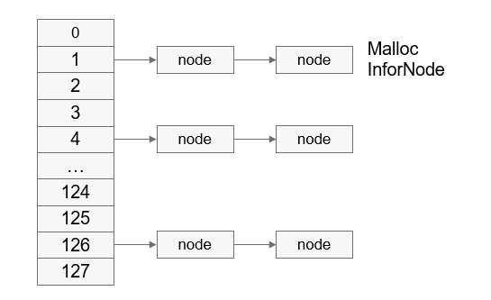

# Working Principles

## Memory Leak Check

The memory debugging module maintains 128 \(that is the maximum number of threads supported in the system\) linked lists for each process. The index of each linked list is the thread ID.

When memory is requested, key information is saved to the memory node control block, which is inserted to the corresponding linked list based on the thread ID.

When memory is released, the system matches the memory node control block based on the memory address to be released and deletes the control block.

**Figure  1**  Heap memory node linked list  

When memory is allocated, the returned address is saved in a link register \(LR\). During the process running, the system adds information, such as the LR corresponding to the suspected leak, to the memory node control block.  [Figure 2](#fig716011269106)  shows the heap memory node information.

**Figure  2**  Heap memory node information  

**TID**  indicates the thread ID;  **PID**  indicates the process ID;  **ptr**  indicates the address of the memory requested;  **size**  indicates the size of the requested memory;  **lr\[_n_\]**  indicates the address of the call stack, and  _n_  is configurable.

When memory is released, the input parameter pointer in the  **free**  API is used to match the  **ptr**  field of the memory node. If the pointer is the same as the  **ptr**  field of the memory node, the memory node control block will be deleted.

You can export the memory debugging information of each process through the serial port or file, and use the addr2line tool to convert the exported information into the code lines that cause memory leaks. In this way, the memory leakage problem can be solved.

**Figure  3**  Process of locating the code lines for a memory leak  

## Heap Memory Statistics

You can collect statistics on the percentage of heap memory requested by each thread to provide data support for optimizing memory usage of user programs. The  **malloc**  and  **free**  APIs are involved in user-mode heap memory statistics. As shown in  [Figure 1](#fig4294145810543), each process maintains 128 linked lists, and the index of each linked list is a thread ID. When heap memory is requested, the  **ptr**  and  **size**  information is recorded in the memory node control block, which is inserted to a linked list with the thread ID as the header. When the heap memory is released, the corresponding heap memory block is removed from the linked list based on the  **ptr**. In addition, the system calculates the total heap memory used by the current thread and updates its heap memory usage and peak heap memory usage.

## Memory Integrity Check

-   If the memory requested by using  **malloc**  is less than or equal to 0x1c000 bytes, the heap allocation algorithm is used to allocate memory.

    When a user program requests heap memory, information such as the check value is added to the heap memory node. If the check value is abnormal, it is probably that the previous heap memory block is overwritten. Currently, the scenario where the check value is damaged by a wild pointer cannot be identified. When memory is allocated or released, the memory node check value is verified. If the memory node is corrupted and the verification fails, the following information is output: TID, PID, and call stack information saved when the previous heap memory block of the corrupted node is allocated. You can use the addr2line tool to obtain the specific code line and rectify the fault.

    **Figure  4**  Adding a check value to the node header information  
    

    When heap memory is released by using  **free**, the memory block is not released immediately. Instead, the magic number 0xFE is written into the memory block, which is then placed in the free queue to prevent the memory block from being allocated by  **malloc**  within a certain period of time. When a wild pointer or  **use-after-free**  operation is performed to read the memory, an exception can be detected. However, this mechanism does not apply to write operations.

    **Figure  5**  Process of releasing memory  
    

-   If the memory requested by using  **malloc**  is greater than 0x1c000 bytes,  **mmap**  is used to allocate memory.

    When  **mmap**  is used to request a large memory block, one more page is allocated at the start and end of the memory region. The current  **PAGE\_SIZE**  of each page is  **0x1000**. The permissions of the two pages are set to  **PROT\_NONE**  \(no read or write permission\) by using the  **mprotect**  API to prevent out-of-bounds read and write of memory. If out-of-bounds read and write of memory occurs, the user program becomes abnormal because the user does not have the read or write permission. The code logic can be identified based on the abnormal call stack information.

    **Figure  6**  Layout of the memory allocated by using the  **mmap**  mechanism of  **malloc**  
    

