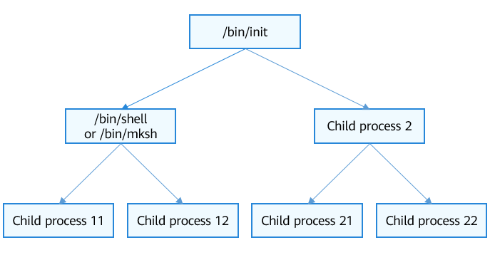

# Startup in User Mode<a name="EN-US_TOPIC_0000001123640059"></a>

-   [Startup of the Root Process in User Mode](#section79911135647)
    -   [Startup Process of the Root Process](#section1184317581349)
    -   [Responsibilities of the Root Process](#section1590220321759)

-   [Running Programs in User Mode](#section194576310611)

## Startup of the Root Process in User Mode<a name="section79911135647"></a>

The root process is the first user-mode process in the system. The process ID is 1. The root process is the ancestor of all user-mode processes.

**Figure  1**  Process tree<a name="fig427516409375"></a>  


### Startup Process of the Root Process<a name="section1184317581349"></a>

Use the link script to place the following init startup code to the specified location in the system image.

```
#define LITE_USER_SEC_ENTRY   __attribute__((section(".user.entry")))
LITE_USER_SEC_ENTRY VOID OsUserInit(VOID *args)
{
#ifdef LOSCFG_KERNEL_DYNLOAD
    sys_call3(__NR_execve, (UINTPTR)g_initPath, 0, 0);
#endif
    while (true) {
    }
}
```

During system startup,  **OsUserInitProcess**  is called to start the  **init**  process. The procedure is as follows:

1.  The kernel calls  **OsLoadUserInit**  to load the code.
2.  A process space is created to start the  **/bin/init**  process.

### Responsibilities of the Root Process<a name="section1590220321759"></a>

-   Starts key system programs or services, such as shell.

    > **NOTE:** 
    >In OpenHarmony, the  **init**  process reads the  **/etc/init.cfg**  file and runs specified commands or starts specified processes based on configurations. For details, see  [init Module](../subsystems/subsys-boot-init.md).


-   Monitors the process for reclaiming the orphan process and clears the zombie processes in child processes.

## Running Programs in User Mode<a name="section194576310611"></a>

Common compilation modes of user-mode programs include:

1.  [Compilation based on the framework](../quick-start/quickstart-lite-steps-hi3516-running.md)
2.  Manual compilation

    Example:

    ```
    clang --target=arm-liteos --sysroot=prebuilts/lite/sysroot -o helloworld helloworld.c
    ```

    Before running the  **clang**  command, install the LLVM compiler. For details, see  [Installing LLVM](../quick-start/quickstart-lite-package-environment.md#section711117144296).

    **--target=arm-liteos**: specifies the compilation platform, which is arm-liteos.

    **--sysroot=$\{YOUR\_ROOT\_PATH\}/prebuilts/lite/sysroot**: specifies the directory in which you can search for the header file and the dependent standard libraries.


A user-mode program can be started in either of the following ways:

-   Run the shell command to start the process.

    ```
    OHOS $ exec helloworld
    OHOS $ ./helloworld
    OHOS $ /bin/helloworld
    ```


-   Start a new process by calling the POSIX API.

    Use the  **Fork\(\)**  method to create a process, and call the  **exec\(\)**  method to execute a new process.


