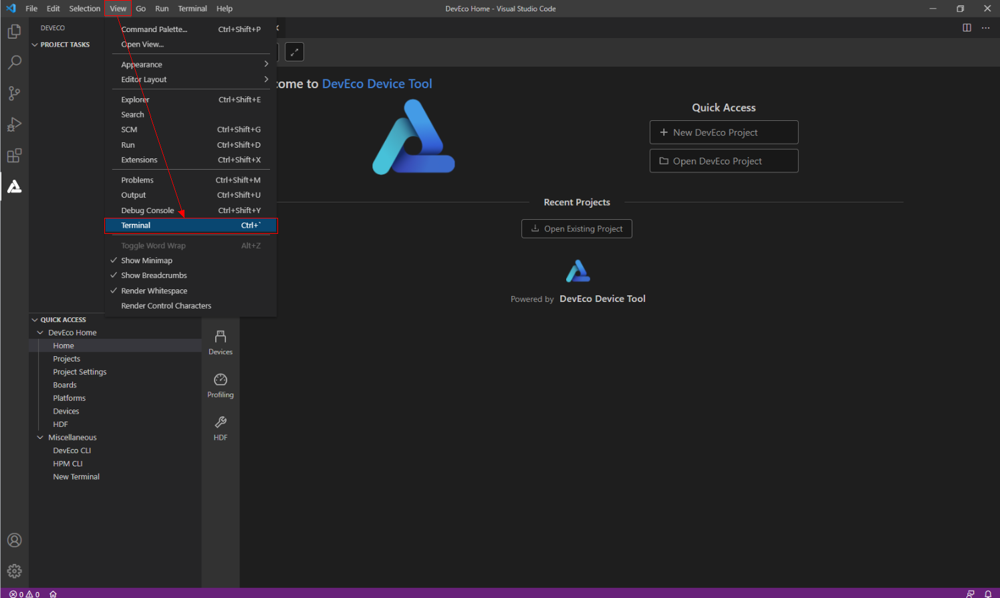
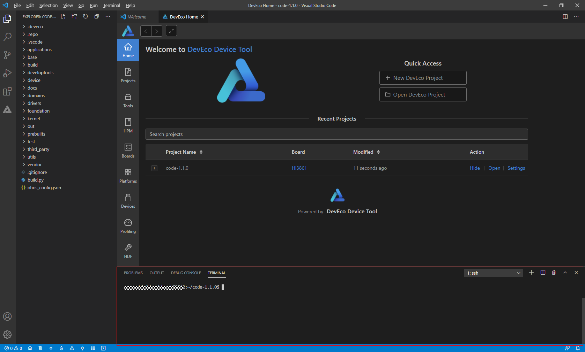
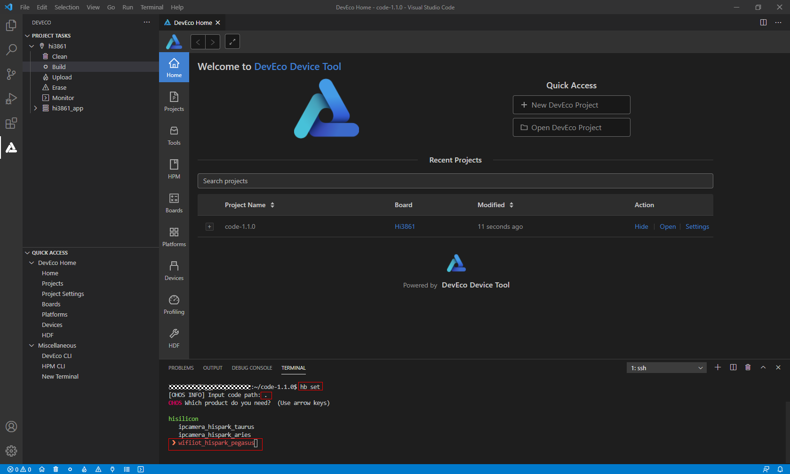
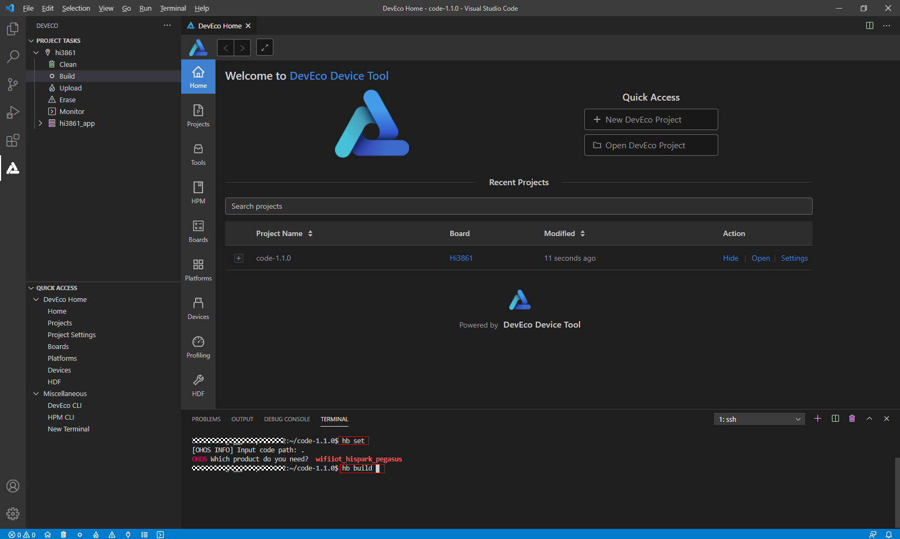
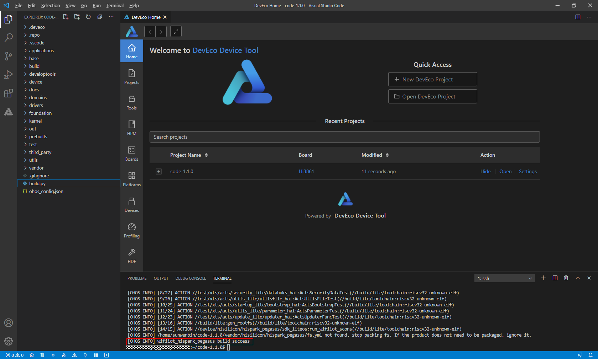
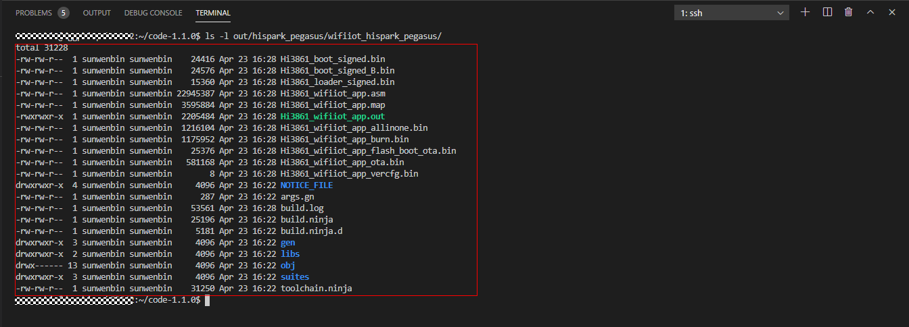

# Developing the First Example Program Running on Hi3861<a name="EN-US_TOPIC_0000001053302600"></a>

-   [Building](#section191121332125319)
-   [Burning Images](#section1610612214150)
-   [Connecting WLAN Module to the Internet](#section168257461059)

This example shows how to connect the WLAN module to the gateway using attention \(AT\) commands.

## Building<a name="section191121332125319"></a>

This section describes how to perform the WLAN module building on a Linux server.

If the Linux environment is installed using Docker, perform the building by referring to  [Using Docker to Prepare the Build Environment](../get-code/acquiring-tools.md). If the Linux environment is installed using a software package, perform the following steps:

1.  Open the HUAWEI DevEco Device Tool and choose  **View**  \>  **Terminal**.

    **Figure  1**  Starting the IDE terminal tool<a name="fig1975813338510"></a>  
    

    

    On the  **TERMINAL**  panel, run the ssh command, for example,  **ssh** **_user_@_ipaddr_**, to connect to the Linux server.

    **Figure  2**  TERMINAL panel<a name="fig91165301546"></a>  
    

    

2.  Go to the root directory of the code, run the  **hb set**  and  **.**  commands on the  **TERMINAL**  panel, and select the  **wifiiot\_hispark\_pegasus**  version.

    **Figure  3**  Selecting the target build version<a name="fig17727115215612"></a>  
    

    

3.  Run the  **hb build**  command to start building.

    **Figure  4**  Running commands on the TERMINAL panel<a name="fig5493164414573"></a>  
    

    

4.  Check whether the building is successful. If yes,  **wifiiot\_hispark\_pegasus build success**  will be displayed, as shown in the following figure.

    **Figure  5**  Successful building<a name="fig1262101218463"></a>  
    

    

5.  Check whether the following files are generated in the  **./out/wifiiot/**  directory.

    ```
    ls -l out/hispark_pegasus/wifiiot_hispark_pegasus/
    ```

    **Figure  6**  Directory for storing the generated files<a name="fig38521346164618"></a>  
    

    


## Burning Images<a name="section1610612214150"></a>

You can use the DevEco tool to perform the image burning of the Hi3861 WLAN module. For details about how to use the tool, see  [HUAWEI DevEco Device Tool User Guide](https://device.harmonyos.com/en/docs/ide/user-guides/service_introduction-0000001050166905).

1.  Connect the PC and the target development board through the USB port. For details, please refer to  [Introduction to the Hi3861 Development Board](https://device.harmonyos.com/en/docs/start/introduce/oem_wifi_start_des-0000001050168548).
2.  <a name="en-us_topic_0000001056563976_li848662117291"></a>Open Device Manager, then check and record the serial port number corresponding to the development board.

    > **NOTE:** 
    >If the serial port number is not displayed correctly, follow the steps described in  [Installing the Serial Port Driver on the Hi3861 Series Development Boards](https://device.harmonyos.com/cn/docs/ide/user-guides/hi3861-drivers-0000001058153433).

    

3.  Open DevEco Device Tool and go to  **Projects**  \>  **Settings**.

    

4.  On the  **hi3861**  tab page, set the programming options.

    -   **upload\_port**: Select the serial port number obtained in step  [2](#en-us_topic_0000001056563976_li848662117291).
    -   **upload\_protocol**: Select the programming protocol  **burn-serial**.
    -   **upload\_partitions**: Select the file to be programmed.  **hi3861\_app**  is selected by default.

    

5.  Modify the settings of the  **hi3861\_app**  file. In general cases, you can leave the fields at their default settings. To change the default settings, select the target item in the  **New Option**  field first.

    

6.  When you finish modifying, click  **Save**  in the upper right corner.

    

7.  Open the project file. In the DevEco Device Tool window, go to  **PROJECT TASKS**  \>  **env:hi3861**  \>  **Upload**  to start programming.

    

8.  When the following information is displayed, press the RST button on the development board to restart it.

    

9.  Start programming. When the following message is displayed, it indicates that the programming is successful.

    


## Connecting WLAN Module to the Internet<a name="section168257461059"></a>

After completing version building and burning, do as follows to connect the WLAN module to the Internet using AT commands.

1.  Click the icon of  **DevEco: Serial Monitor**  at the bottom of DevEco Studio to keep the connection between the Windows workstation and the WLAN module.

    **Figure  7**  Opening the DevEco serial port<a name="fig12489182991119"></a>  
    

    

2.  Reset the WLAN module. The message  **ready to OS start**  is displayed on the  **TERMINAL**  panel, indicating that the WLAN module is started successfully.

    **Figure  8**  Successful resetting of the WLAN module <a name="fig496084516332"></a>  
    

    

3.  Run the following AT commands in sequence via the DevEco serial port terminal to start the STA mode, connect to the specified AP, and enable Dynamic Host Configuration Protocol \(DHCP\).

    ```
    AT+STARTSTA                             # Start the STA mode.
    AT+SCAN                                 # Scan for available APs.
    AT+SCANRESULT                           # Display the scanning result.
    AT+CONN="SSID",,2,"PASSWORD"            # Connect to the specified AP. (SSID and PASSWORD represent the name and password of the hotspot to be connected, respectively.)
    AT+STASTAT                              # View the connection result.
    AT+DHCP=wlan0,1                         # Request the IP address of wlan0 from the AP using DHCP.
    ```

4.  Check whether the WLAN module is properly connected to the gateway, as shown in the following figure.

    ```
    AT+IFCFG                                # View the IP address assigned to an interface of the module.
    AT+PING=X.X.X.X                         # Check the connectivity between the module and the gateway. Replace X.X.X.X with the actual gateway address.
    ```

    **Figure  9**  Successful networking of the WLAN module<a name="fig1166371318339"></a>  
    

    


