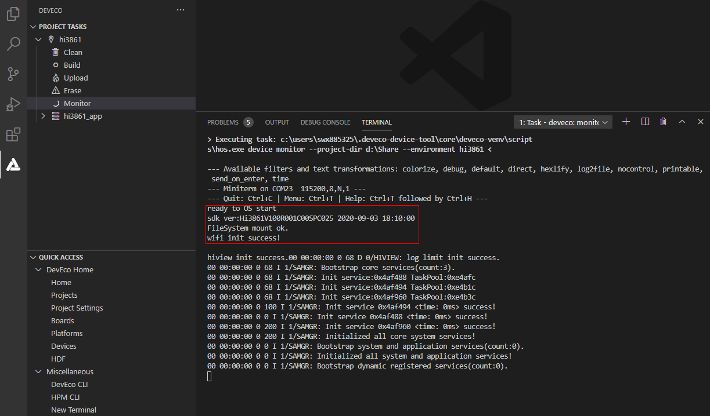

# Networking


After completing compilation and burning, perform the following to connect the Hi3861 WLAN module to the Internet using AT commands.


1. Click the icon of **DevEco: Serial Monitor** at the bottom of DevEco Device Tool to keep the connection between the Windows workstation and the Hi3861 WLAN module.

     **Figure 1** Opening the DevEco Device Tool serial port

     

2. Reset the Hi3861 WLAN module. The message **ready to OS start** is displayed on the **TERMINAL** panel, indicating that the WLAN module is started successfully.

     **Figure 2** Successful resetting of the Hi3861 WLAN module

     

3. Run the following AT commands in sequence via the DevEco serial port terminal to start the STA mode, connect to the specified AP, and enable Dynamic Host Configuration Protocol (DHCP).
     
   ```
   AT+STARTSTA                             # Start the STA mode.
   AT+SCAN                                 # Scan for available APs.
   AT+SCANRESULT                           # Display the scanning result.
   AT+CONN="SSID",,2,"PASSWORD"            # Connect to the specified AP. (SSID and PASSWORD represent the name and password of the hotspot to be connected, respectively.)
   AT+STASTAT                              # View the connection result.
   AT+DHCP=wlan0,1                         # Request the IP address of wlan0 from the AP using DHCP.
   ```

4. Check whether the Hi3861 WLAN module is properly connected to the gateway, as shown in the following figure.
     
   ```
   AT+IFCFG                                # View the IP address assigned to an interface of the module.
   AT+PING=X.X.X.X                         # Check the connectivity between the module and the gateway. Replace X.X.X.X with the actual gateway address.
   ```

     **Figure 3** Successful networking of the Hi3861 WLAN module

     
