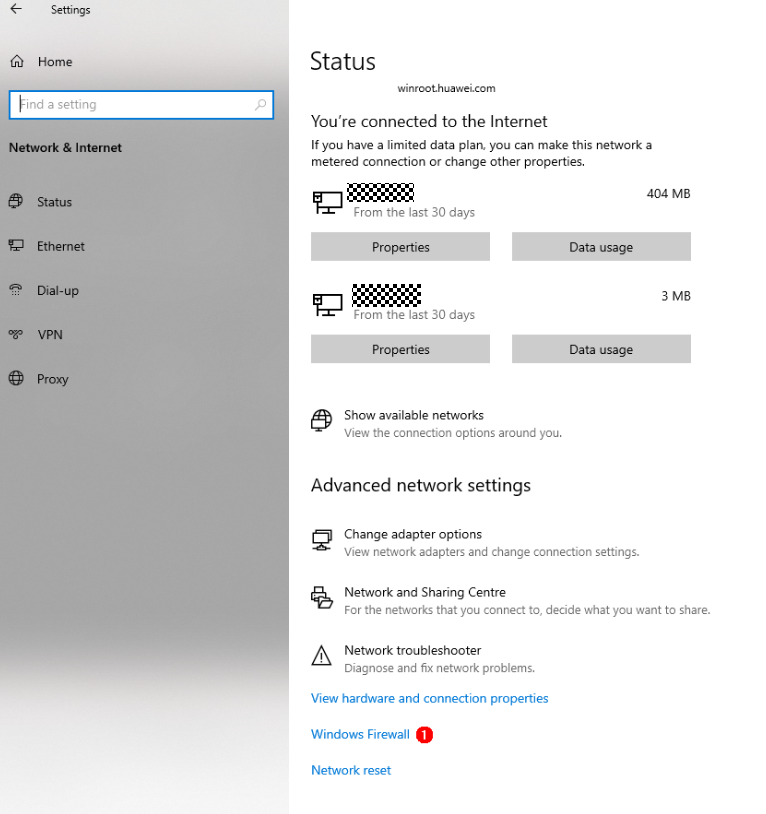

# Fixing Burning Issues

## What should I do if Error: Opening COMxx: Access denied is displayed when I start burning

- **Symptom**

  Error: Opening COMxx: Access denied is displayed after clicking Burn and selecting a serial port.

    **Figure 1** Failed to open the serial port

    

- **Possible Causes**

  The serial port is in use.

- **Solution**

1. Search for the terminal using serial-xx from the drop-down list in the **TERMINAL** panel.

     **Figure 2** Checking whether the serial port is in use

     

2. Click the dustbin icon as shown below to disable the terminal using the serial port.

     **Figure 3** Disabling the terminal using the serial port

     

3. Click **Burn**, select the serial port, and start burning images again.

     **Figure 4** Restarting the burning task

     

## What should I do when Windows-based PC failed to be connected to the board?

- **Symptom**

  The file image cannot be obtained after clicking Burn and selecting a serial port.

    **Figure 5** Failed to obtain the file image due to network disconnection

    

- **Possible Causes**

  The board is disconnected from the Windows-based PC.

  Windows Firewall does not allow Visual Studio Code to access the network.

- **Solution**

1. Check whether the network cable is properly connected.

2. Click Windows Firewall.

     **Figure 6** Network and firewall settings

     

3. Click **Firewall & network protection**, and on the displayed page, click **Allow applications to communicate through Windows Firewall**.

     **Figure 7** Firewall and network protection

     

4. Select Visual Studio Code.

     **Figure 8** Selecting Visual Studio Code

     

5. Select the **Private** and **Public** network access rights for Visual Studio Code.

     **Figure 9** Allowing Visual Studio Code to access the network

     

## What should I do when the image failed to be burnt?

- **Symptom**

  The burning status is not displayed after clicking Burn and selecting a serial port.

- **Possible Causes**

  The IDE is not restarted after the DevEco plug-in is installed.

- **Solution**

  Restart the IDE.

## What should I do if no information is displayed through the serial port? (Hi3516)

- **Symptom**

  The serial port shows that the connection has been established. After the board is restarted, nothing is displayed when you press **Enter**.

- **Possible Cause 1**

  The serial port is connected incorrectly.

- **Solution**

  Change the serial port number.

  Open Device Manager to check whether the serial port connected to the board is the same as the serial port connected to the terminal. If they are different, change the serial port number by following the instructions provided in " Error: Opening COMxx: Access denied".

- **Possible Cause 2**

  The U-Boot of the board is damaged.

- **Solution**

  Burn the U-Boot.

  If the fault persists after you perform the preceding operations, the U-Boot of the board may be damaged. You can burn the U-Boot by performing the following steps:

1. Obtain the U-Boot file.

   >  **NOTICE**
   > The U-Boot file of the two boards can be obtained from the following paths, respectively.
   > 
   > Hi3516D V300: device\hisilicon\hispark_taurus\sdk_liteos\uboot\out\boot\u-boot-hi3516dv300.bin
   > 
   > Hi3518E V300: device\hisilicon\hispark_aries\sdk_liteos\uboot\out\boot\u-boot-hi3518ev300.bin

2. Burn the U-Boot file by following the procedures for burning a U-Boot file over USB.

   Select the U-Boot files of corresponding development boards for burning by referring to [Burning to Hi3516D V300](https://device.harmonyos.com/en/docs/documentation/guide/ide-hi3516-upload-0000001052148681)/[Burning to Hi3518E V300](https://device.harmonyos.com/en/docs/documentation/guide/ide-hi3518-upload-0000001057313128#section93591711580).

3. Log in to the serial port after the burning is complete.

     **Figure 10** Information displayed through the serial port after the U-Boot file is burnt

     
