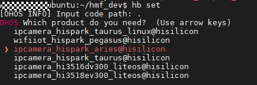
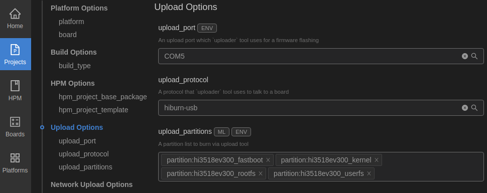

# Running a Hello OHOS Program<a name="EN-US_TOPIC_0000001174350607"></a>

-   [Creating a Program](#section1550972416485)
-   [Building](#section234175193114)
-   [Burning](#section7609155824819)
-   [Running an Image](#section17612105814480)
-   [Follow-up Learning](#section9712145420182)

This section describes how to create, compile, burn, and run the first program, and finally print  **Hello OHOS!**  on the develop board.

## Creating a Program<a name="section1550972416485"></a>

1.  Create a directory and the program source code.

    Create the  **applications/sample/camera/apps/src/helloworld.c**  directory and file whose code is shown in the following example. You can customize the content to be printed. For example, you can change  **OHOS**  to  **World**. You can use either C or C++ to develop a program.

    ```
    #include <stdio.h>
    
    int main(int argc, char **argv)
    {
        printf("\n************************************************\n");
        printf("\n\t\tHello OHOS!\n");
        printf("\n************************************************\n\n");
    
        return 0;
    }
    ```

2.  Create a build file.

    Create the  **applications/sample/camera/apps/BUILD.gn**  file. The file content is as follows:

    ```
    import("//build/lite/config/component/lite_component.gni")
    lite_component("hello-OHOS") {
      features = [ ":helloworld" ]
    }
    executable("helloworld") {
      output_name = "helloworld"
      sources = [ "src/helloworld.c" ]
      include_dirs = []
      defines = []
      cflags_c = []
      ldflags = []
    }
    ```

3.  Add a component.

    Add the configuration of the  **hello\_world\_app**  component to the  **build/lite/components/applications.json**  file. The sample code below shows some configurations defined in the  **applications.json**  file, and the code between  **"\#\#start\#\#"**  and  **"\#\#end\#\#"**  is the new configuration \(Delete the rows where  **"\#\#start\#\#"**  and  **"\#\#end\#\#"**  are located after the configurations are added.\)

    ```
    {
      "components": [
        {
          "component": "camera_sample_communication",
          "description": "Communication related samples.",
          "optional": "true",
          "dirs": [
            "applications/sample/camera/communication"
          ],
          "targets": [
            "//applications/sample/camera/communication:sample"
          ],
          "rom": "",
          "ram": "",
          "output": [],
          "adapted_kernel": [ "liteos_a" ],
          "features": [],
          "deps": {
            "components": [],
            "third_party": []
          }
        },
    ##start##
        {
          "component": "hello_world_app",
          "description": "Communication related samples.",
          "optional": "true",
          "dirs": [
            "applications/sample/camera/apps"
          ],
          "targets": [
            "//applications/sample/camera/apps:hello-OHOS"
          ],
          "rom": "",
          "ram": "",
          "output": [],
          "adapted_kernel": [ "liteos_a" ],
          "features": [],
          "deps": {
            "components": [],
            "third_party": []
          }
        },
    ##end##
        {
          "component": "camera_sample_app",
          "description": "Camera related samples.",
          "optional": "true",
          "dirs": [
            "applications/sample/camera/launcher",
            "applications/sample/camera/cameraApp",
            "applications/sample/camera/setting",
            "applications/sample/camera/gallery",
            "applications/sample/camera/media"
          ],
    ```

4.  Modify the board configuration file.

    Add the  **hello\_world\_app**  component to the  **vendor/hisilicon/hispark\_aries/config.json**  file. The sample code below shows the configurations of the  **applications**  subsystem, and the code between  **\#\#start\#\#**  and  **\#\#end\#\#**  is the new configuration \(Delete the rows where  **\#\#start\#\#**  and  **\#\#end\#\#**  are located after the configurations are added.\)

    ```
          {
            "subsystem": "applications",
            "components": [
    ##start##
              { "component": "hello_world_app", "features":[] },
    ##end##
              { "component": "camera_sample_app", "features":[] }
    
            ]
          },
    ```


## Building<a name="section234175193114"></a>

If the Linux environment is installed using Docker, perform the building by referring to  [Using Docker to Prepare the Build Environment](../get-code/gettools-acquire.md). If the Linux environment is installed using a software package, go to the root directory of the source code and run the following commands for source code compilation:

```
hb set (Set the building path.)
. (Select the current path.)
Select ipcamera_hispark_aries@hisilicon and press Enter.
hb build -f (Start building.)
```

The result files are generated in the  **out/hispark\_aries/ipcamera\_hispark\_aries**  directory.

**Figure  1**  Settings<a name="fig4305770509"></a>  


> **NOTICE:** 
>The U-Boot file of the Hi3518E V300 development board can be obtained from the following path: device/hisilicon/hispark\_aries/sdk\_liteos/uboot/out/boot/u-boot-hi3518ev300.bin

## Burning<a name="section7609155824819"></a>

The USB port is the only burning mode supported by the Hi3518 development board.

1.  Connect the PC and the target development board through the serial port and USB port. In this section, the Hi3518EV300 is used as an example. For details, see  [Introduction to the Hi3518 Development Board](quickstart-lite-introduction-hi3518.md).
2.  <a name="en-us_topic_0000001057313128_li46411811196"></a>Open Device Manager, then check and record the serial port number corresponding to the development board.

    > **NOTE:** 
    >If the serial port number is not displayed correctly, follow the steps described in  [Installing the Serial Port Driver on the Hi3516 or Hi3518 Series Development Boards](https://device.harmonyos.com/en/docs/ide/user-guides/hi3516_hi3518-drivers-0000001050743695).

    

3.  Open DevEco Device Tool and go to  **Projects**  \>  **Settings**.

    

4.  On the  **Partition Configuration**  tab page, modify the settings. In general cases, you can leave the fields at their default settings.
5.  On the  **hi3518ev300**  tab page, set the programming options.

    -   **upload\_port**: Select the serial port number obtained in  [2](#en-us_topic_0000001057313128_li46411811196).
    -   **upload\_protocol**: Select the programming protocol  **hiburn-usb**.
    -   **upload\_partitions**: Select the file to be programmed. By default, the  **fastboot**,  **kernel**,  **rootfs**, and  **userfs**  files are programmed at the same time.

    

6.  When you finish modifying, click  **Save**  in the upper right corner.
7.  Open the project file and click  . In the DevEco Device Tool window, choose  **PROJECT TASKS**  \>  **hi3518ev300\_fastboot**  \>  **Erase**  to erase U-Boot.

    

8.  When the following message is displayed, power off the development board and then power it on.

    

9.  If the following message is displayed, it indicates that U-Boot is erased successfully.

    

10. Go to  **hi3518ev300**  \>  **Upload**  to start programming.

    

11. If the following message is displayed, it indicates that the programming is successful.

    


## Running an Image<a name="section17612105814480"></a>

1.  Connect to a serial port.

    > **NOTICE:** 
    >If the connection fails, rectify the fault by referring to  [FAQs](quickstart-lite-steps-board3518-faqs.md).

    **Figure  2**  Serial port connection<a name="fig056645018495"></a>  
    

    

    1.  Click  **Monitor**  to enable the serial port. The  **TERMINAL**  window is displayed.
    2.  Press  **Enter**  repeatedly until  **hisilicon**  displays.
    3.  Go to  [step 2](#li9441185382314)  if the board is started for the first time or the startup parameters need to be modified; go to  [step 3](#li6442853122312)  otherwise.

2.  <a name="li9441185382314"></a>\(Mandatory for first-time burning\) Modify the  **bootcmd**  and  **bootargs**  parameters of U-Boot. This step is a fixed operation and the result can be saved. However, you need to perform the following steps again if U-Boot needs to be reburnt.

    **Table  1**  Parameters of the U-Boot

    <a name="table1336762011222"></a>
    <table><thead align="left"><tr id="row193681920182219"><th class="cellrowborder" valign="top" width="50%" id="mcps1.2.3.1.1"><p id="p3368202016229"><a name="p3368202016229"></a><a name="p3368202016229"></a>Command</p>
    </th>
    <th class="cellrowborder" valign="top" width="50%" id="mcps1.2.3.1.2"><p id="p936812052217"><a name="p936812052217"></a><a name="p936812052217"></a>Description</p>
    </th>
    </tr>
    </thead>
    <tbody><tr id="row10368142032210"><td class="cellrowborder" valign="top" width="50%" headers="mcps1.2.3.1.1 "><p id="p1636882092214"><a name="p1636882092214"></a><a name="p1636882092214"></a>setenv bootcmd "sf probe 0;sf read 0x40000000 0x100000 0x600000;go 0x40000000";</p>
    </td>
    <td class="cellrowborder" valign="top" width="50%" headers="mcps1.2.3.1.2 "><p id="p17368202082213"><a name="p17368202082213"></a><a name="p17368202082213"></a>Run this command to set the content of <strong id="b209671361282"><a name="b209671361282"></a><a name="b209671361282"></a>bootcmd</strong>. Select the flash whose number is 0, and read content that has a size of 0x600000 (6 MB) and a start address of 0x100000 to memory address 0x40000000. The size must be the same as that of the <strong id="b12634352103017"><a name="b12634352103017"></a><a name="b12634352103017"></a>OHOS_Image.bin</strong> file in the IDE.</p>
    </td>
    </tr>
    <tr id="row136814209227"><td class="cellrowborder" valign="top" width="50%" headers="mcps1.2.3.1.1 "><p id="p234414019231"><a name="p234414019231"></a><a name="p234414019231"></a>setenv bootargs "console=ttyAMA0,115200n8 root=flash fstype=jffs2 rw rootaddr=7M rootsize=8M";</p>
    </td>
    <td class="cellrowborder" valign="top" width="50%" headers="mcps1.2.3.1.2 "><p id="p10368102010223"><a name="p10368102010223"></a><a name="p10368102010223"></a>In this command, <strong id="b1475793912349"><a name="b1475793912349"></a><a name="b1475793912349"></a>bootargs</strong> is set to the serial port output, the baud rate is <strong id="b1310782917185"><a name="b1310782917185"></a><a name="b1310782917185"></a>115200</strong>, the data bit is <strong id="b149010367189"><a name="b149010367189"></a><a name="b149010367189"></a>8</strong>, and the <strong id="b19757173918344"><a name="b19757173918344"></a><a name="b19757173918344"></a>rootfs</strong> is mounted to the flash memory. The file system type is set to <strong id="b875763919342"><a name="b875763919342"></a><a name="b875763919342"></a>jffs2 rw</strong>, which provides the read-write attribute for the JFFS2 file system. <strong id="b186911414141517"><a name="b186911414141517"></a><a name="b186911414141517"></a>rootaddr=7M rootsize=8M</strong> indicates the actual start address and length of the <strong id="b841582383217"><a name="b841582383217"></a><a name="b841582383217"></a>rootfs.img</strong> file to be burnt, respectively. The file size must be the same as that of the <strong id="b51690521108"><a name="b51690521108"></a><a name="b51690521108"></a>rootfs.img</strong> file in the IDE.</p>
    </td>
    </tr>
    <tr id="row2368120112219"><td class="cellrowborder" valign="top" width="50%" headers="mcps1.2.3.1.1 "><p id="p20368142072217"><a name="p20368142072217"></a><a name="p20368142072217"></a>saveenv</p>
    </td>
    <td class="cellrowborder" valign="top" width="50%" headers="mcps1.2.3.1.2 "><p id="p19368102020220"><a name="p19368102020220"></a><a name="p19368102020220"></a><strong id="b12547103053713"><a name="b12547103053713"></a><a name="b12547103053713"></a>saveenv</strong> means to save the current configuration.</p>
    </td>
    </tr>
    <tr id="row63689205220"><td class="cellrowborder" valign="top" width="50%" headers="mcps1.2.3.1.1 "><p id="p3368162015223"><a name="p3368162015223"></a><a name="p3368162015223"></a>reset</p>
    </td>
    <td class="cellrowborder" valign="top" width="50%" headers="mcps1.2.3.1.2 "><p id="p23681820182217"><a name="p23681820182217"></a><a name="p23681820182217"></a><strong id="b29195356377"><a name="b29195356377"></a><a name="b29195356377"></a>reset</strong> means to reset the board.</p>
    </td>
    </tr>
    <tr id="row346253519253"><td class="cellrowborder" valign="top" width="50%" headers="mcps1.2.3.1.1 "><p id="p16462113512251"><a name="p16462113512251"></a><a name="p16462113512251"></a>pri</p>
    </td>
    <td class="cellrowborder" valign="top" width="50%" headers="mcps1.2.3.1.2 "><p id="p3462335152514"><a name="p3462335152514"></a><a name="p3462335152514"></a><strong id="b18592103953712"><a name="b18592103953712"></a><a name="b18592103953712"></a>pri</strong> means to view the displayed parameters.</p>
    </td>
    </tr>
    </tbody>
    </table>

    > **NOTICE:** 
    >**go 0x40000000**  \(optional\) indicates that the command is fixed in the startup parameters by default and the board automatically starts after it is reset. If you want to manually start the board, press  **Enter**  in the countdown phase of the U-Boot startup to interrupt the automatic startup.

3.  <a name="li6442853122312"></a>If  **hisilicon \#**  is displayed during the startup, run the  **reset**  command. After the system automatically starts and  **OHOS**  is displayed, run the  **./bin/helloworld**  command and then press  **Enter**. The system is started successfully if information shown in the following figure is displayed.

    **Figure  3**  Successful system startup and program execution<a name="fig265662981319"></a>  
    


## Follow-up Learning<a name="section9712145420182"></a>

Congratulations! You have finished all steps! You are advised to go on learning how to develop  [Cameras with a Screen](../guide/device-iotcamera.md).

