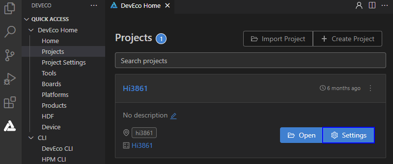
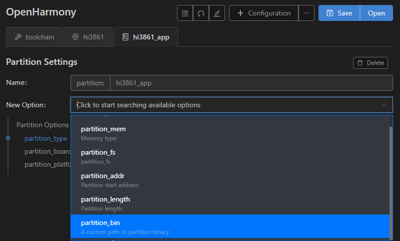

# Burning

Burn the source code to Hi3861 through the serial port in Windows.

### Importing Source Code

After the building is complete, ensure that you can [remotely access the Ubuntu environment from Windows](../quick-start/quickstart-lite-env-setup.md). Then, perform the following steps to import the source code before burning:

1. Open DevEco Device Tool, go to the home page, and click **Import Project** to open your project or source code.

   

2. Select the target directory (in the Ubuntu environment) and click **Import**.

   >  **NOTE**
   > Make sure the selected directory does not contain Chinese characters or spaces. Otherwise, the building may fail.

   

3. If you select to open the OpenHarmony source code, a message will be displayed indicating that the project is not a DevEco Device Tool project. Click **Import** to continue.

   

4. On the **Select Project type** page, select **Import from OpenHarmony Source**.

   

5. On the **Import Project** page, select a product, and the MCU, board, company, and kernel fields will be automatically populated. Then, select the OpenHarmony source code version for **ohosVersion**. Select **wifiiot_hispark_pegasus**.

   

6. Click **Open** to open the project or source code.

### Burning

After the source code is imported, perform the following steps:

1. Connect the computer and the target development board through the serial port and USB port. For details, see [Introduction to the Hi3861 V100 Development Board](https://gitee.com/openharmony/docs/blob/master/en/device-dev/quick-start/quickstart-lite-introduction-hi3861.md).

2. In DevEco Device Tool, choose **REMOTE DEVELOPMENT** > **Local PC** to check the connection status between the remote computer (Ubuntu build environment) and the local computer (Windows build environment).

   - If  is displayed on the right of **Local PC**, the remote computer is connected to the local computer. In this case, no further action is required.
   - If  is displayed, click the connect icon.

   

   >  **NOTE**
   > This operation is required only in remote access mode (in the Windows+Ubuntu hybrid build environment). If the local access mode (Windows or Ubuntu build environment) is used, skip this step.

3. Check the serial port number in **QUICK ACCESS** > **DevEco Home** > **Device** in DevEco Device Tool.

   

   >  **NOTE**
   > If the serial port number is not displayed correctly, follow the steps described in [Installing the Serial Port Driver on Hi3861 V100](https://device.harmonyos.com/en/docs/documentation/guide/hi3861-drivers-0000001058153433).

4. Choose **QUICK ACCESS** > **DevEco Home** > **Projects**, and then click **Settings**.

   

5. On the **hi3861** tab page, set the burning options.

   - **upload_port**: Select the serial port number obtained.
   - **upload_protocol**: Select the burning protocol **hiburn-serial**.
   - **upload_partitions**: Select the files to be burnt. **hi3861_app** is selected by default.

   

6. Check the preset information of the files to be burnt and modify them when necessary.

   On the **hi3861_app** tab page, select **partition_bin** from **New Option**, and set the path of the file to be burnt.

   

7. When you finish modifying, click **Save** on the top.

8. Click **Open** to open the project file. Then, choose **PROJECT TASKS** > **hi3861** > **Upload** to start burning.

   

9. When the following information is displayed, press the RST button on the development board to restart it.

   

10. Wait until the burning is complete. When the following message is displayed, the burning is successful.

   
