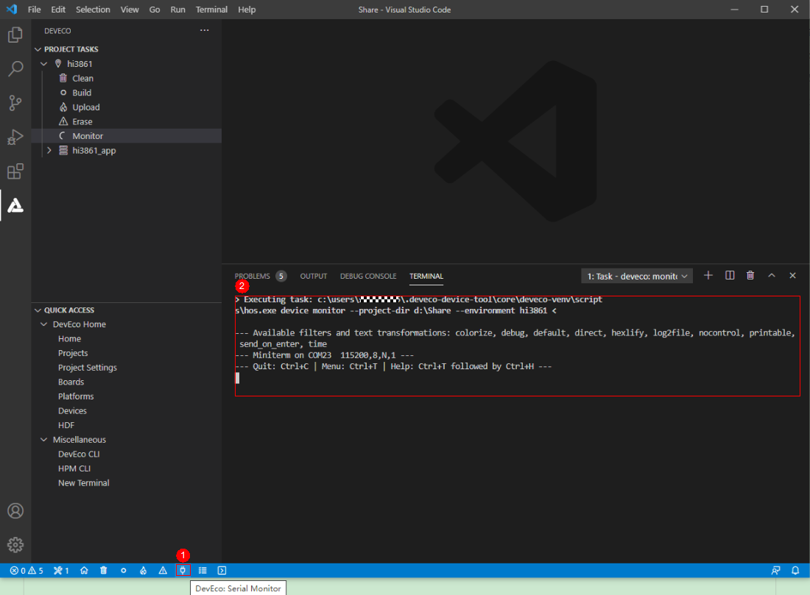

# Setting Up WLAN Connection<a name="EN-US_TOPIC_0000001174350611"></a>

-   [Building Source Code](#section191121332125319)
-   [Burning Images](#section3288165814218)
-   [Connecting WLAN Module to the Internet.](#section194671619167)

This example shows how to connect the WLAN module to the gateway using attention \(AT\) commands.

## Building Source Code<a name="section191121332125319"></a>

This section describes how to perform the WLAN module building on a Linux server.

If the Linux environment is installed using Docker, perform the building by referring to  [Using Docker to Prepare the Build Environment](../get-code/gettools-acquire.md#section107932281315). If the Linux environment is installed using a software package, perform the following steps:

1.  Open the HUAWEI DevEco Device Tool and choose  **View**  \>  **Terminal**.

    **Figure  1**  Starting the IDE terminal tool<a name="fig755583241511"></a>  
    

    On the  **TERMINAL**  panel, run the ssh command, for example,  **ssh** **_user_@_ipaddr_**, to connect to the Linux server.

    **Figure  2**  TERMINAL panel<a name="fig14407256101510"></a>  
    

2.  Go to the root directory of the code, run the  **hb set**  and  **.**  commands on the  **TERMINAL**  panel, and select the  **wifiiot\_hispark\_pegasus**  version.

    **Figure  3**  Selecting the target build version<a name="fig191035701814"></a>  
    

3.  Run the  **hb build**  command to start building.

    **Figure  4**  Running commands on the TERMINAL panel<a name="fig10635942111916"></a>  
    

4.  Check whether the building is successful. If yes,  **wifiiot\_hispark\_pegasus build success**  will be displayed, as shown in the following figure.

    **Figure  5**  Successful building<a name="fig195291328182015"></a>  
    

5.  Check whether the following files are generated in the  **./out/wifiiot/**  directory.

    ```
    ls -l out/hispark_pegasus/wifiiot_hispark_pegasus/
    ```

    **Figure  6**  Directory for storing the generated files<a name="fig112257131214"></a>  
    


## Burning Images<a name="section3288165814218"></a>

Burning is the process of downloading compiled program files to a chipset development board to provide a basis for subsequent debugging. With the one-click burning function of DevEco Device Tool, you can burn development boards quickly and efficiently.

**You can burn to the Hi3861 V100 development board through the serial port using the burn-serial or hiburn-serial protocol. The hiburn-serial protocol is applicable to both Windows and Linux systems, while the burn-serial is applicable to Linux only.**

> **NOTE:** 
>The burn-serial protocol is used for compatibility with the projects of historical versions. It does not differ from hiburn-serial in operations.

The operations for burning in Windows and Linux are the same. The only difference lies in the environment setup for DevEco Device Tool.

1.  Connect the PC and the target development board through the USB port. For details, see  [Introduction to the Hi3861 Development Board](https://device.harmonyos.com/en/docs/start/introduce/oem_minitinier_des_3861-0000001105041324).
2.  <a name="en-us_topic_0000001056563976_li848662117291"></a>Open Device Manager, then check and record the serial port number corresponding to the development board.

    > **NOTE:** 
    >If the serial port number is not displayed correctly, follow the steps described in  [Installing the Serial Port Driver on the Hi3861 Series Development Board](https://device.harmonyos.com/en/docs/ide/user-guides/hi3861-drivers-0000001058153433).

    

3.  Open DevEco Device Tool, choose  **QUICK ACCESS**  \>  **DevEco Home**  \>  **Projects**, and then click  **Settings**.

    

4.  On the  **Partition Configuration**  tab page, modify the settings. In general cases, you can leave the fields at their default settings.

    > **NOTE:** 
    >If the file to be burnt is obtained by copying, you must manually change the path of the file to be burnt: Click the tab of the file to be burnt, select  **Partition\_bin**  from the  **New Option**  drop-down list box in  **Partition Settings**, and set the path of the file to be burnt in  **Partition\_bin**.

5.  On the  **hi3861**  tab page, set the burning options.

    -   **upload\_port**: Select the serial port number obtained in step  [2](#en-us_topic_0000001056563976_li848662117291).
    -   **upload\_protocol**: Select the burning protocol. For Windows, set this parameter to  **burn-serial**  or  **hiburn-serial**. For Linux, set this parameter to  **hiburn-serial**.
    -   **upload\_partitions**: Select the files to be burnt.  **hi3861\_app**  is selected by default.

    

6.  When you finish modifying, click  **Save**  in the upper right corner.
7.  Open the project file. In the DevEco Device Tool window, go to  **PROJECT TASKS**  \>  **hi3861**  \>  **Upload**  to start burning.

    

8.  When the following information is displayed, press the RST button on the development board to restart it.

    

9.  If the following message is displayed, it indicates that the burning is successful.

    


## Connecting WLAN Module to the Internet.<a name="section194671619167"></a>

After completing version building and burning, do as follows to connect the WLAN module to the Internet using AT commands.

1.  Click the icon of  **DevEco: Serial Monitor**  at the bottom of DevEco Studio to keep the connection between the Windows workstation and the WLAN module.

    **Figure  7**  Opening the DevEco serial port<a name="fig464411253297"></a>  
    

2.  Reset the WLAN module. The message  **ready to OS start**  is displayed on the  **TERMINAL**  panel, indicating that the WLAN module is started successfully.

    **Figure  8**  Successful resetting of the WLAN module <a name="fig3327108143016"></a>  
    

3.  Run the following AT commands in sequence via the DevEco serial port terminal to start the STA mode, connect to the specified AP, and enable Dynamic Host Configuration Protocol \(DHCP\).

    ```
    AT+STARTSTA                             # Start the STA mode.
    AT+SCAN                                 # Scan for available APs.
    AT+SCANRESULT                           # Display the scanning result.
    AT+CONN="SSID",,2,"PASSWORD"            # Connect to the specified AP. (SSID and PASSWORD represent the name and password of the hotspot to be connected, respectively.)
    AT+STASTAT                              # View the connection result.
    AT+DHCP=wlan0,1                         # Request the IP address of wlan0 from the AP using DHCP.
    ```

4.  Check whether the WLAN module is properly connected to the gateway, as shown in the following figure.

    ```
    AT+IFCFG                                # View the IP address assigned to an interface of the module.
    AT+PING=X.X.X.X                         # Check the connectivity between the module and the gateway. Replace X.X.X.X with the actual gateway address.
    ```

    **Figure  9**  Successful networking of the WLAN module<a name="fig7672858203010"></a>  
    


