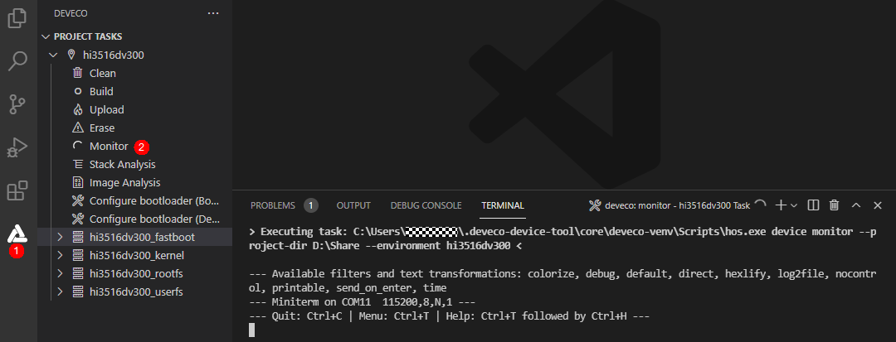

# Running


## Starting the System

After the burning is complete, perform the following steps to start the system in Windows:

>  **NOTE**
> This operation procedure is required only if this is the first time you burn an image for the standard system.

1. In DevEco Device Tool, click **Monitor** to open the serial port tool.

   

2. Restart the development board. Before the autoboot countdown ends, press any key to enter the system.

   

3. Run the following commands to set system boot parameters:
     
   ```
   setenv bootargs 'mem=640M console=ttyAMA0,115200 mmz=anonymous,0,0xA8000000,384M clk_ignore_unused rootdelay=10 hardware=Hi3516DV300 init=/init root=/dev/ram0 rw blkdevparts=mmcblk0:1M(boot),15M(kernel),20M(updater),2M(misc),3307M(system),256M(vendor),-(userdata)';
   ```

     
   ```
   setenv bootcmd 'mmc read 0x0 0x82000000 0x800 0x4800; bootm 0x82000000'
   ```

   

4. Save the parameter settings.
     
   ```
   save
   ```

   

5. Restart the development board to start the system.
     
   ```
   reset
   ```

   


## Running a Hello World Program

After the system is started, start the serial port tool, run the **helloworld** command in any directory, and press **Enter**. If the message "Hello World!" is displayed, the program runs successfully.


## Next

Congratulations! You have finished all steps! Proceed to [develop a sample](../guide/device-clock-guide.md) to better familiarize yourself with OpenHarmony development.
